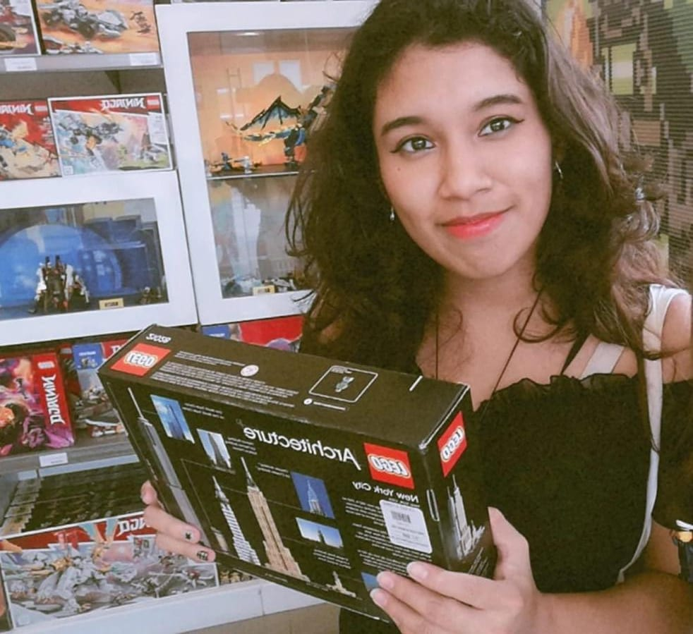
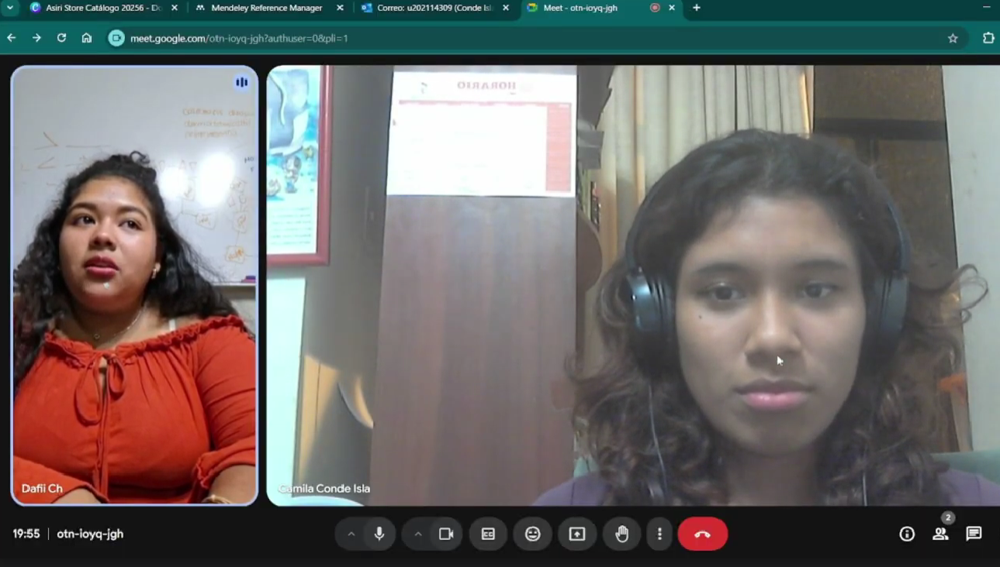
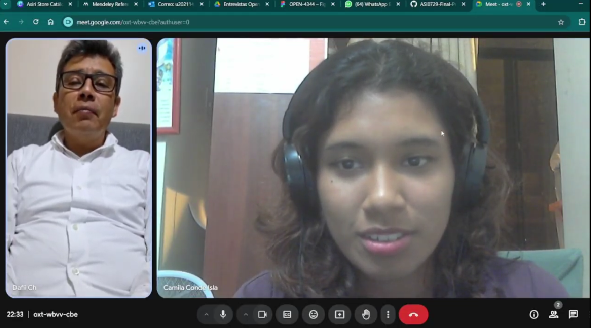
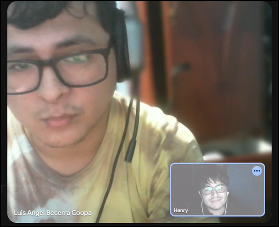
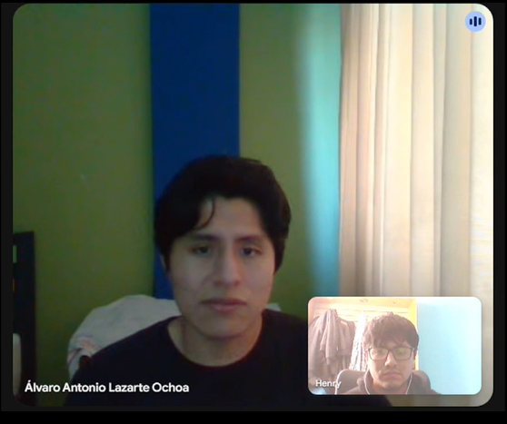
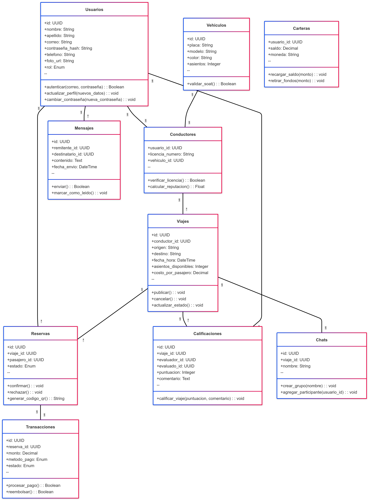
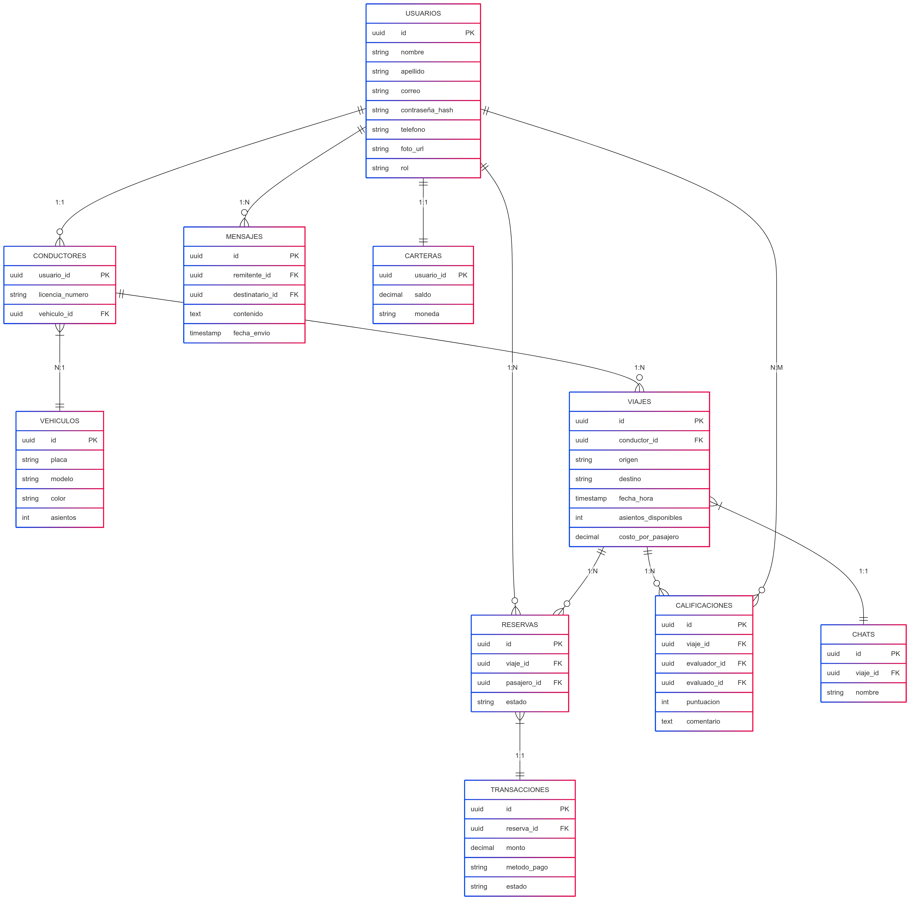
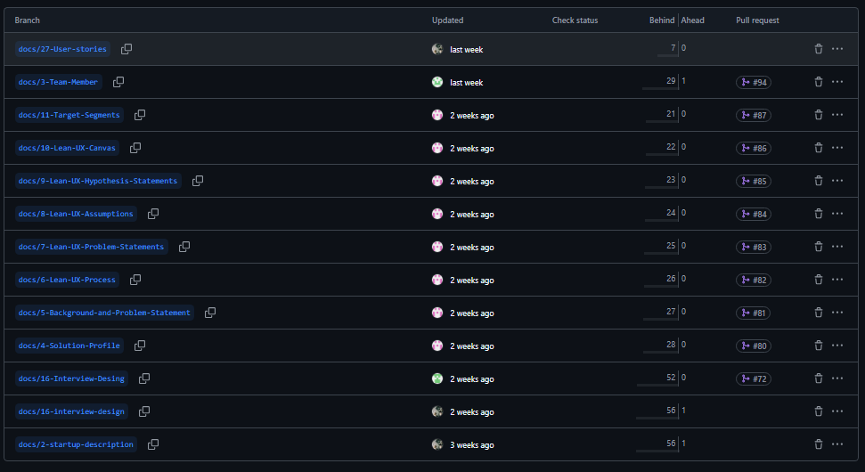

# 
Informe de Trabajo Final

## 
Universidad Peruana de Ciencias Aplicadas

  

Ingeniería de Software

Desarrollo de Aplicaciones Open Source - 4344

<strong>Docente:</strong> Rafael Oswaldo Castro Veramendi

<strong>Startup:</strong> TinkuyTech

<strong>Producto:</strong> Ñango

<strong>Team members:</strong>

| Nombre                            | Código     |
| --------------------------------- | ---------- |
| Almerco Rojas, Damely Jocy        | U20221G068 |
| Gamarra Vega, Anderson Jose       | u202016154 |
| Conde Isla, Camila                | U20201F140 |
| Oblitas Davila, Mariano Moises    | U202310222 |
| Diaz Gutierrez, Henry Kevin       | U201819674 |

<strong>Ciclo 2025-01</strong>

# Registro de versiones del informe

| Versión | Fecha      | Autor             | Descripción de modificación                                                                                                                                                                                                                                                                                       |
| ------- | ---------- | ----------------- | ----------------------------------------------------------------------------------------------------------------------------------------------------------------------------------------------------------------------------------------------------------------------------------------------------------------- |
| TB1     | 25/04/2025 | TinkuyTech | En esta primera entrega se han incluido los capítulos: Capítulo I: Introducción  Capítulo II: Requirements Elicitation & Analysis Capítulo III: Requirements Specification Capítulo IV: Product Design Capítulo V: Product Implementation, Validation & Deployment                       |

# Student Outcomes

ABET – EAC - Student Outcome 1: La capacidad de identificar, formular y resolver problemas complejos de ingeniería aplicando principios de ingeniería, ciencias y matemáticas.

| Criterio específico                                                                 | Acciones realizadas                                                                                                                                                                                                                                                                                                                                                                                                                                                                 | Conclusiones                                                                                                                                                                                                                         |
| ----------------------------------------------------------------------------------- | ---------------------------------------------------------------------------------------------------------------------------------------------------------------------------------------------------------------------------------------------------------------------------------------------------------------------------------------------------------------------------------------------------------------------------------------------------------------------------------- | ------------------------------------------------------------------------------------------------------------------------------------------------------------------------------------------------------------------------------------ |
| Comunica oralmente con efectividad a diferentes rangos de audiencia.                | **Almerco Rojas, Damely Jocy** • Realizó entrevistas a segmentos objetivos registrando respuestas • Presentó oralmente los wireframes y diseños  **Gamarra Vega, Anderson Jose** • Expuso análisis competitivo al equipo • Comunicó hallazgos de needfinding en reuniones  **Conde Isla, Camila** • Participó activamente en entrevistas con usuarios • Explicó mockups durante revisiones  **Diaz Gutierrez, Henry Kevin** • Condujo entrevistas diseñadas • Presentó aspectos técnicos de configuración  **Oblitas Davila, Mariano Moises** • Explicó user stories en planning • Comunicó estructura de backlog | La comunicación oral fue clave para: - Obtener información de usuarios - Alinear visiones del equipo - Presentar avances Todos adaptaron su discurso según la audiencia (usuarios/equipo/profesores)                                                                               |
| Comunica por escrito con efectividad a diferentes rangos de audiencia.              | **Almerco Rojas, Damely Jocy** • Redactó Startup/Solution Profile • Documentó wireflows con claridad  **Gamarra Vega, Anderson Jose** • Elaboró análisis competitivo escrito • Formuló issues técnicas en GitHub  **Conde Isla, Camila** • Documentó sistemas de labeling • Describió user flows detalladamente  **Diaz Gutierrez, Henry Kevin** • Escribió manual de estilo de código • Registró configuración de entorno  **Oblitas Davila, Mariano Moises** • Redactó user stories concisas • Modeló BD con documentación asociada       | La documentación escrita: - Fue adecuada para distintos niveles técnicos - Permitió trazabilidad del proyecto - Incluyó formatos variados (técnicos/descriptivos) Los registros fueron precisos y orientados al propósito |

### [Capítulo I: Introducción](#capítulo-i-introducción)

- [1.1. Startup Profile](#11-startup-profile)
  - [1.1.1. Descripción de la Startup](#111-descripción-de-la-startup)
  - [1.1.2. Perfiles de integrantes del equipo](#112-perfiles-de-integrantes-del-equipo)
- [1.2. Solution Profile](#12-solution-profile)
  - [1.2.1 Antecedentes y problemática](#121-antecedentes-y-problemática)
  - [1.2.2 Lean UX Process](#122-lean-ux-process)
    - [1.2.2.1. Lean UX Problem Statements](#1221-lean-ux-problem-statements)
    - [1.2.2.2. Lean UX Assumptions](#1222-lean-ux-assumptions)
    - [1.2.2.3. Lean UX Hypothesis Statements](#1223-lean-ux-hypothesis-statements)
    - [1.2.2.4. Lean UX Canvas](#1224-lean-ux-canvas)
- [1.3. Segmentos objetivo](#13-segmentos-objetivo)

### [Capítulo II: Requirements Elicitation & Analysis](#capítulo-ii-requirements-elicitation--analysis)

- [2.1. Competidores](#21-competidores)
  - [2.1.1. Análisis competitivo](#211-análisis-competitivo)
  - [2.1.2. Estrategias y tácticas frente a competidores](#212-estrategias-y-tácticas-frente-a-competidores)
- [2.2. Entrevistas](#22-entrevistas)
  - [2.2.1. Diseño de entrevistas](#221-diseño-de-entrevistas)
  - [2.2.2. Registro de entrevistas](#222-registro-de-entrevistas)
  - [2.2.3. Análisis de entrevistas](#223-análisis-de-entrevistas)
- [2.3. Needfinding](#23-needfinding)
  - [2.3.1. User Personas](#231-user-personas)
  - [2.3.2. User Task Matrix](#232-user-task-matrix)
  - [2.3.3. User Journey Mapping](#233-user-journey-mapping)
  - [2.3.4. Empathy Mapping](#234-empathy-mapping)
  - [2.3.5. As-is Scenario Mapping](#235-as-is-scenario-mapping)
- [2.4. Ubiquitous Language](#24-ubiquitous-language)

### [Capítulo III: Requirements Specification](#capítulo-iii-requirements-specification)

- [3.1. To-Be Scenario Mapping](#31-to-be-scenario-mapping)
- [3.2. User Stories](#32-user-stories)
- [3.3. Impact Mapping](#33-impact-mapping)
- [3.4. Product Backlog](#34-product-backlog)

### [Capítulo IV: Product Design](#capítulo-iv-product-design)

- [4.1. Style Guidelines](#41-style-guidelines)
  - [4.1.1. General Style Guidelines](#411-general-style-guidelines)
  - [4.1.2. Web Style Guidelines](#412-web-style-guidelines)
- [4.2. Information Architecture](#42-information-architecture)
  - [4.2.1. Organization Systems](#421-organization-systems)
  - [4.2.2. Labeling Systems](#422-labeling-systems)
  - [4.2.3. SEO Tags and Meta Tags](#423-seo-tags-and-meta-tags)
  - [4.2.4. Searching Systems](#424-searching-systems)
  - [4.2.5. Navigation Systems](#425-navigation-systems)
- [4.3. Landing Page UI Design](#43-landing-page-ui-design)
  - [4.3.1. Landing Page Wireframe](#431-landing-page-wireframe)
  - [4.3.2. Landing Page Mock-up](#432-landing-page-mock-up)
- [4.4. Web Applications UX/UI Design](#44-web-applications-uxui-design)
  - [4.4.1. Web Applications Wireframes](#441-web-applications-wireframes)
  - [4.4.2. Web Applications Wireflow Diagrams](#442-web-applications-wireflow-diagrams)
  - [4.4.3. Web Applications Mock-ups](#443-web-applications-mock-ups)
  - [4.4.4. Web Applications User Flow Diagrams](#444-web-applications-user-flow-diagrams)
- [4.5. Web Applications Prototyping](#45-web-applications-prototyping)
- [4.6. Domain-Driven Software Architecture](#46-domain-driven-software-architecture)
  - [4.6.1. Software Architecture Context Diagram](#461-software-architecture-context-diagram)
  - [4.6.2. Software Architecture Container Diagrams](#462-software-architecture-container-diagrams)
  - [4.6.3. Software Architecture Components Diagrams](#463-software-architecture-components-diagrams)
- [4.7. Software Object-Oriented Design](#47-software-object-oriented-design)
  - [4.7.1. Class Diagrams](#471-class-diagrams)
  - [4.7.2. Class Dictionary](#472-class-dictionary)
- [4.8. Database Design](#48-database-design)
  - [4.8.1. Database Diagram](#481-database-diagram)

### [Capítulo V: Product Implementation, Validation & Deployment](#capítulo-v-product-implementation-validation--deployment)

- [5.1. Software Configuration Management](#51-software-configuration-management)
  - [5.1.1. Software Development Environment Configuration](#511-software-development-environment-configuration)
  - [5.1.2. Source Code Management](#512-source-code-management)
  - [5.1.3. Source Code Style Guide & Conventions](#513-source-code-style-guide--conventions)
  - [5.1.4. Software Deployment Configuration](#514-software-deployment-configuration)
- [5.2. Landing Page, Services & Applications Implementation](#52-landing-page-services--applications-implementation)
  - [5.2.1. Sprint 1](#521-sprint-1)
    - [5.2.1.1. Sprint Planning 1](#5211-sprint-planning-1)
    - [5.2.1.2. Aspect Leaders and Collaborators](#5212-aspect-leaders-and-collaborators)
    - [5.2.1.3. Sprint Backlog 1](#5213-sprint-backlog-1)
    - [5.2.1.4. Development Evidence for Sprint Review](#5214-development-evidence-for-sprint-review)
    - [5.2.1.5. Execution Evidence for Sprint Review](#5215-execution-evidence-for-sprint-review)
    - [5.2.1.6. Services Documentation Evidence for Sprint Review](#5216-services-documentation-evidence-for-sprint-review)
    - [5.2.1.7. Software Deployment Evidence for Sprint Review](#5217-software-deployment-evidence-for-sprint-review)
    - [5.2.1.8. Team Collaboration Insights during Sprint](#5218-team-collaboration-insights-during-sprint)

# Capítulo I: Introducción

## 1.1. Startup Profile

En esta sección se describen los detalles del problema que buscamos resolver. Se detalla el perfil de la startup, el mercado objetivo, y se presentan la misión y visión. Asimismo, se expone una visión atractiva del equipo, resaltando su potencial en función de las habilidades y capacidades de cada integrante.

### 1.1.1. Descripción de la Startup

TinkuyTech es una startup tecnológica dedicada a mejorar la seguridad de transporte de los estudiantes en Perú. Nuestra empresa ofrece un nuevo producto llamado ÑanGo, una aplicación web diseñada específicamente para los estudiantes. ÑanGo conecta a estudiantes que cuentan con movilidad propia con aquellos que buscan transporte para ir a la universidad. Los usuarios pueden coordinar rutas, compartir gastos y optimizar su tiempo de desplazamiento, contribuyendo así al bienestar y la eficiencia del viaje.

Para ello, desarrollaremos una plataforma interactiva que permitirá a los estudiantes visualizar y coordinar rutas compartidas hacia la universidad, organizar horarios, optimizar los costos de transporte y consultar los perfiles de los choferes y pasajeros, ofreciendo así una alternativa más segura. Esto hace que la aplicación sea aún más viable y útil para los estudiantes.

Este producto está diseñado principalmente para estudiantes (choferes o pasajeros) y familiares de los estudiantes (choferes), quienes priorizan la seguridad y buscan una alternativa de transporte más práctica para su vida diaria.

**Misión**

Nuestra misión es transformar la forma en que los estudiantes se movilizan en Perú, brindándoles una solución tecnológica que les permita acceder a un sistema de transporte compartido, seguro, accesible y solidario. Buscamos promover la seguridad estudiantil y contribuir a un futuro más seguro, conectado y sostenible.

**Visión**

Nuestra visión es posicionarnos como una startup líder en seguridad de transporte para universidades en Perú. Aspiramos a construir y promover un entorno donde los estudiantes puedan acceder fácilmente a una movilidad segura, eficiente, confiable y colaborativa.

### 1.1.2. Perfiles de integrantes del equipo

Código de Alumno: U20221G068

Descripción:
Soy estudiante de Ingeniería de Software y actualmente curso el 5to ciclo. Considero que tengo buen dominio en la elaboración de diagramas en C++. Los lenguajes que sé es C++, SQL, CSS, HTML y Javascript. En mi tiempo libre me gusta tocar ukelele, leer libros, resolver sudoku, escuchar música y ver series. Mi compromiso radica en ser responsable con las tareas asignadas, y mis habilidades incluyen la creatividad, el trabajo en equipo, la empatía y la responsabilidad.

Código de Alumno:  U202016154

Descripción:
Mi nombre es Anderson Jose Gamarra Vega, tengo 24 años , estudiante de Ingeniería de Software. Desde siempre he sentido una gran pasión por la tecnología, pero me decanto especialmente por el desarrollo de software, pues me fascina aprender nuevos lenguajes de programación, diseñar soluciones digitales y afrontar retos mediante código. Esta inclinación hacia el software fue lo que me motivó a elegir esta carrera, y actualmente estoy profundizando en áreas como backend, arquitectura de software, metodologías agile.

Código de Alumno: U202310222

Descripción:Mi nombre es Mariano Moises Oblitas Davila soy estudiante de 18 años de Ingeniería de Software en la UPC. Me caracterizo por mi creatividad, eficacia y capacidad para resolver problemas de manera racional. Apasionado por la programación y el desarrollo de software, busco constantemente innovar y aprender nuevas tecnologías.

Código de Alumno: U201819674

Mi nombre es Henry Kevin Diaz Gutierrez, tengo 24 años, soy estudiante de Ingenieria de Software en la UPC.Me caracterizo por ser creativo , cumplir con lo que se me brinda y ayudar a resolver problemas si se presenta.Desde siempre me intereso el tema de los videojuegos y de el tipo de diseño que se empleaba, eso hizo que me guste el desarrollo de software. 
 

Código de Alumno: u202114309

Descripción:
Soy Camila Conde, estudiante de la carrera de Ingeniería de Software. Mi motivación para seguir aprendiendo es llegar a crear y diseñar soluciones creativas. Me considero una persona creativa, proactiva, tolerante, respetuosa y apasionada por lo que me gusta. Me comprometo a apoyar en el proceso para poder tener un proyecto final bien planteado para obtener una buena nota

## 1.2. Solution Profile

En esta sección se describe el perfil de la solución teniendo en cuenta el problema y las ideas que se debe resolver para fomentar la seguridad de los estudiantes.

### 1.2.1 Antecedentes y problemática

En los últimos años, la inseguridad en el transporte ha aumentado significativamente en el Perú, afectando tanto a conductores como a pasajeros. Este problema se intensifica en el caso de los estudiantes, quienes muchas veces son víctimas de robos y asaltos, especialmente en zonas cercanas a sus centros de estudio. Además, la extorsión a transportistas por el cobro de "cupos" limita la disponibilidad de servicios seguros, generando temor y restringiendo la libertad de movilización.

Ante esta situación, surge la necesidad de una solución tecnológica que permita a los estudiantes movilizarse con mayor seguridad. Es en este contexto que se propone ÑanGo, una plataforma de transporte compartido enfocada exclusivamente en la comunidad estudiantil. Esta solución facilita que los estudiantes que cuentan con movilidad propia puedan compartir sus rutas con otros compañeros, optimizando costos, mayor tranquilidad en los desplazamientos y minimizando los riesgos de seguridad por las medidas de protección integradas.

Para analizar la problemática, se utilizó la técnica de las 5 "W" y 2 "H":

**WHAT**

**¿Cuál es el problema?**

Los servicios de transporte actuales en el Perú presentan serias deficiencias relacionadas con la inseguridad ciudadana. Los constantes actos delictivos, como robos, asaltos y extorsiones a conductores, exponen a los estudiantes a situaciones de riesgo. Esto ha generado desconfianza y una necesidad urgente de contar con un servicio de transporte confiable, accesible y seguro.

**¿Cuál es la relación con la persona en cuestión?**

Este problema afecta directamente a los estudiantes, quienes buscan llegar a sus destinos académicos de manera segura y asequible. La falta de opciones seguras y económicas genera estrés, miedo y limita su libertad de movilidad.

**WHEN**

**¿Cuándo sucede el problema?**

El problema surge diariamente en las calles de Lima, especialmente en horarios de entrada y salida de universidades. Durante estos momentos, las rutas cercanas a los centros educativos se convierten en puntos críticos por la presencia de delincuentes que buscan aprovechar el tráfico.

**¿Cuándo utiliza el cliente el producto?**

Los usuarios usarán la plataforma de ÑanGo antes de las clases, para programar y coordinar viajes compartidos con otros estudiantes. De esta manera, se reducirá los tiempos de espera y optimizando la movilidad diaria.

**WHERE**

**¿Dónde está el cliente cuando usa el producto?**

Los usuarios podrán acceder a ÑanGo desde sus casas, centros de estudio o cualquier otro lugar con acceso a internet. Esto les permitirá reservar un auto y coordinar el recojo en puntos específicos y planificar su ruta junto a otros estudiantes verificados.

**¿A dónde se dirige?**

Los usuarios pueden utilizar ÑanGo para planificar rutas hacia la universidad, coordinar horarios y puntos de encuentro, optimizar el tiempo de viaje, verificar los perfiles de conductores y pasajeros, compartir los costos del transporte con otros estudiantes de su misma universidad y aprovechar mejor el uso del vehículo.

**¿Dónde surge el problema?**

El problema se presenta en calles y avenidas de Lima y otras ciudades universitarias, donde el transporte informal, falsos taxistas, la congestión y la delincuencia generan un entorno poco seguro para los jóvenes estudiantes.

**WHO**

**¿Quiénes están involucrados?**

Los principales involucrados son los estudiantes universitarios, quienes pueden participar tanto como pasajeros como conductores. Buscan movilizarse de forma segura, ofreciendo sus vehículos para compartir viajes y reducir costos. Además, están involucrados los familiares de los estudiantes, quienes también pueden participar como choferes para brindar transporte ocasional a los compañeros de sus hijos o familiares. Esto podría fomentar el uso de esta herramienta como una solución para mejorar la movilidad y seguridad de la comunidad estudiantil.

**¿A quiénes le sucede el problema?**

El problema le sucede directamente a los estudiantes universitarios, principalmente aquellos que deben trasladarse desde zonas lejanas o vulnerables, y que dependen del transporte público para llegar a sus universidades.

**¿Quién lo utilizará?**

Lo utilizará los estudiantes registrados que deseen compartir viajes con compañeros de confianza. También podrán usarlo aquellos que tengan vehículo propio (como estudiantes o familiar del estudiante) y deseen reducir sus gastos ofreciendo rutas seguras a otros estudiantes.

**WHY**

**¿Cuál es la causa del problema?**

La causa principal es la falta de un sistema de transporte seguro, regulado y confiable para los estudiantes universitarios. La informalidad del servicio de taxis, la escasa presencia policial en zonas clave, y la falta de tecnología para coordinar viajes seguros agravan esta situación. Además, los costos elevados de movilidad individual hacen que muchos opten por opciones más económicas pero menos seguras.

**HOW**

**¿En qué condiciones los clientes usan nuestro producto?**

Los estudiantes utilizan ÑanGo principalmente en condiciones de alta demanda de transporte, como horas punta, zonas alejadas, o lugares con alto índice delictivo. Usan la aplicación para coordinar de manera segura sus rutas, ahorrar dinero al compartir gastos y tener la tranquilidad de movilizarse con otros estudiantes verificados.

**¿Cómo nos conocieron los compradores?**

Los usuarios pueden conocer ÑanGo a través de campañas de concientización en redes sociales y mediante recomendaciones de boca a boca (Word of Mout) entre estudiantes.

**¿Cómo prefieren los lectores acceder a nuestro contenido?**

Los estudiantes prefieren acceder a nuestro contenido de manera digital, desde la aplicación página web. Ya que valoran las notificaciones instantáneas, la coordinacion sobre las rutas y gastos compartidas y perfiles verificados.

**¿Qué llevó a la persona a llegar a esta situación?**

La persona llegó a esta situación debido al aumento de la delincuencia y los altos costos del transporte privado. Esta necesidad de sentirse protegidos, moverse sin temor, y no gastar excesivamente llevó a los estudiantes a buscar una solución como ÑanGo, que responde tanto a la seguridad como a la economía.

**HOW MUCH**

Incluir estadísticas que sustenten la problemática

Con el objetivo de sustentar la necesidad de implementar una solución de movilidad compartida más segura, se consultaron las estadísticas proporcionadas por la Policía Nacional del Perú y el Ministerio del Interior. A través de gráficos, se muestran los altos índices de robos de vehículos en Lima Metropolitana, lo que resalta la urgencia de tomar medidas preventivas.

**Figura 1:** Robo de vehículos según SIDPOL

**\*Nota:** Gráfico N.º 1.2. Comparativo de delitos relacionados con la seguridad pública según SIDPOL 2024.\*
**Fuente:** Instituto Nacional de Estadística e Informática (2024)

Según la Policía Nacional del Perú - Sistema de Denuncias Policiales-SIDPOL (como se cita en Instituto Nacional de Estadística e Informática, 2024), nos presenta un cuadro comparativo donde uno de los delitos genéricos más evidenciados en el Perú corresponde a la seguridad pública. Esto significa que dicho sector es uno de los más vulnerables, debido al elevado número de denuncias registradas por la comisión de este tipo de delitos.

**Figura 2:** Robo de vehículos en Lima Metropolitana

**\*Nota:** Gráfico N.º 1.5. Estadísticas del robo de vehículos en Lima Metropolitana durante el 2020, 2021, 2022, 2023 y 2024.\*
**Fuente:** Instituto Nacional de Estadística e Informática(2024)

Según la Policía Nacional del Perú (como se cita en Instituto Nacional de Estadística e Informática, 2024), en el trimestre abril-junio del 2024 se registraron 1,816 denuncias por robo de vehículos en Lima Metropolitana, lo cual representa el 25,6 % del total nacional. Esta cifra equivale a aproximadamente 20 vehículos robados por día en esta ciudad, siendo los distritos más afectados Villa El Salvador (224 denuncias), San Juan de Lurigancho (190) y Carabayllo (152).

El incremento de los robos de vehículos en Lima Metropolitana, evidenciado por las estadísticas de la Policía Nacional del Perú y el Ministerio del Interior, subraya la urgente necesidad de soluciones de movilidad más seguras. En este contexto, el proyecto Ñanjo ofrece una alternativa valiosa para los universitarios, permitiendo compartir transporte de manera eficiente y segura. Al promover una red de movilidad compartida entre estudiantes, se podría reducir la exposición a riesgos asociados con el uso individual de vehículos, contribuyendo así a la disminución de robos y mejorando la seguridad en los desplazamientos urbanos.

### 1.2.2 Lean UX Process.

La metodología Lean UX se enfoca en el usuario y en la validación constante de soluciones frente a una problemática. Tras identificar la necesidad, consideramos adecuado aplicar esta metodología para diseñar una solución que sea relevante y efectiva.

#### 1.2.2.1. Lean UX Problem Statements

La inseguridad ciudadana en el Perú, particularmente en zonas urbanas como Lima, ha alcanzado niveles alarmantes y ha impactado gravemente en el sistema de transporte público e informal. Esta situación ha convertido el simple acto de movilizarse en una actividad de alto riesgo para los estudiantes universitarios, quienes se enfrentan diariamente a robos, asaltos y extorsiones. A partir del Lean UX Problem Statement, se identifica como eje central la ausencia de una solución de movilidad segura, confiable y accesible que les permita desplazarse sin temor, compartiendo rutas y gastos con personas de confianza.

Uno de los principales desafíos que enfrentan los estudiantes es precisamente esta carencia de un sistema de transporte que garantice seguridad, accesibilidad y economía. La falta de alternativas confiables genera temor, estrés e incertidumbre, afectando directamente su calidad de vida y rendimiento académico.

En consecuencia, muchos optan por alternativas riesgosas o costosas, lo que incrementa su exposición a la delincuencia y reduce su libertad de movilización.

¿Cómo podríamos diseñar una solución que les brinde a los estudiantes una forma de transporte segura, económica y compartida, utilizando tecnología para conectar a compañeros verificados y optimizar sus rutas diarias, promoviendo así la confianza y la protección en sus desplazamientos?

#### 1.2.2.2. Lean UX Assumptions

**Business Assumptions**

1. Creemos que nuestros clientes necesitan una aplicación que les permita movilizarse de forma segura, confiable y económica, compartiendo viajes con otros estudiantes verificados.

2. Esta necesidad puede cubrir mediante una aplicación que integre validación de usuarios, rutas seguras, y un sistema de reparto de gastos entre pasajeros.

3. El valor más importante que se espera de nuestro servicio es la seguridad durante los traslados, seguida de la accesibilidad económica y confianza entre usuarios.

4. Planeamos adquirir la mayoría de nuestros usuarios mediante campañas en redes sociales y eventos académicos.

5. Nuestra competencia directa son los servicios de taxi tradicionales y aplicaciones de movilidad, pero estas no garantizan seguridad ni conexión exclusiva entre estudiantes.

6. Superaremos a la competencia ofreciendo una comunidad cerrada de usuarios verificados, opciones de viaje compartido y evaluación de rutas seguras.

7. El mayor riesgo de nuestro producto es la desconfianza inicial en el uso compartido del transporte con desconocidos.

8. Este riesgo será mitigado mediante perfiles verificados, calificaciones por viaje y soporte de emergencia en la aplicación.

9. La confianza en la plataforma aumentará con el tiempo gracias a la validación de usuarios y experiencias positivas.

10. La satisfacción del cliente también se podrá mejorar mediante la integración de un sistema de soporte.

**User Assumptions**

**1. ¿Quién es el usuario?**

Estudiantes universitarios(como pasajeros o conductores) que necesitan trasladarse hacia sus instituciones educativas de forma segura y económica, así como familiares de los estudiantes que desean compartir su auto para trasladar ocasionalmente a los compañeros de sus hijos.

**2. ¿Dónde encaja nuestro producto en su vida?**

En su rutina diaria, cuando deben movilizarse a las clases universitarias, especialmente en horarios de alto riesgo.

**3. ¿Qué problemas tiene nuestro producto y cómo se pueden resolver?**

Al tratarse de un nuevo sistema, los usuarios podrían tener dudas sobre la seguridad y confiabilidad del servicio. Para resolverlo, se harán campañas informativas, se promoverán testimonios, y se establecerán protocolos de seguridad visibles desde el primer uso.

**4. ¿Cuándo y cómo es usado nuestro producto?**

ÑanGo será utilizado antes de clases para coordinar viajes, compartir rutas y gastos. La aplicación web permitirá programar viajes con antelación y coordinar trayectos similares con compañeros.

**5. ¿Qué características son importantes?**

Verificación de identidad, calificación de usuarios, sistema de pago compartido, coordinar horarios de viajes y rutas seguras, y registro de detalle del trayecto.

**6. ¿Cómo debe verse nuestro producto y cómo debe comportarse?**

Debe tener una interfaz juvenil, amigable y confiable, con diseño intuitivo, colores fríos y botones de acción rápida. Debe responder con fluidez y ofrecer información clara sobre seguridad y confiabilidad del viaje.

**Features**

- Visualización de rutas y horarios disponibles para facilitar la planificación de los viajes.

- Notificaciones instantáneas sobre llegada, cancelaciones o cambios.

- Sistema de verificación.

- Administración eficiente de vehículos.

- Chat interno entre usuarios verificados para coordinar viajes.

- Calificaciones y comentarios entre pasajeros y conductores.

- Historial de viajes y registro de gastos compartidos.

- Soporte técnico constante y actualizaciones de sistema para mejorar el rendimiento y la seguridad.

#### 1.2.2.3. Lean UX Hypothesis Statements

- Creemos que los estudiantes podrán optimizar su tiempo y reducir costos de transporte si se implementa una funcionalidad que les permita coordinar viajes en grupo hacia la universidad a través de una plataforma que les conecte con otros estudiantes de su misma universidad. Sabremos que hemos tenido éxito cuando el 30% de los estudiantes utilicen regularmente la plataforma para coordinar viajes y que el 25% reporte una disminución en sus gastos de transporte mensual.

- Creemos que los estudiantes reducirán su huella de carbono y contribuirán a la sostenibilidad si proporcionamos una opción fácil de coordinar viajes en vehículos compartidos, disminuyendo el número de autos individuales en las rutas comunes hacia las universidades. Sabremos que hemos tenido éxito cuando el 20% de los estudiantes reporten que han preferido la opción de compartir vehículo por encima de usar transporte público o privado.

- Creemos que los estudiantes podrán mejorar la accesibilidad y seguridad en sus traslados si ofrecemos un sistema de calificación y seguimiento de viajes compartidos, lo que proporcionará mayor confianza y control. Sabremos que hemos tenido éxito cuando al menos el 15% de los usuarios reporten mayor confianza y comodidad al utilizar la plataforma, y que el 20% mencionen que el sistema de calificación ha mejorado su experiencia de viaje.

- Creemos que los estudiantes estarán más dispuestos a utilizar la plataforma si esta ofrece perfiles verificados y filtros de coincidencia por universidad o facultad. Sabremos que hemos tenido éxito cuando al menos el 60 % de los usuarios activen la verificación de identidad y el 70 % prefiera viajar con contactos verificados de su misma institución.

- Creemos que la adopción aumentará si se integra un sistema de notificaciones para viajes programados. Sabremos que hemos tenido éxito cuando el 80 % de los trayectos se confirmen con más de 6 horas de anticipación y se reduzca en un 30 % la tasa de cancelaciones de último minuto.

- Creemos que la plataforma será más atractiva si permite compartir gastos automáticamente mediante pagos digitales entre los pasajeros. Sabremos que hemos tenido éxito cuando al menos el 50 % de los viajes registrados utilicen el sistema de pago integrado y el 85 % de los usuarios lo califiquen como fácil y seguro.

#### 1.2.2.4. Lean UX Canvas

**1.Problema de negocios:**

En las ciudades universitarias, los estudiantes enfrentan altos costos de transporte, congestión vehicular y preocupaciones por la sostenibilidad. Actualmente, no existe una solución eficiente y accesible para coordinar viajes compartidos, lo que genera un impacto negativo en los presupuestos de los estudiantes y en el medio ambiente.

Ñango busca resolver esta problemática ofreciendo una plataforma para que los estudiantes puedan compartir viajes de manera segura y económica.Además, integra a familiares de los estudiantes como posibles conductores, brindando un entorno de mayor confianza y apoyo para la comunidad universitaria.

¿Cómo podemos desarrollar una plataforma que conecte de manera segura y eficiente a estudiantes y familiares que actúan como conductores, con estudiantes que necesitan transporte, permitiendo la planificación y coordinación de viajes, comunicación interna entre usuarios y un sistema de calificaciones que genere confianza en la comunidad?

**2.Resultados comerciales:**

- Reducción en los costos de transporte para los estudiantes.

- Mayor seguridad percibida en los viajes gracias a las funcionalidades de calificación y seguimiento.

- Aumento en la cantidad de viajes compartidos entre estudiantes.

- Posicionamiento de ÑanGo como una alternativa confiable frente a otros medios de transporte.

- Generación de ingresos a través de funciones premium o colaboraciones estratégicas.

**3.Usuarios y Clientes:**

Estudiantes (choferes y pasajeros) y familiares de los estudiantes que buscan una alternativa más económica, segura para llegar a la universidad. Los choferes tienen vehículos disponibles, mientras que los pasajeros buscan reducir sus gastos de transporte.

**4.Beneficios del usuario:**

Estudiantes (choferes y pasajeros):

- Ahorro económico al compartir los gastos del transporte.

- Conexión rápida y segura con compañeros de universidad para organizar viajes.

- Optimización del tiempo de desplazamiento mediante rutas eficientes.

- Mayor seguridad al viajar con estudiantes verificados.

Familiares (choferes):

- Posibilidad de movilizarse junto a sus hijos o con estudiantes verificados.

- Ahorro en combustible al compartir gastos del viaje con los pasajeros.

- Tranquilidad al tener un historial de viajes y calificaciones que refuerzan la confianza con los pasajeros.

- Confianza en un sistema diseñado para la seguridad y bienestar estudiantil.

**5.Soluciones:**

Desarrollo de una plataforma web: Con opciones para que los estudiantes encuentren compañeros de viaje, tanto choferes como pasajeros, la capacidad de compartir sus rutas y horarios disponibles.

Sistema de calificación y comentarios: Permitir a los estudiantes calificar a otros usuarios (choferes y pasajeros) para garantizar la confianza en la plataforma.

Notificaciones y seguimiento: Implementar un sistema de notificaciones que permitan a los conductores ver los viajes programados y los detalles del trayecto.

**6.Hipótesis:**

Creemos que los estudiantes que son choferes utilizarán la plataforma si proporciona una forma fácil y confiable de coordinar viajes y compartir gastos de manera segura. Sabremos que hemos tenido éxito cuando al menos el 30% de los choferes se registren y utilicen la plataforma regularmente.

Creemos que los estudiantes que son pasajeros utilizarán la plataforma si les permite encontrar choferes de confianza, recibir un trato adecuado como pasajeros y compartir gastos de manera segura. Sabremos que hemos tenido éxito cuando al menos el 30% de los pasajeros se registren y utilicen la plataforma regularmente para coordinar sus viajes.

Creemos que los familiares estarán más tranquilos si pueden acceder a los detalles de los viajes, como las rutas y horarios de los trayectos de los estudiantes. Sabremos que hemos tenido éxito cuando al menos el 15% de los familiares que son choferes utilicen la plataforma para gestionar los viajes y conocer los detalles de las rutas.

**7.¿Qué es lo más importante que necesitamos aprender primero?**

Zonas de alta demanda de transporte: Conocer las áreas con mayor necesidad de transporte estudiantil nos ayudará a priorizar rutas y recursos, garantizando un servicio eficiente.

Necesidades específicas de los estudiantes y familias: Identificar las principales preocupaciones de los estudiantes (choferes y pasajeros) y sus familias, como seguridad, puntualidad o comodidad, permitirá ajustar los servicios a sus expectativas.

Patrones de uso del transporte: Estudiar cuándo y cómo los estudiantes utilizan el transporte permitirá crear horarios y rutas eficientes que satisfagan las necesidades de los usuarios.

Interacción entre estudiantes y choferes: Entender cómo los estudiantes interactúan con los choferes y qué expectativas tienen sobre esta relación, ayudará a mejorar la experiencia durante el viaje.

Seguridad y medidas preventivas: Identificar las medidas de seguridad necesarias tanto en el vehículo como en la plataforma de gestión del transporte, asegurando que se cumplan los estándares para proteger a los estudiantes y sus familias.

**8.¿Cuál es la menor cantidad de trabajo que necesitamos para hacer lo siguiente más importante?**

Encuestas y entrevistas iniciales: Realizar encuestas breves a estudiantes y familiares para obtener información sobre sus preocupaciones principales respecto al transporte, sin necesidad de un estudio extenso al principio.

Análisis de seguridad básica: Investigar brevemente las principales preocupaciones de seguridad en el transporte estudiantil, enfocándose en los aspectos más críticos como la puntualidad y el estado de los vehículos.

Análisis competitivo: Examinar rápidamente las plataformas o aplicaciones existentes para transporte escolar y aprender de sus características clave, sin realizar un análisis exhaustivo de cada una.

## 1.3. Segmentos Objetivo

**Segmento 1: Estudiantes con vehículo**

Características Demográficas:

Edad: Igual y mayor de 18 años

Nacionalidad: Peruana

Ubicación: Áreas urbanas

Nivel educativo: Estudiantes universitarios

Intereses: Opciones de estacionamiento seguro, eficiencia en el uso del vehículo, comodidad y ahorro en transporte.

Características Psicográficas:

Estudiantes que poseen un vehículo y están dispuestos a compartirlo para reducir los costos de transporte.

Buscan formas de generar ingresos adicionales o reducir los gastos de combustible.

Valoran las ventajas de compartir viajes con otros estudiantes y la posibilidad de crear una comunidad dentro de la universidad.

**Segmento 2: Estudiantes sin vehículo**

Características Demográficas:

Edad: Igual y mayor a 16 años

Nacionalidad: Peruana

Ubicación: Áreas urbanas

Nivel educativo: Principalmente estudiantes de las universidades

Intereses: Transporte accesible, puntualidad, comodidad, seguridad.

Características Psicográficas:

Estudiantes que no tienen vehículo propio o que desean reducir los costos de transporte.

Buscan opciones de transporte más económicas y convenientes.

Valoran la accesibilidad a servicios que les permitan coordinar viajes fácilmente y sin complicaciones.

**Segmento 3: Familiares de los estudiantes con vehiculo**

Características Demográficas:

Edad: 18-50 años

Nacionalidad: Peruana

Ubicación: Áreas urbanas

Nivel educativo: Desde educación universitaria

Intereses: Seguridad de los estudiantes, transporte eficiente y cómodo para los hijos, registro de rutas.

Características Psicográficas:

Buscan garantizar la seguridad de los estudiantes durante sus traslados.

Valoran la posibilidad de ser choferes responsables y brindar un servicio seguro a los estudiantes.

Están interesados en tener una forma fácil de coordinar y realizar las rutas para los estudiantes.

# Capítulo II: Requirements Elicitation & Analysis

## 2.1. Competidores

### 2.1.1 Analisis Competitivo

<table>
<tbody><tr><th colspan="7" valign="top"><b>Competitive Analysis Landscape</b></th></tr><tr><td colspan="2" rowspan="2">¿Por qué llevar a cabo este análisis?</td><td colspan="5">Escriba en el recuadro la pregunta que busca responder o el objetivo de este análisis.</td></tr><tr><td colspan="5">Para poder comprender mejor el panorama competitivo en el mercado de servicios de transporte para alumnos en Lima, Perú. Identificando fortalezas, debilidades, oportunidades y amenazas de mi startup y sus competidores.</td></tr><tr><td colspan="3">Nuestro Producto / Competidores</td><td colspan="1" valign="top" style="font-weight: bold;">ÑanGo </td><td colspan="1" valign="top" style="font-weight: bold;">GoLadies </td><td colspan="1" valign="top" style="font-weight: bold;">Hoop carpool </td><td colspan="1" valign="top" style="font-weight: bold;">BlaBlaCar </td></tr><tr><td colspan="1" rowspan="2">Perfil</td><td colspan="2">Overview</td><td colspan="1" valign="top"> Aplicación web diseñada específicamente para los estudiantes. ÑanGo conecta a estudiantes que cuentan con movilidad propia con aquellos que buscan transporte para ir a la universidad.</td><td colspan="1" valign="top">Go Ladies Perú se dedica a realizar traslados exclusivos a mujeres, niños, personas con discapacidad certificada y adultos mayores con identificación.</td><td colspan="1" valign="top">Hoop Carpool es una empresa de carpooling para empresas. Ofrece a tus empleados y alumnos la opcion de compartir el coche en su dia a dia.</td><td colspan="1" valign="top">BlaBlaCar es una comunidad de usuarios basada en la confianza que conecta a conductores con asientos vacíos y pasajeros que se dirigen a un mismo lugar, para que viajen juntos y compartan el costo.</td></tr><tr><td colspan="2">Ventaja competitiva</td><td colspan="1" valign="top">Movilizacion de forma segura, confiable y económica ademas de compartir viajes solo con estudiantes verificados.</td><td colspan="1" valign="top">Transporte exclusivo de mujeres para mujeres, brindando seguridad y confianza en las usuarias. </td><td colspan="1" valign="top">Enfoque mas orientado a empresas como tambien hacer un impacto al tratar de reducir el uso de vehiculos. </td><td colspan="1" valign="top">Brinda viajes a precios bajos , reconociemiento mediante identificaciones y reservas faciles</td></tr><tr><td colspan="1" rowspan="2">Perfil de Marketing</td><td colspan="2">Mercado objetivo</td><td colspan="1" valign="top">Estudiantes de Universidades en todo Lima.</td><td colspan="1" valign="top">Todas las mujeres de Lima. </td><td colspan="1" valign="top">Personal emprasarial. </td><td colspan="1" valign="top">Todo publico en general. </td></tr><tr><td colspan="2">Estrategias de marketing</td><td colspan="1" valign="top">Promoción y publicidad en redes sociales y anuncios</td><td colspan="1" valign="top">Promoción en redes sociales, anuncios y colaboraciones con influenciadores.</td><td colspan="1" valign="top">Publicidad en redes sociales y anuncios.</td><td colspan="1" valign="top">Publicidad en paginas web.</td></tr><tr><td colspan="1" rowspan="3">Perfil de Producto</td><td colspan="2">Productos &amp; Servicios</td><td colspan="1" valign="top">Brinda servicio de transporte a estudiantes , utilizando vehiculos personales.</td><td colspan="1" valign="top">Brinda servicio de transporte de solo mujeres para mujeres . </td><td colspan="1" valign="top">Brinda servicio de transporte compartido a personal empresarial. </td><td colspan="1" valign="top">Brinda viajes en auto personal y bus compartido a todo publico. </td></tr><tr><td colspan="2">Precios &amp; Costos</td><td colspan="1" valign="top">Tarifa sujeta al conductor con previa coordinacion. </td><td colspan="1" valign="top">Tarifas sujeta al trayecto.</td><td colspan="1" valign="top">Tarifa sujeta a contrato</td><td colspan="1" valign="top">Tarifa sujeta al trayecto.</td></tr><tr><td colspan="2">Canales de distribución (Web y/o Móvil)</td><td colspan="1" valign="top">Aplicación web. </td><td colspan="1" valign="top">Sitio web.</td><td colspan="1" valign="top">Aplicación móvil y sitio web.</td><td colspan="1" valign="top">Aplicacion movil y sitio web.</td><tr></tr><td colspan="1" rowspan="5">Análisis SWOT</td></td></tr><tr><td colspan="2">Fortalezas</td><td colspan="1" valign="top">Seguridad y rapidez al brindar servicio de transportes a estudiantes.</td><td colspan="1" valign="top">Servicio de transporte solo para mujeres. </td><td colspan="1" valign="top">Especializado en servicios de tranporte empresarial.</td><td colspan="1" valign="top">Servicio de transporte para todo publico </td></tr><tr><td colspan="2">Debilidades</td><td colspan="1" valign="top">Dependencia de la disponibilidad de los usuarios. </td><td colspan="1" valign="top">Poca disponibilidad en horario nocturno.</td><td colspan="1" valign="top">Abarca solo empresas y costos altos</td><td colspan="1" valign="top">Poca publicidad y costos altos.
</td></tr><tr><td colspan="2">Oportunidades</td><td colspan="1" valign="top">Mejora la seguridad del transporte de los estudiantes. </td><td colspan="1" valign="top">Mejora la seguridad para las mujeres al transportarse en taxi.</td><td colspan="1" valign="top">Reduccion de autos del personal empresarial. </td><td colspan="1" valign="top">Mejora la seguridad y la confianza al tomar un transporte de viaje extenso.</td></tr><tr><td colspan="2">Amenazas</td><td colspan="1" valign="top">Competencia con servicios de taxi en general. </td><td colspan="1" valign="top">Competencia con servicios de taxi en general.</td><td colspan="1" valign="top">Cantidad minima de contratos. </td><td colspan="1" valign="top">Competencia de otros servicios similares.</td></tr></tbody></table>
  

### 2.1.2 Estrategia y tacticas frente a competidores

#### Servicio especializado solo para estudiantes

-Testimonios reales de usuarios y conductores.  
-Resaltar que nuestros conductores entienden las rutinas , horarios y necesidades de los estudiantes.

#### Precios accesibles y flexibles

- Ofrecer tarifas mas economicas adaptadas a la economia de los estudiantes.
- Descuento por grupo si comparten el viaje entre varios amigos.
- Descuento por horario (cuando no hay mucho trafico o demanda).

#### Competidores tradicionales

- Mostrar perfiles verificados de los conductores-estudiantes.
- Compartir trayectos en tiempo real con amigos o familiares.
- Encuestas rapidas al final de cada viajes sobre la experiencia.

#### Sustentabilidad y comunidad

- Promover campañas como "Maneja seguro, estudia mejor".
- Incentivar el uso compartido para reducir la huella de carbono.

#### Fidelizacion

- Recompensas para los conductores mejor evaluados.
- Eventos offline con premios.

## 2.2. Entrevistas

### 2.2.1 Diseño de Entrevistas

#### Objetivos

Recoger informacion sobre las necesidades , expectativas y posibles preocupaciones de los estudiantes y familiares que estarian interesados de ofrecer servicios de tranporte (como un taxi compartido).

#### Preguntas

#### Estudiante con vehiculo

##### Datos basicos

- ¿Nombre,Edad y carrera?
- ¿Conduces a la universidad? ¿Con qué frecuencia?

##### Transporte compartido

- ¿Has pensado en llevar a otros estudiantes?
- ¿Te incomodaría compartir tu auto? ¿Por qué?

##### Sobre la app

- ¿Qué funciones te parecen esenciales?
- ¿Qué medidas de seguridad te darían confianza?
- ¿Aceptarías compartir tu ruta o horario?
- ¿Preferirías elegir a los pasajeros o que sea automático?
- ¿Qué tipo de pago prefieres?

##### Cierre

- ¿Probarías la app cuando este disponible?
- ¿Te gustaría participar en futuras pruebas?

#### Estudiante sin vehiculo

##### Datos básicos

- ¿Edad y carrera?
- ¿Cómo llegas a la universidad normalmente?
- ¿Cuánto te toma el trayecto?

##### Interés en el servicio

- ¿Te interesaría usar un servicio de transporte compartido con otros estudiantes?
- ¿Qué te haría sentir más seguro al usarlo?

##### Sobre la app

- ¿Qué funciones te gustaría que tenga?
- ¿Qué tipo de pago preferirías?
- ¿Preferirías elegir al conductor o que sea automático?

##### Cierre

- ¿Probarías la app cuando este disponible?
- ¿Te gustaría participar en futuras encuestas o pruebas?

#### Familiar del estudiante

##### Datos básicos

- ¿Nombre y edad?
- ¿Cuál es tu relación con el estudiante?
- ¿Tienes un vehículo que usas para llevar a tu familiar a la universidad?
- ¿Con qué frecuencia haces ese trayecto?

##### Interés en brindar el servicio

- ¿Estarías dispuesto/a a ofrecer transporte a otros estudiantes usando el carné universitario de tu familiar?
- ¿Qué te motivaría a hacerlo?

##### Sobre la app

- ¿Qué funciones te facilitarían ofrecer este servicio? (Ej. mapas, pagos, contacto directo)
- ¿Qué medidas de seguridad te darían tranquilidad al transportar a estudiantes?
- ¿Preferirías elegir a quién llevar o aceptar asignaciones automáticas?
- ¿Qué tipo de pago preferirías recibir?

##### Posibles preocupaciones

- ¿Qué inquietudes tendrías sobre participar en este sistema?
- ¿Qué se debería hacer para que el sistema sea seguro, legal y práctico?

##### Cierre

- ¿Estarías dispuesto/a a probar esta app como conductor?
- ¿Participarías en pruebas futuras para mejorar la app?

### 2.2.2 Registro de Entrevistas

Segmentos objetivos de estudiante con vehículo:

<table border="1">
  <tr>
    <th>Entrevista</th>
    <td>1</td>
    <th>Nombre</th>
    <td>Andres Collazos</td>
  </tr>
  <tr>
    <th>Edad</th>
    <td>20</td>
    <th>Distrito</th>
    <td>La Perla</td>
  </tr>
  <tr>
    <th>Captura de la entrevista: </th>
    <td colspan="3">
        En la entrevista, el estudiante Andres Collazo comenta que conduce moderadamente a la universidad y que estaría dispuesto a llevar a otros estudiantes para obtener un ingreso adicional. No le incomoda compartir su auto, pero recalca la importancia del respeto dentro del vehículo. Respecto a la aplicación web, considera importante consultar los perfiles tanto de choferes como de pasajeros, ya que desea una buena comunicación. Además, sugiere implementar un código de identificación como medida de seguridad. Sobre la ruta, le preocupa que pueda ser vista por terceras personas; sin embargo, no tiene problemas en compartir el horario. También prefiere poder elegir a los pasajeros para asegurar una buena experiencia. Respecto al método de pago, opta por Yape por su practicidad. En conclusión, le parece interesante el servicio que le ofrece Ñango y le gustaría probar la aplicación web y participar en futuras pruebas.
    </td>
  </tr>
  <tr>
    <th>URL de la grabación</th>
    <td colspan="3">
      <a href="https://drive.google.com/file/d/1mZ01IQ44AkLbB81HGdB91WgFqreGUh9a/view?usp=drive_link">
        Ver grabación
      </a>
    </td>
  </tr>
  <tr>
   <th>Timing</th>
    <td colspan="3">
        00:00 - 4:05
    </td>
  </tr>
</table>

<table border="1">
  <tr>
    <th>Entrevista</th>
    <td>2</td>
    <th>Nombre</th>
    <td>Yulia Martinez</td>
  </tr>
  <tr>
    <th>Edad</th>
    <td>19</td>
    <th>Distrito</th>
    <td>Santiago de Surco</td>
  </tr>
  <tr>
    <th>Captura de la entrevista: </th>
    <td colspan="3">
        En la entrevista, la estudiante Yulia Martinez comenta que conduce casi diariamente a la universidad y que estaría dispuesta a llevar a otros estudiantes para obtener un ingreso adicional, ya que ciertas veces trasnporta a compañeras, amigas de esta misma, y opta por un metodo de pago virtual, coimo Yape o PLin, tambien esta dispuesta a probar la aplicacion y participar en futuras pruebas.
    </td>
  </tr>
  <tr>
    <th>URL de la grabación</th>
    <td colspan="3">
      <a href="https://drive.google.com/file/d/1iQG1POjiUkZo-9h1XJCk6l_RWJ6Frf7V/view?usp=sharing">
        Ver grabación
      </a>
    </td>
  </tr>
  <tr>
   <th>Timing</th>
    <td colspan="3">
        00:04 - 4:35
    </td>
  </tr>
</table>

Segmentos objetivos de estudiante sin vehículo:

<table border="1">
  <tr>
    <th>Entrevista</th>
    <td>4</td>
    <th>Nombre</th>
    <td>Marllely Arias</td>
  </tr>
  <tr>
    <th>Edad</th>
    <td>22</td>
    <th>Distrito</th>
    <td>Lurigancho Chosica</td>
  </tr>
  <tr>
    <th>Captura de la entrevista: </th>
    <td colspan="3">
         En la entrevista, Marllely Arias comenta que llega a la universidad en transporte público, lo cual le toma entre una hora y veinte minutos (sin tráfico) hasta dos horas (sin tráfico). Le interesaría utilizar un servicio de transporte compartido con otros estudiantes, ya que considera que sería más seguro y que puede compartir la ruta con compañeros de la universidad. Respecto a la aplicación web, considera importante contar con actualización en tiempo real de la ubicación y visualizar la calificación de los conductores. También prefiere poder elegir al conductor para tener mayor confianza. En cuanto al método de pago, opta por Yape y Plin por su practicidad. En conclusión, le resulta atractiva la propuesta del servicio que ofrece Ñango y le gustaría participar en futuras pruebas para compartir su experiencia como estudiante.
    </td>
  </tr>
  <tr>
    <th>URL de la grabación</th>
    <td colspan="3">
      <a href="https://drive.google.com/file/d/1yk4mQYxuR0_7n1OF_ND7Ogh0_6BDjMTv/view?usp=drive_link">
        Ver grabación
      </a>
    </td>
  </tr>
  <tr>
   <th>Timing</th>
    <td colspan="3">
        00:00 - 2:43
    </td>
  </tr>
</table>

<table border="1">
  <tr>
    <th>Entrevista</th>
    <td>5</td>
    <th>Nombre</th>
    <td>Fiorella Chiquinaupa</td>
  </tr>
  <tr>
    <th>Edad</th>
    <td>20</td>
    <th>Distrito</th>
    <td>San Miguel</td>
  </tr>
  <tr>
    <th>Captura de la entrevista: </th>
    <td colspan="3">
     Fiorella se traslada en transporte público hasta la universidad, pero le resulta incómodo por la falta de espacio y la congestión en las unidades durante horas punta. Su viaje toma entre 1 hora 20 minutos y 2 horas. Considera que un servicio de transporte compartido con estudiantes sería una opción más segura y ordenada. Le gustaría que la aplicación permita ver calificaciones, elegir al conductor y seguir la ubicación en tiempo real. Prefiere usar Yape o Plin como medio de pago y está interesada en participar en pruebas del servicio ÑanGo.
    </td>
  </tr>
  <tr>
    <th>URL de la grabación</th>
    <td colspan="3">
      <a href="https://drive.google.com/file/d/1Xh4D4Xz7sj_SylvQF9hLsyzM5X_oH3HX/view?usp=drive_link">
        Ver grabación
      </a>
    </td>
  </tr>
  <tr>
   <th>Timing</th>
    <td colspan="3">
        00:00 - 3:40
    </td>
  </tr>
</table>

Segmentos objetivos de familiar del estudiante:
<table border="1">
  <tr>
    <th>Entrevista</th>
    <td>7</td>
    <th>Nombre</th>
    <td>Reiner Chuquinaupa</td>
  </tr>
  <tr>
    <th>Edad</th>
    <td>52</td>
    <th>Distrito</th>
    <td>San Miguel</td>
  </tr>
  <tr>
    <th>Captura de la entrevista: </th>
    <td colspan="3">
        Reiner es padre de Fiorella y cuenta con un vehículo propio. Le gustaría utilizarlo para apoyar en el transporte de su hija y compartir el viaje con algunos de sus compañeros de universidad. Considera que esta opción contribuiría a su seguridad y permitiría optimizar el uso del auto. Ve con buenos ojos la propuesta de ÑanGo y está dispuesto a participar como conductor en una red confiable de transporte estudiantil.
    </td>
  </tr>
  <tr>
    <th>URL de la grabación</th>
    <td colspan="3">
      <a href="https://drive.google.com/file/d/1pN3AankKyMPINmh4XmcEDJW3cENZw4dk/view?usp=drive_link">
        Ver grabación
      </a>
    </td>
  </tr>
  <tr>
   <th>Timing</th>
    <td colspan="3">
        00:00 - 5:30
    </td>
  </tr>
</table>

<table border="1">
  <tr>
    <th>Entrevista</th>
    <td>9</td>
    <th>Nombre</th>
    <td>Luis Angel Becerra</td>
  </tr>
  <tr>
    <th>Edad</th>
    <td>30</td>
    <th>Distrito</th>
    <td>Chorrillos</td>
  </tr>
  <tr>
    <th>Captura de la entrevista: </th>
    <td colspan="3"> 
    Luis Ángel cuenta con vehículo propio y actualmente apoya en los traslados de su prima, estudiante universitaria que cursa clases en el turno mañana. Debido a que ella vive en una zona con pocas rutas seguras y suele salir muy temprano, Luis Ángel considera que acompañarla le da mayor tranquilidad tanto a ella como a su familia. Estaría dispuesto a compartir el viaje con uno o dos compañeros de su prima, siempre que sean verificados, para aprovechar mejor el uso del auto y contribuir a su seguridad. Le interesa una solución como ÑanGo que facilite este tipo de coordinación entre familiares y estudiantes.
    </td>
  </tr>
  <tr>
    <th>URL de la grabación</th>
    <td colspan="3">
      <a href="https://drive.google.com/file/d/1x73hd6iTWwZnEDO1hQaXoada_pWeMqZM/view?usp=drive_link">
        Ver grabación
      </a>
    </td>
  </tr>
  <tr>
   <th>Timing</th>
    <td colspan="3">
        00:00 - 3:46
    </td>
  </tr>
</table>

<table border="1">
  <tr>
    <th>Entrevista</th>
    <td>8</td>
    <th>Nombre</th>
    <td>Alvaro Lazarte</td>
  </tr>
  <tr>
    <th>Edad</th>
    <td>32</td>
    <th>Distrito</th>
    <td>Chorrillos</td>
  </tr>
  <tr>
    <th>Captura de la entrevista: </th>
    <td colspan="3"> 
    Álvaro tiene un vehículo propio y expresó su disposición a apoyar en los traslados universitarios de su hermana menor, quien inicia su primer ciclo en una universidad del Cercado de Lima. Debido a que ella aún no conoce bien la zona ni las rutas seguras, Álvaro considera importante acompañarla al menos en los primeros meses, y está dispuesto a compartir el viaje con uno o dos de sus compañeros para optimizar el uso del vehículo. Valora una solución como ÑanGo porque fomentaría un entorno seguro y de confianza para los jóvenes estudiantes, especialmente en zonas de alto tránsito.
    </td>
  </tr>
  <tr>
    <th>URL de la grabación</th>
    <td colspan="3">
      <a href="https://drive.google.com/file/d/1Eda29uZega_h7xYKHt1DU_ks12OnxMk0/view?usp=drive_link">
        Ver grabación
      </a>
    </td>
  </tr>
  <tr>
   <th>Timing</th>
    <td colspan="3">
        00:00 - 4:42
    </td>
  </tr>
</table>

### 2.2.3. Análisis de entrevistas 

**Segmentos objetivos de estudiante con vehículo:**

- Los entrevistados consideraron que una plataforma que le permita ofrecer cupos a otros estudiantes sería beneficiosa tanto en términos económicos como de eficiencia. También valoraron positivamente aspectos como la geolocalización en tiempo real y la validación de perfiles, al considerar que la seguridad es un factor clave para generar confianza en este tipo de iniciativas.

En cuanto a los incentivos, mencionaron que una compensación justa por viaje, así como una interfaz fácil de usar, serían elementos determinantes para su participación activa como conductor dentro del sistema.

**Segmentos objetivos de estudiante sin vehículo:**

- Los participantes destacaron como elementos clave la necesidad de contar con una aplicación web que brinde actualización en tiempo real de la ubicación del vehículo, así como la posibilidad de visualizar la calificación de los conductores. Además, manifestaron preferencia por poder seleccionar al conductor, lo cual les genera mayor confianza y sensación de seguridad.

En cuanto al método de pago, se mostraron inclinados por opciones digitales como Yape y Plin, debido a su facilidad de uso y accesibilidad. En general, la propuesta del servicio fue bien recibida, generando interés en participar en pruebas piloto y contribuir con su experiencia como usuarios potenciales.

**Segmentos objetivos de familiar del estudiante:**

- Los entrevistados expresaron una actitud positiva hacia la iniciativa de implementar un sistema de transporte compartido para estudiantes, destacando que ya se encuentra involucrado en el traslado diario de su familiar a la universidad. Esta rutina, aunque asumida con responsabilidad, representa una carga de tiempo y esfuerzo que podría optimizarse si se integraran más pasajeros en un solo viaje.

Valoraron especialmente que la plataforma proponga medidas de seguridad como la verificación de identidad de los usuarios y el monitoreo en tiempo real del recorrido, aspectos que considera fundamentales al tratarse del transporte de jóvenes.

Asimismo, mostraron disposición a participar en el servicio siempre que exista claridad en los horarios, rutas y condiciones.

## 2.3. Needfinding

### 2.3.1. User Persons

#### Estudiante

#### Estudiante conductor

#### Familiar de estudiante

### 2.3.2. User Task Matrix

El User Task Matrix identifica las tareas que cada arquetipo debe realizar para alcanzar sus objetivos, sin confundir actividades o funcionalidades específicas de la aplicación. Se consideran la frecuencia y la importancia de cada tarea para cada User Persona.

#### Table

<table border="1" cellspacing="0" cellpadding="5">
<thead>
<tr>
<th rowspan="2">Tarea / Actividad</th>
<th colspan="2">Estudiante-Conductor</th>
<th colspan="2">Estudiante-Pasajero</th>
<th colspan="2">Familiar-Conductor</th>
</tr>
<tr>
<th>Frec.</th>
<th>Importancia</th>
<th>Frec.</th>
<th>Importancia</th>
<th>Frec.</th>
<th>Importancia</th>
</tr>
</thead>
<tbody>
<tr>
<td>Buscar rutas disponibles</td>
<td>Alta</td>
<td>Alta</td>
<td>Alta</td>
<td>Alta</td>
<td>Media</td>
<td>Media</td>
</tr>
<tr>
<td>Publicar disponibilidad de viaje</td>
<td>Alta</td>
<td>Alta</td>
<td>-</td>
<td>-</td>
<td>Alta</td>
<td>Alta</td>
</tr>
<tr>
<td>Coordinar horarios y puntos de encuentro</td>
<td>Alta</td>
<td>Alta</td>
<td>Alta</td>
<td>Alta</td>
<td>Alta</td>
<td>Alta</td>
</tr>
<tr>
<td>Confirmar reserva o viaje</td>
<td>Media</td>
<td>Alta</td>
<td>Alta</td>
<td>Alta</td>
<td>Media</td>
<td>Media</td>
</tr>
<tr>
<td>Revisar y gestionar perfiles/rese&ntilde;as</td>
<td>Media</td>
<td>Alta</td>
<td>Alta</td>
<td>Alta</td>
<td>Alta</td>
<td>Alta</td>
</tr>
<tr>
<td>Compartir detalles del trayecto</td>
<td>Alta</td>
<td>Media</td>
<td>Media</td>
<td>Alta</td>
<td>Media</td>
<td>Meida</td>
</tr>
</tbody>
</table>

### 2.3.3 User Journey Mapping

El User Journey Mapping representa el “viaje” actual (As-Is) de cada User Persona sin contar con la solución propuesta, identificando puntos de dolor y momentos clave.

#### Estudiante pasajero

#### Estudiante conductor

#### Familiar de estudiante

### 2.3.4. Empathy Mapping

#### Estudiante pasajero

#### Estudiante conductor

#### Familiar de estudiante

### 2.3.5. As-is Scenario Mapping

#### Estudiante pasajero

#### Estudiante conductor

#### Familiar de estudiante

## 2.4 Ubiquitous Language

<table border="1" cellspacing="0" cellpadding="8">
  <thead>
    <tr>
      <th>Term (Español)</th>
      <th>Definition (español)</th>
    </tr>
  </thead>
  <tbody>
    <tr>
      <td><strong>Student‑Passenger</strong> (Estudiante‑Pasajero)</td>
      <td>Persona que necesita transporte para llegar a la universidad y busca compartir viaje con un conductor.</td>
    </tr>
    <tr>
      <td><strong>Student‑Driver</strong> (Estudiante‑Conductor)</td>
      <td>Persona con vehículo propio que ofrece asientos disponibles para llevar a otros estudiantes a la universidad.</td>
    </tr>
    <tr>
      <td><strong>Family‑Driver</strong> (Conductor‑Familiar)</td>
      <td>Miembro de la familia del estudiante que extiende la red de confianza ofreciendo su vehículo para transportar al estudiante y a otros compañeros.</td>
    </tr>
    <tr>
      <td><strong>Ride</strong> (Viaje)</td>
      <td>Trayecto completo acordado entre un conductor y uno o varios pasajeros, desde un punto de origen hasta un punto de destino.</td>
    </tr>
    <tr>
      <td><strong>Route</strong> (Ruta)</td>
      <td>Camino predefinido o planificado que recorre el vehículo durante un ride, normalmente optimizado por distancia o tiempo.</td>
    </tr>
    <tr>
      <td><strong>Trip</strong> (Trayecto)</td>
      <td>Segmento individual dentro de un ride, por ejemplo, desde el origen hasta el punto de encuentro o desde allí al destino final.</td>
    </tr>
    <tr>
      <td><strong>Meeting Point</strong> (Punto de Encuentro)</td>
      <td>Lugar acordado donde conductor y pasajero se encuentran para iniciar un trip.</td>
    </tr>
    <tr>
      <td><strong>Reservation</strong> (Reserva)</td>
      <td>Compromiso formal del pasajero de ocupar un asiento en un ride específico, bloqueando su cupo en la ruta.</td>
    </tr>
    <tr>
      <td><strong>Availability</strong> (Disponibilidad)</td>
      <td>Franjas horarias y días en que un driver declara que puede ofrecer asientos para otros usuarios.</td>
    </tr>
    <tr>
      <td><strong>Schedule</strong> (Horario)</td>
      <td>Planificación de fechas y horas de inicio y fin de cada ride o trip.</td>
    </tr>
    <tr>
      <td><strong>Cost‑Sharing</strong> (Compartición de Costos)</td>
      <td>Mecanismo por el cual conductor y pasajeros reparten entre ellos los gastos de combustible y peajes en proporción acordada.</td>
    </tr>
    <tr>
      <td><strong>Payment</strong> (Pago)</td>
      <td>Dinero que el pasajero entrega al conductor o a la plataforma como contraprestación por el servicio de transporte.</td>
    </tr>
    <tr>
      <td><strong>Payment Method</strong> (Método de Pago)</td>
      <td>Forma en que el pasajero elige realizar el payment: tarjeta, billetera electrónica o efectivo.</td>
    </tr>
    <tr>
      <td><strong>Commission</strong> (Comisión)</td>
      <td>Porcentaje o cargo fijo que la plataforma retiene sobre la tarifa del ride como contraprestación por el servicio.</td>
    </tr>
    <tr>
      <td><strong>Cancellation Fee</strong> (Cargo por Cancelación)</td>
      <td>Monto que se cobra al pasajero si cancela el ride después de haberse emparejado con un driver, compensando tiempo y combustible.</td>
    </tr>
    <tr>
      <td><strong>Refund</strong> (Reembolso)</td>
      <td>Devolución total o parcial de la tarifa al pasajero conforme a la política de reembolso establecida.</td>
    </tr>
    <tr>
      <td><strong>Profile</strong> (Perfil)</td>
      <td>Conjunto de atributos (nombre, foto, calificaciones) que describen a un usuario dentro de la plataforma.</td>
    </tr>
    <tr>
      <td><strong>Rating</strong> (Calificación)</td>
      <td>Valor numérico o cualitativo que un usuario asigna a otro tras completar un ride, reflejando satisfacción y confianza.</td>
    </tr>
    <tr>
      <td><strong>Verification</strong> (Verificación)</td>
      <td>Proceso de validar la identidad de un usuario (por ejemplo, mediante documento o selfie) para asegurar que es quien dice ser.</td>
    </tr>
    <tr>
      <td><strong>University</strong> (Universidad)</td>
      <td>Institución académica a la que los usuarios asisten y en cuyos alrededores ocurre la mayoría de los rides.</td>
    </tr>
    <tr>
      <td><strong>Community</strong> (Comunidad)</td>
      <td>Conjunto de estudiantes y familiares que interactúan y organizan rides dentro del ámbito universitario.</td>
    </tr>
  </tbody>
</table>

### 3.1. To-be Scenario Mapping

#### Estudiante pasajero

#### Estudiante conductor

#### Familiar de estudiante

[comment]: <> (USER STORIES EN GENERAL)

### 3.2 User Stories

[comment]: <> (USER STORIES EN GENERAL)

**Tabla 13**  
*Registro de nuevas cuentas*

| Campo                | Detalle |
|----------------------|---------|
| **Épica**            | Registro de Usuario |
| **ID-HU**            | US01 |
| **Título HU**        | Registro de nuevas cuentas |
| **Descripción HU**   | Como usuario nuevo no registrado, deseo poder crear una cuenta en la aplicación, para acceder a las funcionalidades exclusivas de ÑanGo. |
| **Criterios de Aceptación (Gherkin)** | **Scenario 1: Registro con datos válidos** Dado que el usuario no está registrado, Y se encuentra en la pantalla de "registro", Cuando completa los campos requeridos [Nombres, Apellidos, Correo electrónico, Contraseña, Confirmar Contraseña] con datos válidos Y selecciona su perfil de usuario [Conductor o Pasajero], Y acepta los "términos y condiciones", Entonces el sistema crea la cuenta Y envía un link de verificación al correo.  **Scenario 2: Registro con datos inválidos o incompletos** Dado que el usuario está en la pantalla de "registro", Cuando deja campos obligatorios vacíos o introduce un correo inválido, Entonces el sistema muestra un mensaje de error Y no permite completar el registro hasta corregir los datos. |

---

**Tabla 14**
*Recuperación de contraseña*

| Campo                | Detalle |
|----------------------|---------|
| **Épica**            | Recuperación de Cuenta |
| **ID-HU**            | US02 |
| **Título HU**        | Recuperación de contraseña |
| **Descripción HU**   | Como usuario que olvidó su contraseña, quiero recuperar el acceso a mi cuenta, para poder seguir usando la app. |
| **Criterios de Aceptación (Gherkin)** | **Scenario 1: Solicitud de recuperación de contraseña** Dado que el usuario no recuerda su contraseña, Y accede a la opción "¿Olvidaste tu contraseña?", Cuando tu correo esta en el apartado de "iniciar sesion",  Y es un electrónico registrado, Entonces el sistema envía un enlace para restablecer la contraseña. Cuando el Usuario abra el link podra ingresar a la recuperacion de cuenta, Y completa los campos requeridos  Y le da click a guardar nueva contraseña, Entonces su contraseña es actualizada por el sistema.  **Scenario 2: Recuperación con correo no registrado** Dado que el usuario ha olvidado su contraseña, Y accede a la opción "¿Olvidaste tu contraseña?", Cuando introduce un correo no vinculado a ninguna cuenta, Entonces el sistema muestra un mensaje “Este correo no está registrado.” |

---

**Tabla 15**
*Inicio de sesión*

| Campo                | Detalle |
|----------------------|---------|
| **Épica**            | Autenticación |
| **ID-HU**            | US03 |
| **Título HU**        | Inicio de sesión |
| **Descripción HU**   | Como usuario registrado, quiero iniciar sesión en la app, para acceder a mis funcionalidades personalizadas. |
| **Criterios de Aceptación (Gherkin)** | **Scenario 1: Inicio de sesión exitoso** Dado que el usuario está registrado, Y se encuentra en la pantalla de "Iniciar Sesion", Cuando introduce su "correo" y "contraseña" válidos, Entonces el sistema lo autentica, Y lo redirige a su "pantalla principal".  **Scenario 2: Inicio de sesión fallido** Dado que el usuario está en la pantalla de login, Cuando introduce un correo o contraseña incorrectos, Entonces el sistema muestra un mensaje de error Y no permite iniciar sesión.   **Scenario 3: Inicio de sesión exitoso y guardado de inicio** Dado que el usuario está registrado, Y se encuentra en la pantalla de "Iniciar Ses[Nueva contraseña, Confirmar Contraseña]ion", Cuando introduce su correo y contraseña válidos, Y marca la casilla Recuerdáme, Entonces el sistema lo autentica, Y genera un token de recordatorio único y seguro, Y almacena el token asociado al usuario en la base de datos, Y lo redirige a su "pantalla principal". |

---

 **Tabla 16** 
*Cierre de sesión*

| Campo                | Detalle |
|----------------------|---------|
| **Épica**            | Autenticación |
| **ID-HU**            | US04 |
| **Título HU**        | Cierre de sesión |
| **Descripción HU**   | Como usuario autenticado, quiero cerrar sesión, para proteger el acceso a mi cuenta. |
| **Criterios de Aceptación (Gherkin)** | **Scenario 1: Logout exitoso** Dado que el usuario está autenticado, Cuando selecciona su perfil, Y se despliega el menu cascada, Y selecciona la opción "Salir", Entonces el sistema cierra la sesión actual Y redirige al usuario a la pantalla de inicio.  **Scenario 2: Logout fallido por conexión** Dado que el usuario está autenticado, Cuando selecciona la opción "Cerrar sesión" y no hay conexión de red, Entonces el sistema muestra un mensaje de error Y no cierra la sesión hasta que se recupere la conexión. |

---

**Tabla 17** 
*Edición de perfil*

| Campo                | Detalle |
|----------------------|---------|
| **Épica**            | Gestión de Perfil |
| **ID-HU**            | US05 |
| **Título HU**        | Edición de perfil |
| **Descripción HU**   | Como usuario autenticado, quiero poder editar mi perfil, para mantener mi información actualizada. |
| **Criterios de Aceptación (Gherkin)** | **Scenario 1: Edición de campos personales** Dado que el usuario está autenticado, Y accede a la sección "Mi perfil", Y accede a la opcion "Editar", Cuando modifica los campos de "nombre, email, celular, Plan, o foto de perfil", Y guarda los cambios, Entonces el sistema actualiza su información correctamente.  **Scenario 2: Edición con datos inválidos** Dado que el usuario está autenticado, Y accede a la sección "Mi perfil", Y accede a la opcion "Editar", Cuando introduce caracteres inválidos en el campo "nombre", O intenta subir una imagen no permitida, Entonces el sistema muestra mensajes de validación Y no guarda los cambios hasta que se corrijan. |

---

**Tabla 18**
*Chat de comunicación*

| Campo                | Detalle |
|----------------------|---------|
| **Épica**            | Comunicación |
| **ID-HU**            | US06 |
| **Título HU**        | Chat de comunicación |
| **Descripción HU**   | Como usuario, quiero comunicarme con otros mediante chat, para coordinar viajes y resolver dudas. |
| **Criterios de Aceptación (Gherkin)** | **Scenario 1: Envío de mensaje en chat** Dado que el usuario está en una conversación activa, Cuando escribe un mensaje y pulsa "enviar", Entonces el mensaje se muestra en el chat Y es recibido por el otro usuario en tiempo real.  **Scenario 2: Fallo de red al enviar mensaje** Dado que el usuario está en una conversación activa, Y hay un problema de conexión a internet, Cuando intenta enviar un mensaje, Entonces el sistema muestra un mensaje “No se pudo enviar el mensaje. Intenta nuevamente.” |

---

**Tabla 19**
*Cambiar contraseña* 

| Campo                | Detalle |
|----------------------|---------|
| **Épica**            | Seguridad de Cuenta |
| **ID-HU**            | US07 |
| **Título HU**        | Cambiar contraseña |
| **Descripción HU**   | Como usuario autenticado, quiero cambiar mi contraseña, para reforzar la seguridad de mi cuenta. |
| **Criterios de Aceptación (Gherkin)** | **Scenario 1: Cambio exitoso de contraseña** Dado que el usuario está autenticado, Cuando selecciona su perfil, Y se despliega el menu cascada, Y selecciona la opción "Cambiar contraseña", Y cuando completa los campos de "contraseña" y "nueva contraseña", Y le da click al boton "Guardar nueva contraseña" Entonces el sistema lo lleva a la pagina "Cambiar contraseña",actualiza la "contraseña" Y muestra un mensaje de confirmación.  **Scenario 2: Contraseña actual incorrecta** Dado que el usuario accede a “Configuración > Seguridad”, Cuando introduce una contraseña actual incorrecta, Entonces el sistema muestra un mensaje de error Y no permite cambiar la contraseña. |

---

[comment]: <> (USER STORIES SEGMENTO #1)

**Tabla 20**
*Verificación del perfil estudiante*

| Campo                | Detalle |
|----------------------|---------|
| **Épica**            | Verificación |
| **ID-HU**            | US01 |
| **Título HU**        | Verificación con correo institucional |
| **Criterios de Aceptación (Gherkin)** | **Scenario 1: Validacion con documentos válido** Dado que el estudiante está registrado, Y se encuentra en la pantalla de "Verificacion", Cuando da click en las opciones de subir documento en "DNI" y "Carnet Universitario", Y sube sus documentos validos, Entonces el sistema valida su cuenta.  **Scenario 2: Validacion con documentos inválidos** Dado que el estudiante está registrado, Y se encuentra en la pantalla de "Verificacion", Cuando da click en las opciones de subir documento en "DNI" y "Carnet Universitario", Y sube documentos son invalidos, Entonces el sistema valida su cuenta. |
| **Descripción HU**   | Como estudiante, quiero verificar mi cuenta utilizando mi "DNI" y "Carnet Universitario", para tener acceso a las funcionalidades de la aplicación. |

---

**Tabla 21**
*Búsqueda de viajes disponibles*

| Campo                | Detalle |
|----------------------|---------|
| **Épica**            | Búsqueda de Viajes |
| **ID-HU**            | US02 |
| **Título HU**        | Búsqueda de viajes disponibles |
| **Descripción HU**   | Como estudiante sin vehículo, quiero buscar viajes disponibles, para poder unirme a ellos. |
| **Criterios de Aceptación (Gherkin)** | **Scenario 1: Búsqueda de viajes según filtro** Dado que el estudiante está en la pantalla de cotizaciones, Cuando selecciona filtros como "fecha", "origen" y "destino", Entonces el sistema muestra una lista de viajes disponibles que coinciden con los filtros.  **Scenario 2: Sin resultados de búsqueda** Dado que el estudiante está en la pantalla de cotizaciones, Cuando no hay viajes disponibles para los filtros seleccionados, Entonces el sistema muestra un mensaje “No se encontraron viajes disponibles.” |

---

**Tabla 22**
*Solicitud de unirse a un viaje*

| Campo                | Detalle |
|----------------------|---------|
| **Épica**            | Solicitud de Viaje |
| **ID-HU**            | US03 |
| **Título HU**        | Solicitud de unirse a un viaje |
| **Descripción HU**   | Como estudiante, quiero solicitar unirme a un viaje disponible, para poder participar en el transporte compartido. |
| **Criterios de Aceptación (Gherkin)** | **Scenario 1: Solicitud de unirse a un viaje disponible** Dado que el estudiante ha encontrado un viaje disponible, Cuando selecciona la opción “Unirse al viaje”, Y le aparece la ventana para reservar Y selecciona la opción en el apartado de "pago", Y selecciona la opción “Solicitar” Entonces el sistema envía la solicitud al conductor.  **Scenario 2: Solicitud de unirse a un viaje lleno** Dado que el estudiante ha encontrado un viaje, Cuando intenta unirse a un viaje que ya está lleno, Entonces el sistema muestra el mensaje “Este viaje ya está completo.” |

---

**Tabla 23**
*Notificaciones en tiempo real*

| Campo                | Detalle |
|----------------------|---------|
| **Épica**            | Comunicación |
| **ID-HU**            | US04 |
| **Título HU**        | Notificaciones en tiempo real |
| **Descripción HU**   | Como estudiante, quiero recibir notificaciones en tiempo real sobre el estado de mi solicitud de viaje, para estar informado de cualquier cambio. |
| **Criterios de Aceptación (Gherkin)** | **Scenario 1: Notificación de aceptación de solicitud** Dado que el estudiante ha solicitado unirse a un viaje, Cuando el conductor acepta la solicitud, Entonces el sistema envía una notificación al estudiante con la confirmación.  **Scenario 2: Notificación de rechazo de solicitud** Dado que el estudiante ha solicitado unirse a un viaje, Cuando el conductor rechaza la solicitud, Entonces el sistema envía una notificación al estudiante con el mensaje “Solicitud rechazada.” |

---

**Tabla 24** 
*Sistema de calificación post-viaje*

| Campo                | Detalle |
|----------------------|---------|
| **Épica**            | Calificación Post-Viaje |
| **ID-HU**            | US05 |
| **Título HU**        | Sistema de calificación post-viaje |
| **Descripción HU**   | Como estudiante, quiero calificar el viaje después de completarlo, para evaluar el servicio y ayudar a mejorar la calidad de los viajes. |
| **Criterios de Aceptación (Gherkin)** | **Scenario 1: Calificación exitosa del viaje** Dado que el viaje ha finalizado, Cuando el estudiante accede a la sección de "calificación", Y selecciona una "calificación" y "comentarios", Entonces el sistema guarda la calificación y muestra un mensaje de confirmación.  **Scenario 2: Calificación incompleta** Dado que el estudiante ha finalizado el viaje, Cuando intenta calificar sin proporcionar "comentarios" o "calificación", Entonces el sistema muestra un mensaje “Por favor, proporciona una calificación para continuar.” |

---

**Tabla 25**
*Chat interno con Grupo*

| Campo                | Detalle |
|----------------------|---------|
| **Épica**            | Comunicación |
| **ID-HU**            | US06 |
| **Título HU**        | Chat interno con Grupo |
| **Descripción HU**   | Como estudiante, quiero poder comunicarme con el conductor a través del chat interno una vez que mi solicitud de viaje haya sido aceptada. |
| **Criterios de Aceptación (Gherkin)** | **Scenario 1: Enviar mensaje al conductor después de aceptación** Dado que el estudiante ha sido aceptado en un viaje, Cuando el estudiante envía un mensaje grupo, Entonces el mensaje aparece en el chat y es recibido por el grupo en tiempo real.  **Scenario 2: No poder enviar mensaje antes de aceptación** Dado que el estudiante no ha sido aceptado aún, Cuando intenta enviar un mensaje, Entonces el sistema muestra el mensaje “Esperando aceptación del conductor para iniciar el chat.” |

---

**Tabla 26**
*Ruta del Viaje en el Mapa*

| Campo                | Detalle |
|----------------------|---------|
| **Épica**            | Ruta del Viaje en el Mapa |
| **ID-HU**            | US08 |
| **Título HU**        | Ruta de mi viaje |
| **Descripción HU**   | Como estudiante, quiero poder ver la ruta del viaje, para saber dónde se encuentra el conductor. |
| **Criterios de Aceptación (Gherkin)** | **Scenario 1: Visualización del mapa** Dado que el estudiante ha solicitado un viaje, Cuando accede al seguimiento del viaje, Entonces el sistema muestra la ruta en el mapa.  **Scenario 2: Sin señal** Dado que el estudiante está en un viaje activo, Cuando no puede obtener señal, Entonces el sistema muestra el mensaje “No se puede obtener la ruta y ubicacion.” |

---

**Tabla 27**
*Historial de viajes y gastos*

| Campo                | Detalle |
|----------------------|---------|
| **Épica**            | Historial de Viajes |
| **ID-HU**            | US09 |
| **Título HU**        | Historial de viajes y gastos |
| **Descripción HU**   | Como estudiante, quiero consultar el historial de mis viajes y los gastos generados, para llevar un control de mis viajes y pagos. |
| **Criterios de Aceptación (Gherkin)** | **Scenario 1: Ver historial completo de viajes** Dado que el estudiante está en la sección de "historial", Cuando selecciona la opción de "ver todos los viajes", Entonces el sistema muestra la lista de viajes realizados, con "fechas" y "detalles".  **Scenario 2: Ver historial con filtros de búsqueda** Dado que el estudiante está en la sección de "historial", Cuando aplica filtros como "fecha" o "tipo de viaje", Entonces el sistema muestra solo los viajes que coinciden con los criterios de búsqueda. |

---

**Tabla 28** 
*Planificación de viajes recurrentes*

| Campo                | Detalle |
|----------------------|---------|
| **Épica**            | Planificación de Viajes |
| **ID-HU**            | US10 |
| **Título HU**        | Planificación de viajes recurrentes |
| **Descripción HU**   | Como estudiante, quiero poder programar viajes recurrentes, para no tener que buscar cada vez que necesite realizar el mismo trayecto. |
| **Criterios de Aceptación (Gherkin)** | **Scenario 1: Crear un viaje recurrente** Dado que el estudiante está en la pantalla de "planificación", Cuando selecciona la opción de "planificar un viaje recurrente", Y establece las fechas y parámetros para el viaje, Entonces el sistema guarda el viaje como recurrente y muestra la próxima fecha.  **Scenario 2: No crear viaje recurrente sin fecha válida** Dado que el estudiante está en la pantalla de "planificación", Cuando no introduce una fecha válida para el viaje recurrente, Entonces el sistema muestra un mensaje de error “Fecha inválida, por favor ingrese una fecha correcta.” |

[comment]: <> (USER STORIES SEGMENTO #2)

**Tabla 29**
*Registro como conductor*

| Campo                | Detalle |
|----------------------|---------|
| **Épica**            | Registro como Conductor |
| **ID-HU**            | US01 |
| **Título HU**        | Registro como conductor |
| **Descripción HU**   | Como estudiante con vehículo, quiero registrarme como conductor para poder ofrecer viajes a otros estudiantes. |
| **Criterios de Aceptación (Gherkin)** | **Scenario 1: Registro de conductor con datos válidos** Dado que el estudiante no está registrado como conductor, Y se encuentra en la pantalla de "registro" como conductor, Cuando introduce sus datos personales, datos del vehículo y licencia de conducir válidos, Y acepta los términos y condiciones, Entonces el sistema crea la cuenta de conductor Y envía un correo de verificación al estudiante.  **Scenario 2: Registro con datos inválidos** Dado que el estudiante está en la pantalla de "registro" como conductor, Cuando introduce datos del vehículo o licencia inválidos, Entonces el sistema muestra un mensaje de error Y no permite continuar con el registro. |

---

**Tabla 30**
*Verificación de licencia de conducir y datos del vehículo*

| Campo                | Detalle |
|----------------------|---------|
| **Épica**            | Verificación de Datos |
| **ID-HU**            | US02 |
| **Título HU**        | Verificación de licencia de conducir y datos del vehículo |
| **Descripción HU**   | Como conductor registrado, quiero que mis datos y licencia sean verificados, para asegurarme de que puedo ofrecer viajes de manera legal y segura. |
| **Criterios de Aceptación (Gherkin)** | **Scenario 1: Verificación exitosa de licencia y vehículo** Dado que el conductor ha registrado su licencia y datos del vehículo, Cuando el sistema verifica que los datos son válidos, Entonces el sistema confirma la verificación y permite publicar viajes.  **Scenario 2: Verificación fallida de licencia o vehículo** Dado que el conductor ha registrado su licencia y datos del vehículo, Cuando el sistema detecta datos inválidos o incorrectos, Entonces el sistema muestra un mensaje de error Y solicita corrección de los datos. |

---

**Tabla 31**
*Publicación de viajes*

| Campo                | Detalle |
|----------------------|---------|
| **Épica**            | Publicación de Viajes |
| **ID-HU**            | US03 |
| **Título HU**        | Publicación de viajes |
| **Descripción HU**   | Como conductor, quiero poder publicar mis viajes disponibles indicando la ruta, horarios, asientos disponibles y costo por pasajero, para que los estudiantes puedan unirse a ellos. |
| **Criterios de Aceptación (Gherkin)** | **Scenario 1: Publicación de viaje con datos válidos** Dado que el conductor está en la pantalla de "publicación de viaje", Cuando introduce "la ruta", "horario", "asientos disponibles" y "costo por pasajero", Y publica el viaje, Entonces el sistema crea el viaje y lo muestra en la lista de viajes disponibles para los estudiantes.  **Scenario 2: Publicación de viaje con datos inválidos** Dado que el conductor está en la pantalla de "publicación de viaje", Cuando introduce datos incompletos o inválidos, Entonces el sistema muestra un mensaje de error Y no permite publicar el viaje. |

---

**Tabla 32**
*Gestión de solicitudes*

| Campo                | Detalle |
|----------------------|---------|
| **Épica**            | Gestión de Solicitudes |
| **ID-HU**            | US04 |
| **Título HU**        | Gestión de solicitudes |
| **Descripción HU**   | Como conductor, quiero poder aceptar o rechazar solicitudes de pasajeros con perfiles verificados, para asegurarme de que los pasajeros sean confiables. |
| **Criterios de Aceptación (Gherkin)** | **Scenario 1: Aceptar solicitud de pasajero** Dado que el conductor ha recibido una solicitud para unirse a su viaje, Cuando el conductor acepta la solicitud, Entonces el sistema confirma la aceptación al pasajero Y lo agrega a la lista de pasajeros del viaje.  **Scenario 2: Rechazar solicitud de pasajero** Dado que el conductor ha recibido una solicitud para unirse a su viaje, Cuando el conductor rechaza la solicitud, Entonces el sistema notifica al pasajero que la solicitud ha sido rechazada.  **Scenario 3: Solicitud con perfil no verificado** Dado que el conductor ha recibido una solicitud de un pasajero con perfil no verificado, Cuando el conductor revisa el perfil, Entonces el sistema muestra el mensaje “Perfil no verificado” Y el conductor no puede aceptar la solicitud. |

---

**Tabla 33**
*Sistema de reputación*

| Campo                | Detalle |
|----------------------|---------|
| **Épica**            | Reputación |
| **ID-HU**            | US05 |
| **Título HU**        | Sistema de reputación |
| **Descripción HU**   | Como conductor, quiero ver la calificación promedio y los comentarios de pasajeros previos, para poder evaluar mi desempeño y mejorar el servicio. |
| **Criterios de Aceptación (Gherkin)** | **Scenario 1: Visualización de calificación promedio** Dado que el conductor ha completado varios viajes, Cuando accede a la sección de "reputación", Entonces el sistema muestra la calificación promedio obtenida en todos los viajes.  **Scenario 2: Visualización de comentarios de pasajeros previos** Dado que el conductor ha completado varios viajes, Cuando accede a la sección de "reputación", Entonces el sistema muestra los "comentarios de los pasajeros" sobre los viajes anteriores. |

---

**Tabla 34**
*Chat interno con pasajeros*

| Campo                | Detalle |
|----------------------|---------|
| **Épica**            | Comunicación |
| **ID-HU**            | US06 |
| **Título HU**        | Chat interno con pasajeros |
| **Descripción HU**   | Como conductor, quiero comunicarme con los pasajeros a través del chat, para coordinar puntos de encuentro y cambios de última hora. |
| **Criterios de Aceptación (Gherkin)** | **Scenario 1: Enviar mensaje a un pasajero** Dado que el conductor tiene un pasajero confirmado, Cuando escribe un mensaje en el chat, Entonces el mensaje es enviado y recibido por el pasajero en tiempo real.  **Scenario 2: No poder enviar mensaje antes de aceptación** Dado que el pasajero no ha sido aceptado en el viaje, Cuando el conductor intenta enviar un mensaje, Entonces el sistema muestra el mensaje “Esperando aceptación del pasajero.” |

---

**Tabla 35**
*Historial de viajes y ganancias*

| Campo                | Detalle |
|----------------------|---------|
| **Épica**            | Historial y Finanzas |
| **ID-HU**            | US11 |
| **Título HU**        | Historial de viajes y ganancias |
| **Descripción HU**   | Como conductor, quiero ver el historial de viajes realizados y las ganancias generadas, para llevar un registro de mi actividad. |
| **Criterios de Aceptación (Gherkin)** | **Scenario 1: Ver historial de viajes** Dado que el conductor ha completado varios viajes, Cuando el conductor accede a la sección de "historial" de viajes, Entonces el sistema muestra todos los viajes realizados y las ganancias generadas.  **Scenario 2: Sin historial de viajes** Dado que el conductor no ha realizado viajes, Cuando accede a la sección de "historial" de viajes, Entonces el sistema muestra el mensaje “No tienes viajes registrados.” |

---

**Tabla 36**
*Notificaciones de demanda*

| Campo                | Detalle |
|----------------------|---------|
| **Épica**            | Notificaciones |
| **ID-HU**            | US12 |
| **Título HU**        | Notificaciones de demanda |
| **Descripción HU**   | Como conductor, quiero recibir alertas sobre zonas y horarios con alta demanda de transporte, para poder ajustar mis viajes y atender la necesidad de los estudiantes. |
| **Criterios de Aceptación (Gherkin)** | **Scenario 1: Recibir alerta de alta demanda** Dado que el conductor ha indicado disponibilidad en ciertos horarios, Cuando hay alta demanda en esa zona y horario, Entonces el sistema envía una notificación al conductor.  **Scenario 2: No recibir alerta sin disponibilidad** Dado que el conductor no tiene viajes programados, Cuando hay alta demanda en una zona, Entonces el sistema no envía ninguna alerta. |

[comment]: <> (USER STORIES SEGMENTO #3)

**Tabla 37**
*Registro dual como conductor y familiar*

| Campo                | Detalle |
|----------------------|---------|
| **Épica**            | Registro Dual |
| **ID-HU**            | FC01 |
| **Título HU**        | Registro como conductor y vínculo familiar |
| **Descripción HU**   | Como familiar conductor, quiero registrarme como conductor familiar. |
| **Criterios de Aceptación (Gherkin)** | **Scenario 1: Registro exitoso con vínculo familiar** Dado que el usuario es un familiar, Cuando se registra como conductor e ingresa la información de su "tipo de licencia", "Modelo de vehiculo", "Placa de licencia" ,y el "ID del perfil de su hijo/a", Entonces el sistema crea su perfil como conductor Y vincula correctamente al familiar con el estudiante.  **Scenario 2: Registro fallido por datos inválidos** Dado que el familiar está intentando registrarse, Cuando introduce datos inválidos o incompletos, Entonces el sistema muestra un mensaje de error Y no permite completar el registro. |

---

**Tabla 38**
*Calificación bidireccional*

| Campo                | Detalle |
|----------------------|---------|
| **Épica**            | Reputación |
| **ID-HU**            | FC05 |
| **Título HU**        | Calificación bidireccional |
| **Descripción HU**   | Como familiar conductor, quiero calificar a los pasajeros y que ellos puedan calificarme a mí, para fomentar un ambiente seguro y respetuoso. |
| **Criterios de Aceptación (Gherkin)** | **Scenario 1: Calificar a pasajeros** Dado que el viaje ha finalizado, Cuando el familiar conductor accede a la sección de "calificación", Entonces puede dejar una "calificación" y "comentario" para cada pasajero.  **Scenario 2: Recibir calificación como conductor** Dado que el viaje ha finalizado, Cuando los pasajeros califican el viaje, Entonces el sistema muestra la calificación al familiar conductor. |

---

**Tabla 39**
*Reporte de incidentes*

| Campo                | Detalle |
|----------------------|---------|
| **Épica**            | Seguridad |
| **ID-HU**            | FC08 |
| **Título HU**        | Reporte de incidentes |
| **Descripción HU**   | Como familiar conductor, quiero reportar incidentes relacionados con conductores o pasajeros, para contribuir a la seguridad del sistema. |
| **Criterios de Aceptación (Gherkin)** | **Scenario 1: Reportar un incidente** Dado que el familiar ha tenido una experiencia negativa, Cuando accede a la opción de reporte, Entonces puede seleccionar el motivo del incidente, describirlo y enviarlo al sistema.  **Scenario 2: Confirmación de envío** Dado que el familiar ha completado el reporte, Cuando lo envía, Entonces el sistema confirma que el incidente ha sido registrado correctamente. |

---

[comment]: <> (USER STORIES LANDING)
 
 **Tabla 40**  
*Registro en la plataforma*  

| Campo                | Detalle |  
|----------------------|---------|  
| **Épica**            | Onboarding |  
| **ID-HU**            | US-L01 |  
| **Título HU**        | Registro en la plataforma |  
| **Descripción HU**   | Como usuario nuevo, quiero encontrar una sección clara para registrarme, para poder acceder a los servicios de la app. |  
| **Criterios de Aceptación (Gherkin)** | **Scenario 1: Acceder al formulario de registro** Dado que el usuario está en la landing, Cuando hace clic en "Registrarse", Entonces el sistema muestra un formulario con campos obligatorios (email, contraseña, tipo de usuario).  **Scenario 2: Registro exitoso** Dado que el usuario completa el formulario correctamente, Cuando envía los datos, Entonces el sistema redirige a una página de confirmación. |  

---  

**Tabla 41**  
*Inicio de sesión*  

| Campo                | Detalle |  
|----------------------|---------|  
| **Épica**            | Onboarding |  
| **ID-HU**            | US-L02 |  
| **Título HU**        | Inicio de sesión |  
| **Descripción HU**   | Como usuario registrado, quiero encontrar un botón de "Iniciar sesión" visible, para acceder a mi cuenta rápidamente. |  
| **Criterios de Aceptación (Gherkin)** | **Scenario 1: Acceder al login** Dado que el usuario está en la landing, Cuando hace clic en "Iniciar sesión", Entonces el sistema muestra un modal con campos de email y contraseña.  **Scenario 2: Login fallido** Dado que el usuario ingresa credenciales incorrectas, Cuando intenta iniciar sesión, Entonces el sistema muestra un mensaje de error. |  

---  

**Tabla 42**  
*Información sobre la app*  

| Campo                | Detalle |  
|----------------------|---------|  
| **Épica**            | Información |  
| **ID-HU**            | US-L03 |  
| **Título HU**        | Sobre la app |  
| **Descripción HU**   | Como visitante, quiero una sección que explique qué hace la app y cómo funciona, para decidir si usarla. |  
| **Criterios de Aceptación (Gherkin)** | **Scenario 1: Visualizar información básica** Dado que el usuario navega por la landing, Cuando llega a la sección "¿Cómo funciona?", Entonces ve un resumen con iconos y pasos simplificados. |  

---  

**Tabla 43**  
*Beneficios destacados*  

| Campo                | Detalle |  
|----------------------|---------|  
| **Épica**            | Marketing |  
| **ID-HU**            | US-L04 |  
| **Título HU**        | Beneficios clave |  
| **Descripción HU**   | Como visitante, quiero ver los beneficios de la app (ej: ahorro, seguridad), para convencerme de registrarme. |  
| **Criterios de Aceptación (Gherkin)** | **Scenario 1: Lista de beneficios** Dado que el usuario explora la landing, Cuando llega a "Beneficios", Entonces ve al menos 3 ventajas destacadas con iconos. |  

---  

**Tabla 44**  
*Planes para conductores*  

| Campo                | Detalle |  
|----------------------|---------|  
| **Épica**            | Conversión |  
| **ID-HU**            | US-L05 |  
| **Título HU**        | Planes de suscripción |  
| **Descripción HU**   | Como conductor, quiero comparar planes (ej: gratis/premium), para elegir el que mejor se adapte a mis necesidades. |  
| **Criterios de Aceptación (Gherkin)** | **Scenario 1: Visualizar planes** Dado que el usuario selecciona "Soy conductor", Cuando navega a "Planes", Entonces ve una tabla comparativa con precios y características. |  

---  

**Tabla 45**  
*Responsividad*  

| Campo                | Detalle |  
|----------------------|---------|  
| **Épica**            | UX |  
| **ID-HU**            | US-L07 |  
| **Título HU**        | Compatibilidad multi-dispositivo |  
| **Descripción HU**   | Como usuario, quiero que la landing se vea correctamente en móvil, tablet y desktop, para acceder sin errores. |  
| **Criterios de Aceptación (Gherkin)** | **Scenario 1: Adaptabilidad** Dado que el usuario abre la landing en un dispositivo móvil, Cuando navega por las secciones, Entonces todos los elementos se ajustan al tamaño de pantalla sin superposiciones. |  

#### Technical Stories

**Tabla 46**
*Endpoint de Registro de Usuario*

| Campo                | Detalle |
|----------------------|---------|
| **Épica**            | API - Autenticación |
| **ID-TS**            | TS01 |
| **Título TS**        | Endpoint para registro de usuario |
| **Descripción TS**   | Como Developer, necesito crear un endpoint para que los usuarios puedan registrarse, de modo que se almacenen sus datos de forma segura en la base de datos. |
| **Criterios de Aceptación (Gherkin)** | **Scenario 1: Registro exitoso** Dado que se recibe una request POST a `/api/register` con datos válidos, Cuando los datos incluyen correo institucional válido, nombre completo y contraseña segura, Entonces el sistema responde con código 201 y un mensaje de éxito.   **Scenario 2: Registro con datos inválidos** Dado que se recibe una request POST a `/api/register`, Cuando falta algún campo requerido o el correo no es institucional, Entonces el sistema responde con código 400 y un mensaje de error descriptivo. |

---

**Tabla 47**
*Endpoint de Login de Usuario*

| Campo                | Detalle |
|----------------------|---------|
| **Épica**            | API - Autenticación |
| **ID-TS**            | TS02 |
| **Título TS**        | Endpoint para inicio de sesión |
| **Descripción TS**   | Como Developer, necesito implementar un endpoint que permita a los usuarios autenticarse y recibir un token JWT válido. |
| **Criterios de Aceptación (Gherkin)** | **Scenario 1: Login válido** Dado que se recibe una request POST a `/api/login` con correo y contraseña correctos, Cuando las credenciales coinciden con un usuario existente, Entonces el sistema responde con código 200 y un JWT.  **Scenario 2: Login fallido** Dado que se recibe una request POST a `/api/login`, Cuando las credenciales no son válidas, Entonces el sistema responde con código 401 y un mensaje de error. |

---

**Tabla 48**
*Endpoint para publicar viaje*

| Campo                | Detalle |
|----------------------|---------|
| **Épica**            | API - Gestión de Viajes |
| **ID-TS**            | TS03 |
| **Título TS**        | Endpoint para crear un viaje |
| **Descripción TS**   | Como Developer, necesito crear un endpoint para que los conductores publiquen un viaje con ruta, hora, cupos y costo por pasajero. |
| **Criterios de Aceptación (Gherkin)** | **Scenario 1: Publicación exitosa** Dado que el conductor está autenticado, Cuando envía una request POST a `/api/trips` con información válida, Entonces el sistema guarda el viaje y responde con código 201.  **Scenario 2: Datos incompletos o inválidos** Dado que se recibe una request POST a `/api/trips`, Cuando falta información obligatoria (ruta, fecha, cupos), Entonces el sistema responde con código 400. |

---

**Tabla 49**
*Endpoint para solicitar unirse a un viaje*

| Campo                | Detalle |
|----------------------|---------|
| **Épica**            | API - Gestión de Viajes |
| **ID-TS**            | TS04 |
| **Título TS**        | Endpoint para solicitar unirse a un viaje |
| **Descripción TS**   | Como Developer, necesito permitir que los pasajeros envíen solicitudes para unirse a un viaje publicado. |
| **Criterios de Aceptación (Gherkin)** | **Scenario 1: Solicitud enviada con éxito** Dado que el pasajero está autenticado, Cuando envía una request POST a `/api/trips/{trip_id}/request`, Entonces el sistema almacena la solicitud y devuelve código 200.  **Scenario 2: Solicitud duplicada o inválida** Dado que el pasajero ya solicitó unirse al viaje, Entonces el sistema responde con código 409 y un mensaje de conflicto. |

---

**Tabla 50**
*Endpoint para aceptar o rechazar solicitud*

| Campo                | Detalle |
|----------------------|---------|
| **Épica**            | Integración con Servicios Externos|
| **ID-TS**            | TS05 |
| **Título TS**        |  Integración con Servicios Externos |
| **Descripción TS**   | Como Developer, necesito integrar un servicio externo que valide la autenticidad de un ID de estudiante universitario enviado como imagen, para garantizar que el usuario pertenece a una institución educativa.|
| **Criterios de Aceptación (Gherkin)** | **Scenario 1: Solicitud aceptada** Dado que se envía una imagen del ID universitario al endpoint `/api/validate/student-id`, Cuando el servicio externo confirma que el documento es válido y coincide con la institución registrada, Entonces el sistema retorna un código `200` con `{ "valid": true, "institution": "Nombre Universidad" }`.  **Scenario 2: Solicitud no encontrada o no autorizada**  Dado que se envía una imagen del ID universitario,  Cuando el servicio externo no puede validar el documento o detecta manipulación,   Entonces el sistema retorna un código `400` con `{ "valid": false, "error": "Documento no válido" }`.   |

***Nota***
**Tabla 51**
*Leyenda de Traducciones*

| Original (ES) | English (EN) |
|--------------|-------------|
| "registro" | "sign up" |
| "iniciar sesión" | "log in" |
| "términos y condiciones" | "terms and conditions" |
| "pago" | "payment" |
| "calificación" | "rating" |
| "comentarios" | "comments" |
| "historial" | "history" |
| "fechas" | "dates" |
| "detalles" | "details" |
| "planificación" | "planning" |
| "ver todos los viajes" | "view all trips" |
| "tipo de viaje" | "trip type" |
| "planificar un viaje recurrente" | "schedule a recurring trip" |
| "Conductor" | "Driver" |
| "Planes" | "Plans" |
| "DNI" | "National ID" |
| "Carnet Universitario" | "University ID" |
| Nombres | First Name |
| Apellidos | Last Name |
| Correo electrónico | Email |
| Contraseña | Password |
| Confirmar Contraseña | Confirm Password |
| Pasajero | Passenger |
| tipo de licencia | license type |
| Modelo de vehiculo | Vehicle model |
| Placa de licencia | License plate |
| ID del perfil de su hijo/a | Child's profile ID |
| token JWT | JWT token |
| endpoint | endpoint |
| request POST | POST request |
| código 201 | status code 201 |
| mensaje de error descriptivo | descriptive error message |

### Impact Mapping

| Business Goal                                                                                                        | Actor / Persona                                        | Impact                                                                                 | Deliverables                                                                                 | User Stories                                                                                                                                |
| -------------------------------------------------------------------------------------------------------------------- | ------------------------------------------------------ | -------------------------------------------------------------------------------------- | -------------------------------------------------------------------------------------------- | ------------------------------------------------------------------------------------------------------------------------------------------- |
|                                                                                                                      |                                                        | Registrarse en la plataforma con correo institucional | Flujo de registro con validación de dominio institucional   | Como usuario nuevo, deseo poder crear una cuenta con mi correo institucional, para acceder a ÑanGo.        |
|                                                                                                                      |                                                        | Buscar viajes según horarios y ubicaciones            | Motor de búsqueda de viajes con filtros geográficos         | Como estudiante sin carro, deseo buscar viajes disponibles, para encontrar opciones adecuadas para mí.     |
|                                                                                                                      |                                                        | Unirse a un viaje                                     | Solicitud con validación de asientos y perfil               | Como estudiante sin carro, deseo enviar solicitud para unirme a un viaje, para movilizarme a mi destino.   |
|                                                                                                                      |                                                        | Comunicarse con conductores aceptados                 | Chat habilitado tras solicitud aceptada                     | Como pasajero, deseo chatear con el conductor después de ser aceptado, para coordinar el viaje.            |
|                                                                                                                      |                                                        | Calificar al conductor y viaje                        | Módulo de calificaciones post-viaje                         | Como pasajero, deseo calificar el viaje, para mejorar la calidad del servicio.                             |
|                                                                                                                      |                                                        | Activar botón de emergencia                           | Botón que abre chat con contacto de emergencia vía WhatsApp | Como pasajero, deseo activar un botón de emergencia, para alertar a mis contactos si algo ocurre.          |
|                                                                                                                      |                                                        | Ver ruta en tiempo real                               | Integración GPS del viaje en curso                          | Como pasajero, deseo ver el recorrido en tiempo real, para sentirme seguro y saber el avance del viaje.    |
|                                                                                                                      |                                                        | Consultar historial de viajes                         | Registro de viajes pasados y montos pagados                 | Como pasajero, deseo revisar mi historial, para controlar mis viajes y gastos.                             |
|                                                                                                                      | Estudiantes sin carro | Programar viajes frecuentes                           | Planificador de viajes recurrentes                          | Como pasajero frecuente, deseo planificar mis viajes recurrentes, para evitar reservar cada vez.           |
|                                                                                                                      |                                                        | Registrarse como conductor                              | Registro con validación de licencia y datos vehiculares       | Como estudiante, deseo registrarme como conductor, para poder ofrecer viajes.                                |
|                                                                                                                      |                                                        | Publicar viajes                                         | Formulario de creación de viajes                              | Como conductor, deseo publicar viajes, para compartir mi ruta y ganar dinero.                                |
|                                                                                                                      |                                                        | Gestionar solicitudes de pasajeros                      | Dashboard de solicitudes con verificación de perfiles         | Como conductor, deseo aceptar o rechazar solicitudes, para tener control sobre quién viaja conmigo.          |
|                                                                                                                      |                                                        | Visualizar calificaciones y reseñas                     | Perfil con reputación acumulada                               | Como conductor, deseo ver mis calificaciones, para mejorar mi servicio.                                      |
|                                                                                                                      |                                                        | Coordinar con pasajeros                                 | Chat interno habilitado                                       | Como conductor, deseo comunicarme con pasajeros, para coordinar puntos de encuentro.                         |
|                                                                                                                      |                                                        | Optimizar rutas                                         | Algoritmo de sugerencia de rutas eficientes                   | Como conductor, deseo recibir sugerencias de rutas, para ahorrar tiempo y gasolina.                          |
| Alcanzar 10,000 usuarios activos en 6 meses, con una tasa de retención mensual > 70% y calificación promedio > 4.5/5 | Estudiantes con carro   | Compartir ubicación con pasajeros                       | Compartición de ubicación en viaje activo                     | Como conductor, deseo compartir mi ubicación, para generar confianza en mis pasajeros.                       |
|                                                                                                                      |                                                        | Activar botón de emergencia                             | Función de alerta rápida a autoridades/contactos              | Como conductor, deseo contar con un botón de emergencia, para actuar ante cualquier incidente.               |
|                                                                                                                      |                                                        | Calcular automáticamente costos compartidos             | Prorrateo automático de gastos                                | Como conductor, deseo que se calcule automáticamente cuánto debe pagar cada pasajero, para mayor orden.      |
|                                                                                                                      |                                                        | Consultar historial de viajes y ganancias               | Historial de viajes e ingresos generados                      | Como conductor, deseo revisar cuánto he ganado, para tener control financiero.                               |
|                                                                                                                      |                                                        | Recibir notificaciones de demanda                       | Notificaciones por zonas y horarios de alta demanda           | Como conductor, deseo recibir alertas de demanda, para saber dónde ofrecer viajes.                           |
|                                                                                                                      |                                                        | Programar viajes recurrentes                            | Publicación automatizada de viajes diarios/semanales          | Como conductor habitual, deseo programar mis viajes frecuentes, para ahorrar tiempo en publicación.          |
|                                                                                                                      | Familiares Conductores | Registrar cuenta y vincular familiar                   | Flujo de registro dual con vinculación de familiar           | Como familiar, deseo registrarme como conductor y vincular el perfil de mi hijo/a, para viajar con él/ella. |
|                                                                                                                      |                                                        | Publicar viajes con prioridad para familiar            | Opción de asiento reservado en publicación de viaje          | Como conductor, deseo publicar un viaje donde mi hijo/a tenga asiento reservado, para asegurar su traslado. |
|                                                                                                                      |                                                        | Ver ubicación del familiar en viaje                    | Visualización GPS del hijo/a si viaja con otro conductor     | Como familiar, deseo ver en tiempo real dónde está mi hijo/a, si viaja con otro conductor.                  |
|                                                                                                                      |                                                        | Recibir alertas de seguridad de su hijo/a              | Notificaciones por desvíos de ruta o botón de emergencia     | Como familiar, deseo recibir alertas si algo pasa con el viaje de mi hijo/a, para actuar rápidamente.       |
|                                                                                                                      |                                                        | Calificar pasajeros y recibir calificaciones           | Sistema bidireccional de calificaciones                      | Como conductor, deseo calificar a los pasajeros, y recibir evaluaciones, para fomentar confianza.           |
|                                                                                                                      |                                                        | Consultar historial propio y del familiar              | Visualización combinada de viajes propios y del familiar     | Como familiar, deseo ver el historial de viajes míos y de mi hijo/a, para tener trazabilidad.               |
|                                                                                                                      |                                                        | Comunicarse con pasajeros y su familiar                | Chat habilitado para familiares conductores                  | Como familiar conductor, deseo comunicarme por chat, para coordinar mejor con mi hijo/a y pasajeros.        |
|                                                                                                                      |                                                        | Reportar incidentes                                    | Módulo de denuncias                                          | Como familiar, deseo reportar incidentes, para contribuir a la seguridad de la comunidad.                   |
|                                                                                                                      |                                                        | Optimizar rutas con paradas familiares                 | Planificador con puntos familiares                           | Como conductor, deseo planificar rutas que recojan/dejen a mi hijo/a, para comodidad y seguridad.           |
|                                                                                                                      |                                                        | Ser notificado si hijo/a activa botón de emergencia    | Alerta automática por WhatsApp/chat                          | Como familiar, deseo recibir una alerta inmediata si mi hijo/a usa el botón de emergencia.                  |

## 3.4. Product Backlog

| \#Orden | User Story ID | Título | Descripción | Story Points |
| :---- | :---- | :---- | :---- | :---- |
| **1** | US01 | Registro de nuevas cuentas | Como usuario nuevo no registrado, deseo poder crear una cuenta en la aplicación, para acceder a las funcionalidades exclusivas de ÑanGo. | 5 |
| **2** | US02 | Recuperación de contraseña | Como usuario que olvidó su contraseña, quiero recuperar el acceso a mi cuenta, para poder seguir usando la app. | 3 |
| **3** | US03 | Inicio de sesión | Como usuario registrado, quiero iniciar sesión en la app, para acceder a mis funcionalidades personalizadas. | 3 |
| **4** | US04 | Cierre de sesión | Como usuario autenticado, quiero cerrar sesión, para proteger el acceso a mi cuenta. | 2 |
| **5** | US05 | Edición de perfil | Como usuario autenticado, quiero poder editar mi perfil, para mantener mi información actualizada. | 5 |
| **6** | US06 | Chat de comunicación | Como usuario, quiero comunicarme con otros mediante chat, para coordinar viajes y resolver dudas. | 8 |
| **7** | US07 | Cambiar contraseña | Como usuario autenticado, quiero cambiar mi contraseña, para reforzar la seguridad de mi cuenta. |  |
| **8** | US-S01 | Verificación con correo institucional | Como estudiante, quiero verificar mi cuenta utilizando mi "DNI" y "Carnet Universitario". | 5 |
| **9** | US-S02 | Búsqueda de viajes disponibles | Como estudiante sin vehículo, quiero buscar viajes disponibles, para poder unirme a ellos. | 8 |
| **10** | US-S03 | Solicitud de unirse a un viaje | Como estudiante, quiero solicitar unirme a un viaje disponible, para participar en el transporte compartido. | 8 |
| **11** | US-S04 | Notificaciones en tiempo real | Como estudiante, quiero recibir notificaciones sobre el estado de mi solicitud de viaje. | 5 |
| **12** | US-S05 | Sistema de calificación post-viaje | Como estudiante, quiero calificar el viaje después de completarlo. | 5 |
| **13** | US-S06 | Chat interno con Grupo | Como estudiante, quiero comunicarme con el conductor una vez aceptada mi solicitud. | 5 |
| **14** | US-S08 | Ruta del Viaje en el Mapa | Como estudiante, quiero ver la ruta del viaje para saber dónde está el conductor. | 8 |
| **15** | US-S09 | Historial de viajes y gastos | Como estudiante, quiero consultar el historial de mis viajes y gastos. | 5 |
| **16** | US-S10 | Planificación de viajes recurrentes | Como estudiante, quiero programar viajes recurrentes para el mismo trayecto. | 8 |
| **17** | US-D01 | Registro como conductor | Como estudiante con vehículo, quiero registrarme como conductor. | 8 |
| **18** | US-D02 | Verificación de licencia y vehículo | Como conductor, quiero que mis datos y licencia sean verificados. | 5 |
| **19** | US-D03 | Publicación de viajes | Como conductor, quiero publicar viajes indicando ruta, horarios y costo. | 8 |
| **20** | US-D04 | Gestión de solicitudes | Como conductor, quiero aceptar/rechazar solicitudes de pasajeros. | 8 |
| **21** | US-D05 | Sistema de reputación | Como conductor, quiero ver mi calificación promedio y comentarios. | 5 |
| **22** | US-D06 | Chat interno con pasajeros | Como conductor, quiero comunicarme con pasajeros confirmados. | 5 |
| **23** | US-D11 | Historial de viajes y ganancias | Como conductor, quiero ver mi historial de viajes y ganancias. | 5 |
| **24** | US-D12 | Notificaciones de demanda | Como conductor, quiero recibir alertas sobre zonas/horarios con alta demanda. | 5 |
| **25** | US-F01 | Registro dual como conductor y familiar | Como familiar conductor, quiero registrarme como conductor familiar. | 8 |
| **26** | US-F05 | Calificación bidireccional | Como familiar conductor, quiero calificar a pasajeros y recibir calificaciones. | 5 |
| **27** | US-F08 | Reporte de incidentes | Como familiar conductor, quiero reportar incidentes con conductores/pasajeros. | 5 |
| **28** | US-L01 | Registro en la plataforma | Como usuario nuevo, quiero encontrar una sección clara para registrarme. | 3 |
| **29** | US-L02 | Inicio de sesión | Como usuario registrado, quiero encontrar un botón de "Iniciar sesión" visible. | 3 |
| **30** | US-L03 | Información sobre la app | Como visitante, quiero entender qué hace la app y cómo funciona. | 3 |
| **31** | US-L04 | Beneficios clave | Como visitante, quiero ver los beneficios de la app. | 3 |
| **32** | US-L05 | Planes para conductores | Como conductor, quiero comparar planes (gratis/premium). | 5 |
| **33** | US-L07 | Responsividad | Como usuario, quiero que la landing se vea bien en todos los dispositivos. | 5 |
| **34** | TS01 | Endpoint de Registro de Usuario | Como Developer, necesito crear un endpoint para registro de usuarios. | 8 |
| **35** | TS02 | Endpoint de Login de Usuario | Como Developer, necesito implementar un endpoint para autenticación. | 5 |
| **36** | TS03 | Endpoint para publicar viaje | Como Developer, necesito crear un endpoint para publicar viajes. | 8 |
| **37** | TS04 | Endpoint para solicitar unirse a viaje | Como Developer, necesito permitir solicitudes para unirse a viajes. | 8 |
| **38** | TS05 | Integración con Servicios Externos | Como Developer, necesito integrar servicio de validación de ID estudiantil. | 13 |

# Capítulo IV: Product Design
## 4.1. Style Guidelines

QuakeNet ofrece una experiencia coherente, intuitiva y visualmente atractiva. Por ello, en esta sección presentamos el estilo con el que se debe redactar, diseñar y presentar el producto. Se ha seleccionado el patrón Z como el principal esquema de escaneo visual en nuestras interfaces, lo que facilita la interacción del usuario y mejora la navegación. Este enfoque refuerza la experiencia de uso y garantiza una comunicación clara y eficiente en cada punto de contacto.

### 4.1.1. General Style Guidelines

**Colores**

Los colores fueron seleccionados a partir del logo para mantener coherencia visual y fortalecer la identidad de la marca. Se usaron tonos fríos por su capacidad de transmitir confianza y modernidad.
La paleta permite aplicar los colores en diferentes elementos visuales (fondos, botones, textos) garantizando contraste, accesibilidad y una experiencia de usuario clara.

**Figura N:** Paleta de colores

***Nota:** La paleta incluye colores primarios, secundarios, acentos y de soporte, lo que permite aplicarlos en una amplia gama de componente*

**Fuente:** Elaboración Propia

**Tipografía**

La tipografía que está usando Ñango es la fuente Inter por su excelente legibilidad y estilo moderno, ideal para una aplicación web. El sistema tipográfico establece una jerarquía clara mediante variaciones de peso y tamaño, facilitando la lectura y navegación. Desde títulos grandes y llamativos hasta textos de cuerpo sutiles, esta estructura visual refuerza la identidad de marca y mejora la experiencia del usuario.

**Figura N:** Tipografía

***Nota:** La jerarquía visual empleada en la landing page se basa en el uso estratégico de tamaños y pesos tipográficos, utilizando la fuente Nunito como base. Esta estructura facilita la organización del contenido, mejora la legibilidad y guía la atención del usuario de forma intuitiva.*

**Fuente:** Elaboración Propia

**Figura N:** Tipografía

***Nota:** La jerarquía visual implementada en la página web utiliza tamaños de fuente consistentes y proporcionales para organizar la información de manera clara y estructurada. Cabe resaltar que esta estructura está diseñada exclusivamente para la versión web de la plataforma.*

**Fuente:** Elaboración Propia

**Branding**

Ñango es una plataforma intuitiva y dinámica que facilita el transporte compartido entre estudiantes universitarios. La marca se posiciona como un aliado confiable en la vida académica, conectando a estudiantes que necesitan movilizarse (pasajeros) con otros estudiantes o familiares que pueden ofrecer transporte (conductores). Fomentamos la eficiencia, seguridad y colaboración entre la comunidad universitaria, consolidando a Ñango como una solución moderna y solidaria que optimiza los trayectos diarios y refuerza el sentido de comunidad.

**Logotipo**

El logo de Ñango se ha diseñado para reflejar cercanía y confianza. Su forma simple pero reconocible permite una fácil identificación, mientras que sus líneas suaves y modernas transmiten accesibilidad y fluidez. La tipografía utilizada es atractiva y legible, lo que refuerza la naturaleza colaborativa de la plataforma. Ñango es un proyecto inspirado en la idea de “camino en movimiento” o “vamos por el camino”; por ello, el logotipo simboliza el trayecto compartido y la conexión entre estudiantes que se apoyan mutuamente para movilizarse, representando así el espíritu solidario y práctico de Ñango.

**Figura N:** Logo Principal

***Nota:** Logo principal con colores fríos.*

**Fuente:** Elaboración Propia

**Iconos**

Los iconos seleccionados no solo facilitan la interacción dentro de la plataforma, sino que también optimizan el acceso a funciones clave como la comunicación entre pasajeros y conductor, la reserva de servicios o la reprogramación, y la edición de perfiles o comentarios del viaje. 

**Figura N:** Logo Secundario

***Nota:** Logo secundario para una mayor legilibilidad y contraste visual con fondos oscuros.*

**Fuente:** Elaboración Propia

Se usaron los iconos indicados en la figura para lograr un diseño más intuitivo. De esta manera, los usuarios pueden navegar de forma más rápida y eficiente, lo que mejora la experiencia general y promueve una interacción más fluida.

**Tono de Comunicacion**

Ñango utiliza un lenguaje cercano, claro y profesional. Al hablar de forma sencilla y directa, aseguramos que tanto los pasajeros como los conductores comprendan fácilmente cada mensaje. Así, transmitimos confianza, seguridad y una experiencia más humana en cada viaje

**Language**

En Ñango, nos expresamos de manera clara, inclusiva y accesible. Procuramos que la comunicación sea comprensible para todos, evitando tecnicismos o palabras complicadas. Nuestro objetivo es que cualquier persona, sin importar su experiencia en tecnología, pueda interactuar con la plataforma sin dificultades.

### 4.1.2. Web Style Guidelines

En la landing page de Ñango, se ha empleado el patrón de lectura en Z, un enfoque de diseño visual que guía al usuario de manera natural desde la parte superior izquierda hasta la inferior derecha. Este patrón es especialmente eficaz en interfaces de estructuras informativas con jerarquía clara.

Además, en la parte superior de la página se encuentra la barra de navegación, destacada con un tono verde claro, la cual enlaza a las secciones principales: Home, How It Works, About Us,  Features, Plans y Be Ñango.

El cuerpo de la página continúa enmarcado dentro del patrón Z, utilizando el fondo blanco como base principal, lo cual permite generar un contraste visual limpio, ordenado y fácil de recorrer. Este uso del blanco refuerza la identidad de la marca, asociada a una movilidad segura, colaborativa y accesible para estudiantes.

## 4.2. Information Architecture

En esta sección se presentará una estructura que permite entender la navegación desde la perspectiva del estudiante (pasajero), así como del estudiante y del familiar del estudiante que actúan como conductores. Para ello, se explicará el diseño de una arquitectura de la información bien estructurada, que permita evaluar la accesibilidad y la usabilidad de la plataforma, con el objetivo de ofrecer una experiencia agradable y clara para los usuarios.

### 4.2.1. Organization Systems

Se ha realizado dos vistas para la aplicación de Ñango, se basa en dos esquemas, primero es el pasajero y el segundo conductor. A continuación se mostrará las dos estructuras para el sistemas de organización de la aplicación web.

**Figura N:** Sistema de organización de estudiante y familiar del estudiante(conductor)

***Nota:** Sistemas de organización del estudiante y familiar del estudiante.*

**Fuente:** Elaboración Propia

La figura muestra la estructura del sistema de organización correspondiente al estudiante y su familiar (conductor) dentro de la plataforma. El acceso comienza en "Login", donde el usuario puede "Enter Credentials", dirigirse al "Join plan" para escoger el plan de su preferencia y  ejecutar la "Profile Verification". Desde la "Home Screen", se habilita la opción "Post Route" para publicar viajes. En la sección "Routes", se administra el estado de las reservas mediante "Request Management". Posteriormente, el módulo "Requests" permite revisar solicitudes recibidas y gestionarlas a través de "Decision Management for Requests"; en esta misma ruta se puede consultar "Comments" dejados por los pasajeros. Además, el conductor puede revisar su historial de viajes en "History", contactar con el área de ayuda mediante "Support", y modificar su información desde "Edit Profile", incluyendo correcciones a través de "Fix Credentials".

**Figura N:** Sistemas de organización de estudiante (pasajero)

***Nota:** Sistemas de organización del estudiante.*

**Fuente:** Elaboración Propia

En la figura se presenta la estructura del sistema de organización correspondiente al estudiante (pasajero) dentro de la aplicación. El flujo inicia en "Login", donde el usuario puede "Enter Credentials" , dirigirse al "Join plan" para escoger el plan de su preferencia y realizar la "Profile Verification". Luego, desde la "Home Screen", se accede a la funcionalidad principal "Search Trip" para buscar rutas disponibles. A través de la sección "Quotes", el usuario puede visualizar las cotizaciones disponibles y hacer uso de la opción "Reserve Trip" para concretar su solicitud. En "History", se visualiza el registro de viajes previos, incluyendo accesos a "Reschedule" para obetener otra reserva con el mismo conductor y "Comments" para visualizar opiniones y valoraciones. También se cuenta con el módulo de "Support" para gestionar solicitudes de ayuda, y finalmente, la opción "Edit Profile", desde la cual se puede realizar una "Fix Credentials" en caso de error o modificación de datos.

En resumen, los esquemas detallan las principales funcionalidades disponibles para cada segmento de usuario: el estudiante (pasajero), y el conductor, quien puede ser el estudiante o un familiar del estudiante.

### 4.2.2. Labeling Systems

El conjunto de información Ñango será representado por el sistema mediante las siguientes etiquetas.

**Tabla N:** Tabla de sistemas de etiquetas

<table border="1">
  <tr>
    <th>Labeling Systems</th>
    <th>Descripción</th>
  </tr>
  <tr>
    <td>Home</td>
    <td>En esta sección se muestra la sección inicial de la página web, donde se recibe a los usuarios con una pregunta llamativa y me muestra un botón para que te dirija a "Routes".</td>
  </tr>
  <tr>
    <td>Routes</td>
    <td>En esta sección se genera los detalles de la ruta que se desea brindar al usuario (pasajero).</td>
  </tr>
   <tr>
    <td>Request</td>
    <td>.En esta sección se visualiza los detalles de las solicitudes de los usuarios (pasajero) como la fecha enviada, el nombre de la ruta, el estado de la solicitud y entre otros.</td>
  </tr>
  <tr>
    <td>History</td>
    <td>En esta sección se puede vizualizar los viajes pendientes, confirmados o realizados que hizo el usuario (conductor).</td>
  </tr>

</table>

***Nota:** Tabla para la vista de Conductor*

**Fuente:** Elaboración Propia

**Tabla N:** Tabla de sistemas de etiquetas

<table border="1">
  <tr>
    <th>Labeling Systems</th>
    <th>Descripción</th>
  </tr>
  <tr>
    <td>Home</td>
    <td>En esta sección se muestra la sección inicial de la página web, donde se recibe a los usuarios con una pregunta llamativa y se muestra un botón para que te dirija a "Quotes".</td>
  </tr>
  <tr>
    <td>Quotes</td>
    <td>En esta sección se muestran si hay viajes disponibles en base a la busqueda que se realiza.</td>
  </tr>
   <tr>
    <td>History</td>
    <td>En esta sección se muestran todos los viajes y sus detalles como el estado en el que está el viaje.</td>
  </tr>
</table>

***Nota:** Tabla para la vista de Pasajeros*

**Fuente:** Elaboración Propia

### 4.2.3. SEO Tags and Meta Tags

**Title:**
"Ñango – Share the ride, save the day"

**Meta Description:**
"Connect with classmates and share rides to campus in a safe, affordable, and eco-friendly way. Ñango offers a tech-based carpooling solution designed for students in Peru."

**Keywords:**
"Ñango, student carpooling, shared transportation, campus rides, university mobility, safe ride app, ride sharing Peru, student transport solution"

**Author:**
TinkuyTech Team

### 4.2.4. Searching Systems

Los sistemas de búsqueda facilitan al usuario localizar elementos específicos de forma rápida, ya sea mediante un buscador o a través de una clasificación por categorías. Para ello, se estableció una estructura pensada en describir las funcionalidades que permiten buscar, filtrar o encontrar. Esto permite mantener una estructura ordenada que optimiza la precisión y agilidad durante la búsqueda.

**Tabla N:** Tabla de sistemas de búsqueda

<table border="1">
  <tr>
    <th>Searching system</th>
    <th>Descripción</th>
  </tr>
  <tr>
    <td>Search for trips</td>
    <td>Redirige a la sección de "Quotes", en la que este permite al usuario (pasajero) buscar viajes disponibles según "starting point", "destination", "departure date" y "departure time".</td>
  </tr>
  <tr>
    <td>Searching Join Trip</td>
    <td>En la sección de "Quotes", el usuario (pasajero) puede unirse a uno de los viajes disponibles, para ello presiona el botón "Join Trip".</td>
  </tr>
   <tr>
    <td>Searching Comments</td>
    <td>El usuario (pasajero o conductor) puede ver los comentarios hacia el conductor. El pasajero los usa para decidir unirse a un viaje; el conductor para autoevaluarse y mejorar. Ambos pueden filtrar por calificación "Rating".</td>
  </tr>
  <tr>
    <td>Searching History</td>
    <td>En la sección "History" el usuario (pasajero) filtra "Month", "Type of trip" and "Travel expenses" para tener un mejor control de sus reservas y del dinero gastado por viaje. Mientras que para la vista del usuario "conductor" solo se filtra "Month" y "Trip cost" pues este revisa el historial por viaje con sus pasajeros y el costo individual.</td>
  </tr>
   <tr>
    <td>Searching Requests</td>
    <td> El usuario (conductor) busca las reservas para poder ver y aceptar a los pasajeros que deseen que se una al viaje en la sección "Request Management", a traves de los filtros "type", "status" y "Date Range".De esta manera puede crear un chat personalizado solo para el grupo de viaje</td>
  </tr>
  <tr>
    <td>Chat by Trip</td>
    <td>Filtra conversaciones grupales según el estado del viaje (Confirmado, Completado, etc.) para ambas vistas del usuario (pasajero y conductor) </td>
  </tr>
</table>

***Nota:** Tabla de sistemas de búsqueda de la aplicación web.*
**Fuente:** Elaboración Propia

### 4.2.5. Navigation Systems

Para garantizar una experiencia fluida al usuario, la aplicación se estructura en dos niveles de navegación: "Global Navigation" y "Local Navigation".
La navegación global permite el acceso general a las principales secciones de la plataforma, y se encuentra ubicada en la parte superior de la interfaz web.
Por su parte, la navegación local brinda acceso a las subsecciones dentro de cada sección principal, permitiendo al usuario interactuar con todas las funcionalidades disponibles de manera organizada y eficiente.

**Figura N:** Navegación de estudiante y familiar del estudiante (conductor)

***Nota:** Navegación de la navegación del estudiante y familiar del estudiante.*

**Fuente:** Elaboración Propia

**Figura N:** Navegación de estudiante (pasajero)

***Nota:** Navegación de la navegación del estudiante.*

**Fuente:** Elaboración Propia

La implementación de un sistema de navegación jerárquico, basado en niveles globales y locales, permite estructurar de manera eficiente la interfaz de usuario de la aplicación. Esta organización facilita el acceso intuitivo a las funciones más relevantes para cada tipo de usuario, mejorando la usabilidad y reduciendo la curva de aprendizaje. Al adaptar los flujos de navegación a los distintos perfiles (pasajero, conductor), se garantiza una experiencia personalizada y coherente, alineada con los objetivos de accesibilidad, eficiencia y simplicidad que busca la plataforma.

## 4.3. Landing Page UI Design
### 4.3.1. Landing Page Wireframe

**Figura N:** Home de la landing page

***Nota:** El wireframe muestra la sección Home de la landing page, con un mensaje principal, botones de registro (Start for Free) y una barra de navegación con accesos a las secciones clave del sitio.*

**Fuente:** Elaboración Propia

***

**Figura N:** Sección "How it Works"

***Nota:** El wireframe presenta la sección How It Works, donde se explica de forma simple y visual el funcionamiento de la plataforma en tres pasos: buscar u ofrecer un viaje, confirmar y dividir costos, y calificar la experiencia.*

**Fuente:** Elaboración Propia

***

**Figura N:** Sección "About Us"

***Nota:** Muestra la misión y visión de Ñango, junto con su enfoque en movilidad estudiantil.*

**Fuente:** Elaboración Propia

***

**Figura N:** Sección "Features"

***Nota:** Presenta los beneficios clave de la plataforma: ahorro, networking y sostenibilidad.*

**Fuente:** Elaboración Propia

***

**Figura N:** Sección "Plans"

***Nota:** Se detallan los planes de suscripción disponibles, con sus respectivas funcionalidades..*

**Fuente:** Elaboración Propia

***

**Figura N:** Sección "Be Ñango"

***Nota:** Contiene el formulario de registro para nuevos usuarios de la plataforma.*

**Fuente:** Elaboración Propia

### 4.3.2. Landing Page Mock-up

**Figura N:** Home de la landing page

***Nota:** El wireframe muestra la sección Home de la landing page, con un mensaje principal, botones de registro (Start for Free) y una barra de navegación con accesos a las secciones clave del sitio.*

**Fuente:** Elaboración Propia

***

**Figura N:** Sección "How it Works"

***Nota:** El wireframe presenta la sección How It Works, donde se explica de forma simple y visual el funcionamiento de la plataforma en tres pasos: buscar u ofrecer un viaje, confirmar y dividir costos, y calificar la experiencia.*

**Fuente:** Elaboración Propia

***

**Figura N:** Sección "About Us"

***Nota:** Muestra la misión y visión de Ñango, junto con su enfoque en movilidad estudiantil.*

**Fuente:** Elaboración Propia

***

**Figura N:** Sección "Features"

***Nota:** Presenta los beneficios clave de la plataforma: ahorro, networking y sostenibilidad.*

**Fuente:** Elaboración Propia

***

**Figura N:** Sección "Plans"

***Nota:** Se detallan los planes de suscripción disponibles, con sus respectivas funcionalidades..*

**Fuente:** Elaboración Propia

***

**Figura N:** Sección "Be Ñango"

***Nota:** Contiene el formulario para los usuarios puedan entrar a la plataforma.*

**Fuente:** Elaboración Propia

## 4.4. Web Applications UX/UI Design
### 4.4.1. Web Applications Wireframes

**Figura N:** Registro en la aplicación web

***Nota:** Wireframe para registrar al nuevo usuario.*

**Fuente:** Elaboración Propia

***

**Figura N:** Iniciar sesión en la aplicación web

***Nota:** Wireframe para ingresar con una cuenta ya existe.*

**Fuente:** Elaboración Propia

***

**Figura N:** Mensaje para recuperar contraseña desde el login

***Nota:** El wireframe para recuperación de contraseña se activa al hacer clic en el enlace "Forgot your password?". Y se muestra una ventana flotante con instrucciones para restablecer la contraseña del usuario.*

**Fuente:** Elaboración Propia

***

**Figura N:** Recuperación de contraseña

***Nota:** Al realizar la instrucción de la ventana flotante, te dirigirá a la pantalla "Password Recovery" y el usuario tiene que ingresar su contraseña nueva.*

**Fuente:** Elaboración Propia

***

**Figura N:** Ver Planes

***Nota:** Se muestra la pantalla donde el usuario puede visualizar y comparar los planes disponibles antes de contratarlos.*

**Fuente:** Elaboración Propia

***
**Figura N:** Procesar tu pago para un plan

***Nota:**  El wireframe representa el formulario para ingresar los datos de pago al momento de adquirir un plan.*

**Fuente:** Elaboración Propia

***

**Vista para el estudiante y familiar del estudiante (conductor)**

**Figura N:** Verificación de perfil de un estudiante para acceder al rol de conductor

***Nota:** Wireframe para el ingreso de credenciales del estudiante. El estudiante debe subir dos documentos obligatorios: "License Type" y "University ID". Una vez validados, se le otorgará el permiso correspondiente para acceder a la vista del conductor.*

**Fuente:** Elaboración Propia

***

**Figura N:** Verificación de perfil del familiar de un estudiante para acceder al rol de conductor

***Nota:** Wireframe para el ingreso de credenciales del familiar de un estudiante. El familiar debe subir dos documentos obligatorios: "License Type" y "Student ID". Una vez validados, se le otorgará el permiso correspondiente para acceder a la vista del conductor.*

**Fuente:** Elaboración Propia

***

**Figura N:** Menú principal de la página web

***Nota:** Al acceder a la vista del conductor, el usuario podrá navegar por las siguientes secciones: "Routes", "Requests", "History", "My Profile", "Change Password" y "Support".*

**Fuente:** Elaboración Propia

***

**Figura N:** Pantalla de cambio de contraseña

***Nota:** Wireframe correspondiente a la funcionalidad de modificación de contraseña. El acceso a esta opción se realiza desde la sección "Home", navegando hacia "Change Password", donde el usuario puede actualizar sus credenciales de acceso de forma segura.*

**Fuente:** Elaboración Propia

***

**Figura N:** Pantalla del perfil del usuario

***Nota:** Wireframe correspondiente a la funcionalidad de modificación del perfil del usuario. El acceso a esta opción se realiza desde la sección "Home", navegando hacia "My Profile", donde el usuario puede actualizar sus credenciales de acceso de forma segura.*

**Fuente:** Elaboración Propia

***

**Figura N:** Pantalla de rutas 

***Nota:** Wireframe que muestra la interfaz donde el usuario, en su rol de conductor, puede generar los detalles de su ruta.*
**Fuente:** Elaboración Propia

***

**Figura N:** Pantalla de solicitud

***Nota:** En el wireframe se visualiza la sección de solicitudes y reprogramaciones, junto con tres botones que permiten la interacción del usuario. El primero permite aceptar la solicitud de viaje, el segundo añade al pasajero al chat grupal del viaje, y el tercero permite rechazar la solicitud.*

**Fuente:** Elaboración Propia

***

**Figura N:** Pantalla flotante para aceptar la solicitud del pasajero

***Nota:** Wireframe para aceptar la solicitud del usuario (pasajero).

**Fuente:** Elaboración Propia

***

**Figura N:** Pantalla flotante para agregar al usuario (pasajero) a un chat grupal

***Nota:** Wireframe para agregar al usuario (pasajero) al grupo del viaje solicitado*

**Fuente:** Elaboración Propia

***

**Figura N:** Pantalla flotante para rechazar la solicitud del pasajero

***Nota:** Wireframe para rechazar la solicitud del usuario (pasajero)*

**Fuente:** Elaboración Propia

***

**Figura N:** Pantalla flotante para ver los comentarios

***Nota:** Wireframe que muestra la interfaz donde el conductor puede visualizar los comentarios recibidos relacionados con su calificación como prestador del servicio. Esta sección permite consultar opiniones de los pasajeros sobre su desempeño en los viajes realizados.*

**Fuente:** Elaboración Propia

***

**Figura N:** Pantalla del chat grupal

***Nota:** El usuario puede interactuar con el chat grupal desde las secciones "Routes" y "Requests", facilitando así la comunicación entre los participantes del viaje.*

**Fuente:** Elaboración Propia

***

**Figura N:** Pantalla del historial de viajes

***Nota:** El wireframe muestra el historial de los detalles de sus rutas como "passengers", "starting point", "destination", "date", "time", "number of passengers", "individual fare", "total fare", y "status".*

**Fuente:** Elaboración Propia

***

**Figura N:** Pantalla de soporte

***Nota:** Desde la sección Home, el usuario puede acceder a la funcionalidad de soporte, donde tendrá las siguientes opciones: "Report a problem", "View questions", "Contact number" y "Send email".*

**Fuente:** Elaboración Propia

***

**Vista para el estudiante (pasajero)**

**Figura N:** Verificación de perfil del estudiante para acceder al rol de pasajero

***Nota:** Wireframe para el ingreso de credenciales del estudiante. El estudiante debe subir dos documentos obligatorios: "ID" y "University ID". Una vez validados, se le otorgará el permiso correspondiente para acceder a la vista del pasajero.*

**Fuente:** Elaboración Propia

***

**Figura N:** Menú principal de la página web

***Nota:** Al acceder a la vista del pasajero, el usuario podrá navegar por las siguientes secciones: "Quotese", "History", "My Profile", "Change Password" y "Support"*

**Fuente:** Elaboración Propia

***

**Figura N:** Pantalla de cambio de contraseña

***Nota:** Wireframe correspondiente a la funcionalidad de modificación de contraseña. El acceso a esta opción se realiza desde la sección "Home", navegando hacia "Change Password", donde el usuario puede actualizar sus credenciales de acceso de forma segura*

**Fuente:** Elaboración Propia

***

**Figura N:** Pantalla del perfil del usuario

***Nota:** Wireframe correspondiente a la funcionalidad de modificación del perfil del usuario. El acceso a esta opción se realiza desde la sección "Home", navegando hacia "My Profile", donde el usuario puede actualizar sus credenciales de acceso de forma segura.*

**Fuente:** Elaboración Propia

***

**Figura N:** Pantalla de cotización 

***Nota:** El presente wireframe facilita al estudiante la búsqueda y selección de rutas disponibles, optimizando así su experiencia de navegación dentro de la plataforma.*

**Fuente:** Elaboración Propia

***

**Figura N:** Pantalla de cotización para ver las notificaciónes

***Nota:**La sección de notificaciones muestra al usuario los mensajes y actualizaciones referentes al estado de sus solicitudes de reserva, permitiéndole mantenerse informado en tiempo real.*

**Fuente:** Elaboración Propia

***

**Figura N:** Pantalla de reserva

***Nota:** Wireframe que muestra la visualización de una cotización para un próximo viaje. Esta interfaz se accede desde la sección "Quotes" y despliega una pantalla flotante "Reserve".*

**Fuente:** Elaboración Propia

***

**Figura N:** Pantalla de comentarios 

***Nota:** Wireframe que muestra los comentarios enviados por los pasajeros al conductor respecto a un viaje específico. Esta interfaz se accede desde la sección "Quotes" y despliega una pantalla flotante denominada "Comments".*

**Fuente:** Elaboración Propia

***

**Figura N:** Pantalla del chat grupal

***Nota:** El usuario puede interactuar con el chat grupal desde la secciones "Quotes", facilitando así la comunicación entre todo el grupo del viaje.*

**Fuente:** Elaboración Propia

***

**Figura N:** Pantalla de historial

***Nota:** El wireframe muestra el historial de los detalles de los viajes que realizó como "driver", "starting point", "destination", "date", "hour"y "Pay"*
**Fuente:** Elaboración Propia

***

**Figura N:** Pantalla de reporgamación

***Nota:** Este wireframe corresponde a la pantalla flotante de "Reschedule" accesible desde la sección "History".*

**Fuente:** Elaboración Propia

***

**Figura N:** Pantalla de comentarios 

***Nota:** Wireframe que muestra los comentarios enviados por los pasajeros al conductor respecto a un viaje específico, y que además permite continuar dejando mensajes relacionados con su experiencia de viaje. Esta interfaz se accede desde la sección "History" y despliega una pantalla flotante denominada "Comments"*

**Fuente:** Elaboración Propia

***

**Figura N:** Pantalla de soporte

***Nota:** Desde la sección Home, el usuario puede acceder a la funcionalidad de soporte, donde tendrá las siguientes opciones: "Report a problem", "View questions", "Contact number" y "Send email"*

**Fuente:** Elaboración Propia

***

### 4.4.2. Web Applications Wireflow Diagrams

**Figura N:** User goal: Registrar con un plan

***Nota:** Diagrama de flujo respecto al User Pasajero*

**Fuente:** Elaboración Propia

***

**Figura N:** User goal: Registrar con un plan 

***Nota:** Diagrama de flujo respecto al User Conductor*

**Fuente:** Elaboración Propia

***

**Figura N:** User goal: Recuperación de contraseña desde el inicio sesión

***Nota:** Diagrama de flujo respecto al User Pasajero y Conductor*

**Fuente:** Elaboración Propia

***

**Figura N:** User goal: Cambio de contraseña desde home

***Nota:** Diagrama de flujo respecto al User Pasajero o Conductor*

**Fuente:** Elaboración Propia

***

**Figura N:** User goal: Editar perfil desde home

***Nota:** Diagrama de flujo respecto al User Pasajero o Conductor*

**Fuente:** Elaboración Propia

***

**Figura N:** User goal: Navegar en el dashboard del pasajero

***Nota:** Diagrama de flujo respecto al User Pasajero*

**Fuente:** Elaboración Propia

***

**Figura N:** User goal: Navegar en el dashboard del conductor

***Nota:** Diagrama de flujo respecto al User Pasajero*

**Fuente:** Elaboración Propia

### 4.4.2. Web Applications Mock-ups

**Figura N:** Registro en la aplicación web

***Nota:** Mock-up para registrar al nuevo usuario*

**Fuente:** Elaboración Propia

***

**Figura N:** Iniciar sesión en la aplicación web

***Nota:** Mock-up para ingresar con una cuenta ya existe.*

**Fuente:** Elaboración Propia

***

**Figura N:** Mensaje para recuperar contraseña desde el login

***Nota:** El mock-up para recuperación de contraseña se activa al hacer clic en el enlace "Forgot your password?". Y se muestra una ventana flotante con instrucciones para restablecer la contraseña del usuario.*

**Fuente:** Elaboración Propia
***

**Figura N:** Recuperación de contraseña

***Nota:** Al realizar la instrucción de la ventana flotante, te dirigirá a la pantalla "Password Recovery" y el usuario tiene que ingresar su contraseña nueva.*

**Fuente:** Elaboración Propia

***
**Figura N:** Ver Planes

***Nota:** Se muestra la pantalla donde el usuario puede visualizar y comparar los planes disponibles antes de contratarlos.*

**Fuente:** Elaboración Propia

***
**Figura N:** Procesar tu pago para un plan

***Nota:**  El mock-ups representa el formulario para ingresar los datos de pago al momento de adquirir un plan.*

**Fuente:** Elaboración Propia

***

**Vista para el estudiante y familiar del estudiante (conductor)**

**Figura N:** Verificación de perfil de un estudiante para acceder al rol de conductor

***Nota:**  Mock-up para el ingreso de credenciales del estudiante. El estudiante debe subir dos documentos obligatorios: "License Type" y "University ID". Una vez validados, se le otorgará el permiso correspondiente para acceder a la vista del conductor.*

**Fuente:** Elaboración Propia

***

**Figura N:** Verificación de perfil del familiar de un estudiante para acceder al rol de conductor

***Nota:** Mock-up para el ingreso de credenciales del familiar de un estudiante. El familiar debe subir dos documentos obligatorios: "License Type" y "Student ID". Una vez validados, se le otorgará el permiso correspondiente para acceder a la vista del conductor.*

**Fuente:** Elaboración Propia
***

**Figura N:** Menú principal de la página web

***Nota:**  Al acceder a la vista del conductor, el usuario podrá navegar por las siguientes secciones: "Home","Routes", "Requests" y "History".*

**Fuente:** Elaboración Propia

***

**Figura N:** Pantalla de cambio de contraseña

***Nota:** Mock-up correspondiente a la funcionalidad de modificación de contraseña. El acceso a esta opción se realiza desde la sección "Home", navegando hacia "Change Password", donde el usuario puede actualizar sus credenciales de acceso de forma segura.*

**Fuente:** Elaboración Propia

***

**Figura N:** Pantalla del perfil del usuario

***Nota:**  El mock-up correspondiente a la funcionalidad de modificación del perfil del usuario. El acceso a esta opción se realiza desde la sección "Home", navegando hacia "My Profile", donde el usuario puede actualizar sus credenciales de acceso de forma segura.*

**Fuente:** Elaboración Propia

***

**Figura N:** Pantalla de rutas 

***Nota:** Mock-up que muestra la interfaz donde el usuario, en su rol de conductor, puede generar los detalles de su ruta.*

**Fuente:** Elaboración Propia
***

**Figura N:** Pantalla de solicitud

***Nota:** En el mock-up se visualiza la sección de solicitudes y reprogramaciones, junto con tres botones que permiten la interacción del usuario. El primero permite aceptar la solicitud de viaje, el segundo añade al pasajero al chat grupal del viaje, y el tercero permite rechazar la solicitud.*

**Fuente:** Elaboración Propia

***
**Figura N:** Pantalla flotante para aceptar la solicitud del pasajero

***Nota:** Mock-up para aceptar la solicitud del usuario (pasajero)*

**Fuente:** Elaboración Propia

***

**Figura N:** Pantalla flotante para agregar al usuario (pasajero) a un chat grupal

***Nota:** Mock-up para agregar al usuario (pasajero) al grupo del viaje solicitado*

**Fuente:** Elaboración Propia

***

**Figura N:** Pantalla flotante para rechazar la solicitud del pasajero

***Nota:** Mock-up para rechazar la solicitud del usuario (pasajero).*

**Fuente:** Elaboración Propia

***

**Figura N:** Pantalla flotante para ver los comentarios

***Nota:** Mock-up que muestra la interfaz donde el conductor puede visualizar los comentarios recibidos relacionados con su calificación como prestador del servicio. Esta sección permite consultar opiniones de los pasajeros sobre su desempeño en los viajes realizados.*

**Fuente:** Elaboración Propia
***

**Figura N:** Pantalla del chat grupal

***Nota:** El usuario puede interactuar con el chat grupal desde las secciones "Routes" y "Requests", facilitando así la comunicación entre los participantes del viaje.*

**Fuente:** Elaboración Propia

***

**Figura N:**  Pantalla del historial de viajes

***Nota:** El mock-up muestra el historial de los detalles de sus rutas como "passengers", "starting point", "destination", "date", "time", "number of passengers", "individual fare", "total fare", y "status".*

**Fuente:** Elaboración Propia

***

**Figura N:** Pantalla de soporte

***Nota:** Desde la sección Home, el usuario puede acceder a la funcionalidad de soporte, donde tendrá las siguientes opciones: "Report a problem", "View questions", "Contact number" y "Send email".*

**Fuente:** Elaboración Propia
***

**Vista para el estudiante (pasajero)**

**Figura N:** Verificación de perfil del estudiante para acceder al rol de pasajero

***Nota:** Mock-up para el ingreso de credenciales del estudiante. El estudiante debe subir dos documentos obligatorios: "ID" y "University ID". Una vez validados, se le otorgará el permiso correspondiente para acceder a la vista del pasajero.*

**Fuente:** Elaboración Propia

***

**Figura N:** Menú principal de la página web

***Nota:** Al acceder a la vista del pasajero, el usuario podrá navegar por las siguientes secciones: "Quotese", "History", "My Profile", "Change Password" y "Support"*

**Fuente:** Elaboración Propia

***

**Figura N:** Pantalla de cambio de contraseña

***Nota:**  Mock-up correspondiente a la funcionalidad de modificación de contraseña. El acceso a esta opción se realiza desde la sección "Home", navegando hacia "Change Password", donde el usuario puede actualizar sus credenciales de acceso de forma segura.*

**Fuente:** Elaboración Propia

***

**Figura N:** Verificación de perfil del estudiante para acceder al rol de pasajero

***Nota:**  Mock-up para el ingreso de credenciales del estudiante. El estudiante debe subir dos documentos obligatorios: "ID" y "University ID". Una vez validados, se le otorgará el permiso correspondiente para acceder a la vista del pasajero.*

**Fuente:** Elaboración Propia

***

**Figura N:** Pantalla de cotización

***Nota:** El presente Mock-up facilita al estudiante la búsqueda y selección de rutas disponibles, optimizando así su experiencia de navegación dentro de la plataforma.*

**Fuente:** Elaboración Propia

***

**Figura N:** Pantalla de reserva

***Nota:** Mock-up que muestra la visualización de una cotización para un próximo viaje. Esta interfaz se accede desde la sección "Quotes" y despliega una pantalla flotante "Reserve".*

**Fuente:** Elaboración Propia

***

**Figura N:** Pantalla de comentarios

***Nota:** Mock-up que muestra los comentarios enviados por los pasajeros al conductor respecto a un viaje específico. Esta interfaz se accede desde la sección "Quotes" y despliega una pantalla flotante denominada "Comments".*

**Fuente:** Elaboración Propia

***

**Figura N:** Pantalla del chat grupal

***Nota:** El usuario puede interactuar con el chat grupal desde la secciones "Quotes", facilitando así la comunicación entre todo el grupo del viaje.*

**Fuente:** Elaboración Propia

***

**Figura N:** Pantalla de historial

***Nota:** El Mock-up muestra el historial de los detalles de los viajes que realizó como "driver", "starting point", "destination", "date", "hour"y "Pay".*

**Fuente:** Elaboración Propia

***

**Figura N:** Pantalla de reporgamación

***Nota:** Este Mock-up corresponde a la pantalla flotante de "Reschedule" accesible desde la sección "History".*

**Fuente:** Elaboración Propia
***

**Figura N:** Pantalla de comentarios

***Nota:**  Mock-up que muestra los comentarios enviados por los pasajeros al conductor respecto a un viaje específico, y que además permite continuar dejando mensajes relacionados con su experiencia de viaje. Esta interfaz se accede desde la sección "History" y despliega una pantalla flotante denominada "Comments".*

**Fuente:** Elaboración Propia

***

**Figura N:** Pantalla de soporte

***Nota:** Desde la sección Home, el usuario puede acceder a la funcionalidad de soporte, donde tendrá las siguientes opciones: "Report a problem", "View questions", "Contact number" y "Send email".*

**Fuente:** Elaboración Propia

### 4.4.3. Web Applications User Flow Diagrams

**Figura N:** User goal: Registrar con un plan

***Nota:** Diagrama de flujo respecto al User Pasajero*

**Fuente:** Elaboración Propia

***

**Figura N:** User goal: Registrar con un plan 

***Nota:** Diagrama de flujo respecto al User Conductor*

**Fuente:** Elaboración Propia

***

**Figura N:** User goal: Recuperación de contraseña desde el inicio sesión

***Nota:** Diagrama de flujo respecto al User Pasajero y Conductor*

**Fuente:** Elaboración Propia

***

**Figura N:** User goal: Cambio de contraseña desde home

***Nota:** Diagrama de flujo respecto al User Pasajero o Conductor*

**Fuente:** Elaboración Propia

***

**Figura N:** User goal: Editar perfil desde home

***Nota:** Diagrama de flujo respecto al User Pasajero o Conductor*

**Fuente:** Elaboración Propia

***

**Figura N:** User goal: Navegar en el dashboard del pasajero

***Nota:** Diagrama de flujo respecto al User Pasajero*

**Fuente:** Elaboración Propia

***

**Figura N:** User goal: Navegar en el dashboard del conductor

***Nota:** Diagrama de flujo respecto al User Pasajero*

**Fuente:** Elaboración Propia

## 4.5. Web Applications Prototyping

## 4.6. Domain-Driven Software Architecture.

En Ñango adoptamos un enfoque Domain-Driven Design (DDD) que divide la lógica de negocio en cinco Bounded Contexts independientes: Users, Payments, Reservations, Ratings y Messaging

### 4.6.1. Software Architecture Context Diagram.

En el Diagrama de Contexto (C4 Level 1) representamos a Ñango como un único sistema (“Ride-Share Platform”) y sus interacciones con actores y sistemas externos:

- Actores (Persons): Student-Passenger, Student-Driver, Family-Driver.

- Sistemas externos: University Authentication (SSO universitario) y Payment Gateway (pasarela de pagos).

### 4.6.2. Software Architecture Container Diagrams.

En el Diagrama de Contenedores (C4 Level 2) desglosamos Ñango en piezas ejecutables:

- Web Application (Angular SPA): interfaz de usuario para reservas y gestión de rides.

- API Gateway (Spring Boot): enrutador que delega peticiones a los bounded context.

- User Service, Payment Service, Reservation Service, Rating Service, Messaging Service

- Database (PostgreSQL): almacena usuarios, pagos, reservas, calificaciones y mensajes.

### 4.6.3. Software Architecture Components Diagrams.

En los Diagramas de Componentes (C4 Level 3) profundizamos en el interior de cada contenedor para mostrar sus piezas lógicas. Por ejemplo, en Reservation Service:

- ReservationController: expone los endpoints /rides y /reserve.

- ReservationApplicationService: implementa casos de uso como reserva y cancelación.

- ReservationDomain: entidades, agregados y lógica de dominio.

- ReservationRepository: persistencia de datos en PostgreSQL.

## 4.7. Software Object-Oriented Design.
### 4.7.1. Class Diagrams.
   

### 4.7.2. Class Dictionary

Here are the Class Dictionary tables in Markdown format for easy copying and pasting:

#### 1. User
| Campo | Tipo | Requerido | Único | Descripción |
|-------|------|-----------|-------|-------------|
| id | UUID | Sí | Sí | Identificador único del usuario (PK) |
| firstName | String | Sí | No | Nombres del usuario |
| lastName | String | Sí | No | Apellidos del usuario |
| email | String | Sí | Sí | Correo electrónico (usado para login) |
| password | String | Sí | No | Contraseña hasheada |
| phone | String | No | No | Teléfono de contacto |
| profilePicture | URL | No | No | URL de la foto de perfil |
| isVerified | Boolean | No | No | Indica si el email está verificado (default: false) |
| userType | Enum [student, driver, family_driver] | Sí | No | Tipo de usuario |
| createdAt | DateTime | Auto | No | Fecha de creación |
| updatedAt | DateTime | Auto | No | Fecha de última actualización |

#### 2. Student
| Campo | Tipo | Requerido | Único | Descripción |
|-------|------|-----------|-------|-------------|
| userId | UUID | Sí | Sí | FK a User (PK) |
| studentId | String | Sí | Sí | Código de estudiante universitario |
| university | String | Sí | No | Universidad a la que pertenece |
| verificationStatus | Enum [pending, verified, rejected] | Sí | No | Estado de verificación institucional |

#### 3. Driver
| Campo | Tipo | Requerido | Único | Descripción |
|-------|------|-----------|-------|-------------|
| userId | UUID | Sí | Sí | FK a User (PK) |
| licenseNumber | String | Sí | Sí | Número de licencia de conducir |
| carModel | String | Sí | No | Modelo del vehículo |
| licensePlate | String | Sí | Sí | Placa del vehículo |
| verificationStatus | Enum [pending, verified, rejected] | Sí | No | Estado de verificación como conductor |

#### 4. FamilyDriver
| Campo | Tipo | Requerido | Único | Descripción |
|-------|------|-----------|-------|-------------|
| driverId | UUID | Sí | Sí | FK a Driver (PK) |
| childId | UUID | Sí | Sí | FK a Student (hijo/a vinculado) |

#### 5. Trip
| Campo | Tipo | Requerido | Único | Descripción |
|-------|------|-----------|-------|-------------|
| id | UUID | Sí | Sí | Identificador único (PK) |
| driverId | UUID | Sí | No | FK a Driver |
| origin | String | Sí | No | Punto de origen del viaje |
| destination | String | Sí | No | Punto de destino |
| departureTime | DateTime | Sí | No | Fecha y hora de salida |
| availableSeats | Integer | Sí | No | Número de asientos disponibles |
| pricePerSeat | Float | Sí | No | Costo por pasajero |
| status | Enum [pending, active, completed, cancelled] | Sí | No | Estado del viaje |

#### 6. TripRequest
| Campo | Tipo | Requerido | Único | Descripción |
|-------|------|-----------|-------|-------------|
| id | UUID | Sí | Sí | Identificador único (PK) |
| tripId | UUID | Sí | No | FK a Trip |
| studentId | UUID | Sí | No | FK a Student |
| status | Enum [pending, accepted, rejected] | Sí | No | Estado de la solicitud |

#### 7. Review
| Campo | Tipo | Requerido | Único | Descripción |
|-------|------|-----------|-------|-------------|
| id | UUID | Sí | Sí | Identificador único (PK) |
| tripId | UUID | Sí | No | FK a Trip |
| reviewerId | UUID | Sí | No | FK a User (quien califica) |
| revieweeId | UUID | Sí | No | FK a User (quien recibe la calificación) |
| rating | Integer (1-5) | Sí | No | Puntuación del 1 al 5 |
| comment | Text | No | No | Comentario opcional |

#### 8. Chat
| Campo | Tipo | Requerido | Único | Descripción |
|-------|------|-----------|-------|-------------|
| id | UUID | Sí | Sí | Identificador único (PK) |
| tripId | UUID | Sí | Sí | FK a Trip (1:1) |

#### 9. Message
| Campo | Tipo | Requerido | Único | Descripción |
|-------|------|-----------|-------|-------------|
| id | UUID | Sí | Sí | Identificador único (PK) |
| chatId | UUID | Sí | No | FK a Chat |
| senderId | UUID | Sí | No | FK a User |
| content | Text | Sí | No | Contenido del mensaje |
| timestamp | DateTime | Auto | No | Fecha y hora de envío |

#### Relaciones Clave:
- **User** es la clase padre de **Student** y **Driver** (herencia)
- **Driver** es padre de **FamilyDriver** (herencia)
- **Trip** tiene relaciones 1:N con **TripRequest** y **Review**
- **Chat** se asocia 1:1 con **Trip** y 1:N con **Message**

## **4.8. Database Design**

### **4.8.1. Database Diagrams.**
   

  
# Capítulo V: Product Implementation, Validation & Deployment. 

## 5.1. Software Configuration Management. 

### 5.1.1. Software Development Environment Configuration. 

**Project Management**

- **Discord**: Discord es una plataforma que usamos como si fuera un salon virtual. 
Podemos crear un servidor solo para nuestro proyecto, con canales para chatear, compartir ideas y hacer reuniones por voz o video. 
También se puede compartir pantalla y todo queda guardado. 
Es fácil de usar, gratis, y se adapta bien para trabajar en equipo.

- **WhatsApp**: WhatsApp es una app de mensajería que usamos para chatear, hacer llamadas o videollamadas. También se pueden mandar fotos, audios, documentos y hasta crear grupos para hablar con varias personas al mismo tiempo. 
Es súper útil para comunicarse rápido y directo.

- **Desarrollo de la Landing Page:** : Para lograr el desarrollo, se uso herramientas como HTML, CSS.

**Requirements Management**

- **Miro**: Es una plataforma de pizarra digital que permite a los equipos colaborar en tiempo real. 
Es especialmente útil para desarrollar ideas visualmente, como esquemas, mapas conceptuales o prototipos, lo que 
la hace ideal para sesiones de brainstorming y planificación de proyectos.

**Product UX/UI Design:**

- **Figma**: Es una herramienta enfocada en el diseño de interfaces y la experiencia del usuario. 
Permite desarrollar prototipos y maquetas de aplicaciones, facilitando la colaboración en tiempo real entre 
los miembros del equipo durante el desarrollo de proyectos.

**Software Development**

- **Git**: Es una tecnología clave en el desarrollo de software, ya que permite llevar un control 
de los cambios en el código fuente y mejorar el trabajo en equipo. 
Por otro lado, Visual Studio Code es un editor de código muy versátil y personalizable, ideal para 
escribir, depurar y desarrollar programas en distintos lenguajes de programación.

**Software Documentation**

- **GitHub**: Es una plataforma de desarrollo que utiliza el sistema de
control de Git. Se utiliza para alojar, revisar y colaborar en proyectos
de desarrollo de software

**Software Testing**

- **Gherkin**: un lenguaje especializado diseñado para describir pruebas de 
aceptación de manera que sean fáciles de entender por cualquier persona. 
Generalmente, se utiliza junto con herramientas de pruebas basadas en comportamiento 
para automatizar la verificación de funcionalidades en el software.

### 5.1.2. Source Code Management. 

Para un mayor orden el proyecto se trabajó en GitHub, donde se creó
una organización y sus respectivos repositorios, cada uno con sus respectivas 
  ramas.

  Los enlaces correspondientes son los siguientes:

- [<u>https://github.com/ASI0729-Final-Project/Landing_page</u>](https://github.com/ASI0729-Final-Project/landing-page)

- [<u>https://github.com/ASI0729-Final-Project/Informe_final </u>](https://github.com/ASI0729-Final-Project/docs)

- [<u>https://github.com/ASI0729-Final-Project/backend</u>](https://github.com/ASI0729-Final-Project/backend)

- [<u>https://github.com/ASI0729-Final-Project/frontend</u>](https://github.com/ASI0729-Final-Project/frontend)

### 

### 5.1.3. Source Code Style Guide & Conventions. 

En esta sección se presentarán las normas, estructuras, estilos y
demás características utilizados en el proyecto.

- HTML: Se mencionan las convenciones y estándares de este lenguaje : 

  - Utilizar el nombre de las etiquetas en minúsculas

  - En las etiquetas, color comillas para los valores de los atributos

  - No omitir las etiquetas

  - No omitir los metadatos

- CSS: Se considero las siguientes recomendaciones como las más
  importantes:

  - Usan nombres breves para las clases

  - No usar los selectores de ID

  - Usar propiedades abreviadas

  - Usar nombres generales para las clases

- JavaScript: Se considero los siguientes puntos como los más
  importantes para tener un buen desarrollo del código:

  - Usar nombres fáciles de leer y recordar

  - Comentar lo esencial

  - Usar notaciones sencillas de entender

  - Evitar el uso de variables globales

- Gherkin: Se consideran los siguientes puntos como los más importantes,
  además, fueron las que consideramos para el proyecto:

  - Para los pasos se deben usar tablas

  - En los parámetros usar comillas

  - Separar los escenarios

### 5.1.4. Software Deployment Configuration. 

En esta entrega, se ha realizado nuestra Landing Page. El código realizado se encuentra alojado en un repositorio en GitHub. Usamos GitHub Pages para desplegar la página, para que los usuarios puedan visualizar correctamente y tener una buena experiencia.

## 5.2. Landing Page, Services & Applications Implementation.

### 5.2.1. Sprint 1 

#### 5.2.1.1. Sprint Planning 1. 
<table border="1">
  <tr>
    <th>Sprint #</th>
    <td>Sprint 1</td>
  </tr>
  <tr>
    <td colspan="2" style="text-align:center; font-weight:bold;">Sprint Planning Background</td>
  </tr>
  <tr>
    <th>Date</th>
    <td>01/04/2024</td>
  </tr>
  <tr>
    <th>Time</th>
    <td>16:00 horas (GMT -5)</td>
  </tr>
  <tr>
    <th>Location</th>
    <td>Modalidad remota a través de WhatsApp y Discord</td>
  </tr>
  <tr>
    <th>Prepared by</th>
    <td>Gamarra Vega, Anderson</td>
  </tr>
  <tr>
    <th>Attendees (to planning meeting)</th>
    <td>Todos los miembros de TinkuyTech</td>
  </tr>
  <tr>
    <th>Sprint 0 – 1 Review Summary</th>
    <td>No consideramos contar con un sprint anterior</td>
  </tr>
  <tr>
    <th>Sprint 0 – 1 Retrospective Summary</th>
    <td>En este sprint se espera implementar el landing page, algunas caracteristicas del servicio a brindar,
    header y footer. 
    Al final de este sprint, el landing page se desplegara y cualquier usuario debería 
    poder acceder y visualizar la página a través del link.</td>
  </tr>
  <tr>
    <td colspan="2" style="text-align:center; font-weight:bold;">Sprint Goal & User Stories</td>
  </tr>
  <tr>
    <th>Sprint 1 Goal</th>
    <td>Realizar y desplegar el landing page.</td>
  </tr>
  <tr>
    <th>Sprint 1 Velocity</th>
    <td>4</td>
  </tr>
  <tr>
    <th>Sum of Story Points</th>
    <td>4</td>
  </tr>
</table>

#### 5.2.1.2 Aspect Leaders and Collaborators

| Team Member                     | GitHub Username   | Authentication  | User Management | Reservation     | Payment         | Messaging       |
|---------------------------------|-------------------|-----------------|-----------------|-----------------|-----------------|-----------------|
| **Gamarra Vega, Anderson Jose** | `AndersonGamarraV`   | L               | C               | C               | C               | C               |
| **Conde Isla, Camila**  | `camilac07`          | C               | L               | C               | C               | C               |
| **Diaz Gutierrez, Henry Kevin**  | `HenryDiaz12`          | C               | L               | C               | C               | C               |
| **Oblitas Davila, Mariano Moises**  | `MarianoOblitas`          | C               | L               | C               | C               | C               |
| **Almerco Rojas, Damely Jocy**  | `JocyDam`          | C               | L               | C               | C               | C               |

#### 5.2.1.3. Sprint Backlog 1

<table>
<colgroup>
<col style="width: 6%" />
<col style="width: 6%" />
<col style="width: 6%" />
<col style="width: 10%" />
<col style="width: 29%" />
<col style="width: 9%" />
<col style="width: 18%" />
<col style="width: 13%" />
</colgroup>
<thead>
<tr class="header">
<th>Sprint #</th>
<th colspan="7">Sprint 1</th>
</tr>
<tr class="odd">
<th colspan="2">User Story</th>
<th colspan="6">Work-Item / Task</th>
</tr>
<tr class="header">
<th>Id</th>
<th>Title</th>
<th>Id</th>
<th>Title</th>
<th>Description</th>
<th>Estimation (Hours)</th>
<th>Assigned To</th>
<th>Status (To-do / In-Process / To-Review (Done)</th>
</tr>
<tr class="odd">
<th colspan="2" rowspan="8">
US01

Visualización del landing page
</th>
<th>WI01</th>
<th>Header</th>
<th>Implementación de estilos que corresponden al
encabezado (Header). Debe ser responsive</th>
<th>2</th>
<th>Camila Conde</th>
<th>Done</th>
</tr>
<tr class="header">
<th>WI02</th>
<th>Footer</th>
<th>Implementación de los estilos que correspondan al pie
de página (Footer). Debe ser responsive.</th>
<th>2</th>
<th>Mariano Oblitas</th>
<th>Done</th>
</tr>
<tr class="odd">
<th>WI03</th>
<th>Bienvenida</th>
<th>Implementación de los estilos que corresponden al mensaje de bienvenida en el landing page. Debe ser responsive.</th>
<th>3</th>
<th>Jocelyn Almerco</th>
<th>Done</th>
</tr>
<tr class="header">
<th>WI04</th>
<th>Navigation Bar</th>
<th>Implementación de los estilos que corresponden a la barra de navegación. Debe ser responsive.</th>
<th>3</th>
<th>Camila Conde</th>
<th>Done</th>
</tr>
<tr class="odd">
<th>WI05</th>
<th>Botones</th>
<th>Implementación de los estilos que corresponden a los
botones de la página. Debe ser responsive.</th>
<th>4</th>
<th>Jocelyn Almerco</th>
<th>Done</th>
</tr>
<tr class="odd">
<th>WI06</th>
<th>Formulario de registro</th>
<th>Diseño e implementación de la sección de Registro de una cuenta.</th>
<th>4</th>
<th>Anderson Gamarra</th>
<th>Done</th>
</tr>
<tr class="header">
<th>WI07</th>
<th>Información de la aplicación web</th>
<th>Implementación que corresponden al
apartado para conocer la aplicación web. Debe ser responsive.</th>
<th>3</th>
<th>Henry Diaz</th>
<th>Done</th>
</tr>
</thead>
<tbody>
</tbody>
</table>

#### 5.2.1.3. Development Evidence for Sprint Review. 

| **Repository**                                                                                                  | **Branch**                   | **Commit Id** | **Commit messages**              | **Commit Messages Body** | **Commit On (Date)** |
|-----------------------------------------------------------------------------------------------------------------|------------------------------|---------------|----------------------------------|--------------------------|----------------------|
| **[<u>https://github.com/ASI0729-Final-Project/landing-page</u>](https://github.com/ASI0729-Final-Project/landing-page)** | feature/navbar-footer-styles | ec8b49c       | feature: navbar, footer y styles | feat: Add more ilustrations                       | 25/04/2025           |

#### 5.2.1.4. Testing Suite Evidence for Sprint Review. 

En el sprint 1 solo se trabajo en el diseño e implementacion de Landing page 
por lo cual no hay una evidencia de testing. 

#### 5.2.1.5. Execution Evidence for Sprint Review 

*https://upcedupe-my.sharepoint.com/:v:/g/personal/u202114309_upc_edu_pe/EboMLpOfe95AhllEEjWPfnoBzTcnNtEyMJKeAjVLD6XokQ?nav=eyJyZWZlcnJhbEluZm8iOnsicmVmZXJyYWxBcHAiOiJTdHJlYW1XZWJBcHAiLCJyZWZlcnJhbFZpZXciOiJTaGFyZURpYWxvZy1MaW5rIiwicmVmZXJyYWxBcHBQbGF0Zm9ybSI6IldlYiIsInJlZmVycmFsTW9kZSI6InZpZXcifX0%3D&e=bqFpnq*

#### 5.2.1.6. Services Documentation Evidence for Sprint Review

Este sprint 1 solo trata la implementación del landing page, por lo
que no hay un servicio adicinal.

#### 5.2.1.7. Software Deployment Evidence for Sprint Review. 

El despliegue del Landing Page se realizó a través de GitHub pages. El
link de nuestra Landing Page es el siguiente:

Link:
[<u>https://github.com/ASI0729-Final-Project/Landing_page</u>](https://github.com/ASI0729-Final-Project/landing-page)

#### 5.2.1.8. Team Collaboration Insights during Sprint.

## Anexos. 

**Link Figma**
*https://www.figma.com/design/VGb5iBL3GtskGhtV5oCplx/OPEN-4344?node-id=0-1&t=f4sPtIxZx8sdwShS-1*

**Link Landing Page**
*https://asi0729-final-project.github.io/landing-page/*

**Link Repositorio Docs Github**
*https://github.com/ASI0729-Final-Project/docs*

**Link Organizacion Github**
*https://github.com/ASI0729-Final-Project*