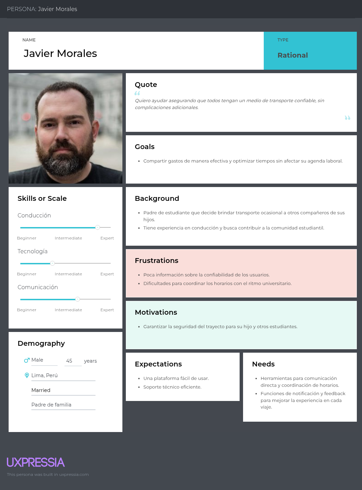

# Capítulo I: Introducción

## 1.1. Startup Profile

En esta sección se describen los detalles del problema que buscamos resolver. Se detalla el perfil de la startup, el mercado objetivo, y se presentan la misión y visión. Asimismo, se expone una visión atractiva del equipo, resaltando su potencial en función de las habilidades y capacidades de cada integrante.

### 1.1.1. Descripción de la Startup

TinkuyTech es una startup tecnológica dedicada a mejorar la seguridad de transporte de los estudiantes en Perú. Nuestra empresa ofrece un nuevo producto llamado ÑanGo, una aplicación web diseñada específicamente para los estudiantes. ÑanGo conecta a estudiantes que cuentan con movilidad propia con aquellos que buscan transporte para ir a la universidad. Los usuarios pueden coordinar rutas, compartir gastos y optimizar su tiempo de desplazamiento, contribuyendo así al bienestar y la eficiencia del viaje.

Para ello, desarrollaremos una plataforma interactiva que permitirá a los estudiantes visualizar y coordinar rutas compartidas hacia la universidad, organizar horarios, optimizar los costos de transporte y consultar los perfiles de los choferes y pasajeros, ofreciendo así una alternativa más segura. Esto hace que la aplicación sea aún más viable y útil para los estudiantes.

Este producto está diseñado principalmente para estudiantes (choferes o pasajeros) y familiares de los estudiantes (choferes), quienes priorizan la seguridad y buscan una alternativa de transporte más práctica para su vida diaria.

**Misión**

Nuestra misión es transformar la forma en que los estudiantes se movilizan en Perú, brindándoles una solución tecnológica que les permita acceder a un sistema de transporte compartido, seguro, accesible y solidario. Buscamos promover la seguridad estudiantil y contribuir a un futuro más seguro, conectado y sostenible.

**Visión**

Nuestra visión es posicionarnos como una startup líder en seguridad de transporte para universidades en Perú. Aspiramos a construir y promover un entorno donde los estudiantes puedan acceder fácilmente a una movilidad segura, eficiente, confiable y colaborativa.

### 1.1.2. Perfiles de integrantes del equipo

Código de Alumno: U20221G068

Descripción:
Soy estudiante de Ingeniería de Software y actualmente curso el 5to ciclo. Considero que tengo buen dominio en la elaboración de diagramas en C++. Los lenguajes que sé es C++, SQL, CSS, HTML y Javascript. En mi tiempo libre me gusta tocar ukelele, leer libros, resolver sudoku, escuchar música y ver series. Mi compromiso radica en ser responsable con las tareas asignadas, y mis habilidades incluyen la creatividad, el trabajo en equipo, la empatía y la responsabilidad.

## 1.2. Solution Profile

En esta sección se describe el perfil de la solución teniendo en cuenta el problema y las ideas que se debe resolver para fomentar la seguridad de los estudiantes.

### 1.2.1 Antecedentes y problemática

En los últimos años, la inseguridad en el transporte ha aumentado significativamente en el Perú, afectando tanto a conductores como a pasajeros. Este problema se intensifica en el caso de los estudiantes, quienes muchas veces son víctimas de robos y asaltos, especialmente en zonas cercanas a sus centros de estudio. Además, la extorsión a transportistas por el cobro de "cupos" limita la disponibilidad de servicios seguros, generando temor y restringiendo la libertad de movilización.

Ante esta situación, surge la necesidad de una solución tecnológica que permita a los estudiantes movilizarse con mayor seguridad. Es en este contexto que se propone ÑanGo, una plataforma de transporte compartido enfocada exclusivamente en la comunidad estudiantil. Esta solución facilita que los estudiantes que cuentan con movilidad propia puedan compartir sus rutas con otros compañeros, optimizando costos, mayor tranquilidad en los desplazamientos y minimizando los riesgos de seguridad por las medidas de protección integradas.

Para analizar la problemática, se utilizó la técnica de las 5 "W" y 2 "H":

**WHAT**

**¿Cuál es el problema?**

Los servicios de transporte actuales en el Perú presentan serias deficiencias relacionadas con la inseguridad ciudadana. Los constantes actos delictivos, como robos, asaltos y extorsiones a conductores, exponen a los estudiantes a situaciones de riesgo. Esto ha generado desconfianza y una necesidad urgente de contar con un servicio de transporte confiable, accesible y seguro.

**¿Cuál es la relación con la persona en cuestión?**

Este problema afecta directamente a los estudiantes, quienes buscan llegar a sus destinos académicos de manera segura y asequible. La falta de opciones seguras y económicas genera estrés, miedo y limita su libertad de movilidad.

**WHEN**

**¿Cuándo sucede el problema?**

El problema surge diariamente en las calles de Lima, especialmente en horarios de entrada y salida de universidades. Durante estos momentos, las rutas cercanas a los centros educativos se convierten en puntos críticos por la presencia de delincuentes que buscan aprovechar el tráfico.

**¿Cuándo utiliza el cliente el producto?**

Los usuarios usarán la plataforma de ÑanGo antes de las clases, para programar y coordinar viajes compartidos con otros estudiantes. De esta manera, se reducirá los tiempos de espera y optimizando la movilidad diaria.

**WHERE**

**¿Dónde está el cliente cuando usa el producto?**

Los usuarios podrán acceder a ÑanGo desde sus casas, centros de estudio o cualquier otro lugar con acceso a internet. Esto les permitirá reservar un auto y coordinar el recojo en puntos específicos y planificar su ruta junto a otros estudiantes verificados.

**¿A dónde se dirige?**

Los usuarios pueden utilizar ÑanGo para planificar rutas hacia la universidad, coordinar horarios y puntos de encuentro, optimizar el tiempo de viaje, verificar los perfiles de conductores y pasajeros, compartir los costos del transporte con otros estudiantes de su misma universidad y aprovechar mejor el uso del vehículo.

**¿Dónde surge el problema?**

El problema se presenta en calles y avenidas de Lima y otras ciudades universitarias, donde el transporte informal, falsos taxistas, la congestión y la delincuencia generan un entorno poco seguro para los jóvenes estudiantes.

**WHO**

**¿Quiénes están involucrados?**

Los principales involucrados son los estudiantes universitarios, quienes pueden participar tanto como pasajeros como conductores. Buscan movilizarse de forma segura, ofreciendo sus vehículos para compartir viajes y reducir costos. Además, están involucrados los familiares de los estudiantes, quienes también pueden participar como choferes para brindar transporte ocasional a los compañeros de sus hijos o familiares. Esto podría fomentar el uso de esta herramienta como una solución para mejorar la movilidad y seguridad de la comunidad estudiantil.

**¿A quiénes le sucede el problema?**

El problema le sucede directamente a los estudiantes universitarios, principalmente aquellos que deben trasladarse desde zonas lejanas o vulnerables, y que dependen del transporte público para llegar a sus universidades.

**¿Quién lo utilizará?**

Lo utilizará los estudiantes registrados que deseen compartir viajes con compañeros de confianza. También podrán usarlo aquellos que tengan vehículo propio (como estudiantes o familiar del estudiante) y deseen reducir sus gastos ofreciendo rutas seguras a otros estudiantes.

**WHY**

**¿Cuál es la causa del problema?**

La causa principal es la falta de un sistema de transporte seguro, regulado y confiable para los estudiantes universitarios. La informalidad del servicio de taxis, la escasa presencia policial en zonas clave, y la falta de tecnología para coordinar viajes seguros agravan esta situación. Además, los costos elevados de movilidad individual hacen que muchos opten por opciones más económicas pero menos seguras.

**HOW**

**¿En qué condiciones los clientes usan nuestro producto?**

Los estudiantes utilizan ÑanGo principalmente en condiciones de alta demanda de transporte, como horas punta, zonas alejadas, o lugares con alto índice delictivo. Usan la aplicación para coordinar de manera segura sus rutas, ahorrar dinero al compartir gastos y tener la tranquilidad de movilizarse con otros estudiantes verificados.

**¿Cómo nos conocieron los compradores?**

Los usuarios pueden conocer ÑanGo a través de campañas de concientización en redes sociales y mediante recomendaciones de boca a boca (Word of Mout) entre estudiantes.

**¿Cómo prefieren los lectores acceder a nuestro contenido?**

Los estudiantes prefieren acceder a nuestro contenido de manera digital, desde la aplicación página web. Ya que valoran las notificaciones instantáneas, la coordinacion sobre las rutas y gastos compartidas y perfiles verificados.

**¿Qué llevó a la persona a llegar a esta situación?**

La persona llegó a esta situación debido al aumento de la delincuencia y los altos costos del transporte privado. Esta necesidad de sentirse protegidos, moverse sin temor, y no gastar excesivamente llevó a los estudiantes a buscar una solución como ÑanGo, que responde tanto a la seguridad como a la economía.

**HOW MUCH**

Incluir estadísticas que sustenten la problemática

Con el objetivo de sustentar la necesidad de implementar una solución de movilidad compartida más segura, se consultaron las estadísticas proporcionadas por la Policía Nacional del Perú y el Ministerio del Interior. A través de gráficos, se muestran los altos índices de robos de vehículos en Lima Metropolitana, lo que resalta la urgencia de tomar medidas preventivas.

**Figura 1:** Robo de vehículos según SIDPOL

**\*Nota:** Gráfico N.º 1.2. Comparativo de delitos relacionados con la seguridad pública según SIDPOL 2024.\*
**Fuente:** Instituto Nacional de Estadística e Informática (2024)

Según la Policía Nacional del Perú - Sistema de Denuncias Policiales-SIDPOL (como se cita en Instituto Nacional de Estadística e Informática, 2024), nos presenta un cuadro comparativo donde uno de los delitos genéricos más evidenciados en el Perú corresponde a la seguridad pública. Esto significa que dicho sector es uno de los más vulnerables, debido al elevado número de denuncias registradas por la comisión de este tipo de delitos.

**Figura 2:** Robo de vehículos en Lima Metropolitana

**\*Nota:** Gráfico N.º 1.5. Estadísticas del robo de vehículos en Lima Metropolitana durante el 2020, 2021, 2022, 2023 y 2024.\*
**Fuente:** Instituto Nacional de Estadística e Informática(2024)

Según la Policía Nacional del Perú (como se cita en Instituto Nacional de Estadística e Informática, 2024), en el trimestre abril-junio del 2024 se registraron 1,816 denuncias por robo de vehículos en Lima Metropolitana, lo cual representa el 25,6 % del total nacional. Esta cifra equivale a aproximadamente 20 vehículos robados por día en esta ciudad, siendo los distritos más afectados Villa El Salvador (224 denuncias), San Juan de Lurigancho (190) y Carabayllo (152).

El incremento de los robos de vehículos en Lima Metropolitana, evidenciado por las estadísticas de la Policía Nacional del Perú y el Ministerio del Interior, subraya la urgente necesidad de soluciones de movilidad más seguras. En este contexto, el proyecto Ñanjo ofrece una alternativa valiosa para los universitarios, permitiendo compartir transporte de manera eficiente y segura. Al promover una red de movilidad compartida entre estudiantes, se podría reducir la exposición a riesgos asociados con el uso individual de vehículos, contribuyendo así a la disminución de robos y mejorando la seguridad en los desplazamientos urbanos.

### 1.2.2 Lean UX Process.

La metodología Lean UX se enfoca en el usuario y en la validación constante de soluciones frente a una problemática. Tras identificar la necesidad, consideramos adecuado aplicar esta metodología para diseñar una solución que sea relevante y efectiva.

#### 1.2.2.1. Lean UX Problem Statements

En el Perú, la inseguridad ciudadana es una problemática creciente que afecta gravemente al sistema de transporte, especialmente en zonas urbanas como Lima. Esta situación representa un riesgo constante para los estudiantes, quienes se ven expuestos a robos, asaltos y extorsiones al utilizar medios de transporte público o informal.

Hemos identificado que uno de los principales desafíos que enfrentan los estudiantes es la falta de un sistema de transporte seguro, confiable y accesible, que además permita compartir gastos y rutas con personas de confianza. Esta carencia genera temor, estrés e incertidumbre, afectando su calidad de vida y su rendimiento académico.

La ausencia de soluciones de movilidad seguras y comunitarias conlleva a que los estudiantes opten por alternativas riesgosas o costosas, incrementando su exposición a la delincuencia y reduciendo sus posibilidades de movilizarse con libertad.

¿Cómo podríamos diseñar una solución que les brinde a los estudiantes una forma de transporte segura, económica y compartida, utilizando tecnología para conectar a compañeros verificados y optimizar sus rutas diarias, promoviendo así la confianza y la protección en sus desplazamientos?

#### 1.2.2.2. Lean UX Assumptions

**Business Assumptions**

1. Creemos que nuestros clientes necesitan una aplicación que les permita movilizarse de forma segura, confiable y económica, compartiendo viajes con otros estudiantes verificados.

2. Esta necesidad puede cubrir mediante una aplicación que integre validación de usuarios, rutas seguras, y un sistema de reparto de gastos entre pasajeros.

3. El valor más importante que se espera de nuestro servicio es la seguridad durante los traslados, seguida de la accesibilidad económica y confianza entre usuarios.

4. Planeamos adquirir la mayoría de nuestros usuarios mediante campañas en redes sociales y eventos académicos.

5. Nuestra competencia directa son los servicios de taxi tradicionales y aplicaciones de movilidad, pero estas no garantizan seguridad ni conexión exclusiva entre estudiantes.

6. Superaremos a la competencia ofreciendo una comunidad cerrada de usuarios verificados, opciones de viaje compartido y evaluación de rutas seguras.

7. El mayor riesgo de nuestro producto es la desconfianza inicial en el uso compartido del transporte con desconocidos.

8. Este riesgo será mitigado mediante perfiles verificados, calificaciones por viaje y soporte de emergencia en la aplicación.

9. La confianza en la plataforma aumentará con el tiempo gracias a la validación de usuarios y experiencias positivas.

10. La satisfacción del cliente también se podrá mejorar mediante la integración de un sistema de soporte.

**User Assumptions**

**1. ¿Quién es el usuario?**

Estudiantes universitarios(como pasajeros o conductores) que necesitan trasladarse hacia sus instituciones educativas de forma segura y económica, así como familiares de los estudiantes que desean compartir su auto para trasladar ocasionalmente a los compañeros de sus hijos.

**2. ¿Dónde encaja nuestro producto en su vida?**

En su rutina diaria, cuando deben movilizarse a las clases universitarias, especialmente en horarios de alto riesgo.

**3. ¿Qué problemas tiene nuestro producto y cómo se pueden resolver?**

Al tratarse de un nuevo sistema, los usuarios podrían tener dudas sobre la seguridad y confiabilidad del servicio. Para resolverlo, se harán campañas informativas, se promoverán testimonios, y se establecerán protocolos de seguridad visibles desde el primer uso.

**4. ¿Cuándo y cómo es usado nuestro producto?**

ÑanGo será utilizado antes de clases para coordinar viajes, compartir rutas y gastos. La aplicación web permitirá programar viajes con antelación y coordinar trayectos similares con compañeros.

**5. ¿Qué características son importantes?**

Verificación de identidad, calificación de usuarios, sistema de pago compartido, coordinar horarios de viajes y rutas seguras, y registro de detalle del trayecto.

**6. ¿Cómo debe verse nuestro producto y cómo debe comportarse?**

Debe tener una interfaz juvenil, amigable y confiable, con diseño intuitivo, colores fríos y botones de acción rápida. Debe responder con fluidez y ofrecer información clara sobre seguridad y confiabilidad del viaje.

**Features**

- Visualización de rutas y horarios disponibles para facilitar la planificación de los viajes.

- Notificaciones instantáneas sobre llegada, cancelaciones o cambios.

- Sistema de verificación.

- Administración eficiente de vehículos.

- Chat interno entre usuarios verificados para coordinar viajes.

- Calificaciones y comentarios entre pasajeros y conductores.

- Historial de viajes y registro de gastos compartidos.

- Soporte técnico constante y actualizaciones de sistema para mejorar el rendimiento y la seguridad.

#### 1.2.2.3. Lean UX Hypothesis Statements

- Creemos que los estudiantes podrán optimizar su tiempo y reducir costos de transporte si se implementa una funcionalidad que les permita coordinar viajes en grupo hacia la universidad a través de una plataforma que les conecte con otros estudiantes de su misma universidad. Sabremos que hemos tenido éxito cuando el 30% de los estudiantes utilicen regularmente la plataforma para coordinar viajes y que el 25% reporte una disminución en sus gastos de transporte mensual.

- Creemos que los estudiantes reducirán su huella de carbono y contribuirán a la sostenibilidad si proporcionamos una opción fácil de coordinar viajes en vehículos compartidos, disminuyendo el número de autos individuales en las rutas comunes hacia las universidades. Sabremos que hemos tenido éxito cuando el 20% de los estudiantes reporten que han preferido la opción de compartir vehículo por encima de usar transporte público o privado.

- Creemos que los estudiantes podrán mejorar la accesibilidad y seguridad en sus traslados si ofrecemos un sistema de calificación y seguimiento de viajes compartidos, lo que proporcionará mayor confianza y control. Sabremos que hemos tenido éxito cuando al menos el 15% de los usuarios reporten mayor confianza y comodidad al utilizar la plataforma, y que el 20% mencionen que el sistema de calificación ha mejorado su experiencia de viaje.

#### 1.2.2.4. Lean UX Canvas

**1.Problema de negocios:**

En las ciudades universitarias, los estudiantes enfrentan altos costos de transporte, congestión vehicular y preocupaciones por la sostenibilidad. Actualmente, no existe una solución eficiente y accesible para coordinar viajes compartidos, lo que genera un impacto negativo en los presupuestos de los estudiantes y en el medio ambiente.

Ñango busca resolver esta problemática ofreciendo una plataforma para que los estudiantes puedan compartir viajes de manera segura y económica.Además, integra a familiares de los estudiantes como posibles conductores, brindando un entorno de mayor confianza y apoyo para la comunidad universitaria.

¿Cómo podemos desarrollar una plataforma que conecte de manera segura y eficiente a estudiantes y familiares que actúan como conductores, con estudiantes que necesitan transporte, permitiendo la planificación y coordinación de viajes, comunicación interna entre usuarios y un sistema de calificaciones que genere confianza en la comunidad?

**2.Resultados comerciales:**

- Reducción en los costos de transporte para los estudiantes.

- Mayor seguridad percibida en los viajes gracias a las funcionalidades de calificación y seguimiento.

- Aumento en la cantidad de viajes compartidos entre estudiantes.

- Posicionamiento de ÑanGo como una alternativa confiable frente a otros medios de transporte.

- Generación de ingresos a través de funciones premium o colaboraciones estratégicas.

**3.Usuarios y Clientes:**

Estudiantes (choferes y pasajeros) y familiares de los estudiantes que buscan una alternativa más económica, segura para llegar a la universidad. Los choferes tienen vehículos disponibles, mientras que los pasajeros buscan reducir sus gastos de transporte.

**4.Beneficios del usuario:**

Estudiantes (choferes y pasajeros):

- Ahorro económico al compartir los gastos del transporte.

- Conexión rápida y segura con compañeros de universidad para organizar viajes.

- Optimización del tiempo de desplazamiento mediante rutas eficientes.

- Mayor seguridad al viajar con estudiantes verificados.

Familiares (choferes):

- Posibilidad de movilizarse junto a sus hijos o con estudiantes verificados.

- Ahorro en combustible al compartir gastos del viaje con los pasajeros.

- Tranquilidad al tener un historial de viajes y calificaciones que refuerzan la confianza con los pasajeros.

- Confianza en un sistema diseñado para la seguridad y bienestar estudiantil.

**5.Soluciones:**

Desarrollo de una plataforma web: Con opciones para que los estudiantes encuentren compañeros de viaje, tanto choferes como pasajeros, la capacidad de compartir sus rutas y horarios disponibles.

Sistema de calificación y comentarios: Permitir a los estudiantes calificar a otros usuarios (choferes y pasajeros) para garantizar la confianza en la plataforma.

Notificaciones y seguimiento: Implementar un sistema de notificaciones que permitan a los conductores ver los viajes programados y los detalles del trayecto.

**6.Hipótesis:**

Creemos que los estudiantes que son choferes utilizarán la plataforma si proporciona una forma fácil y confiable de coordinar viajes y compartir gastos de manera segura. Sabremos que hemos tenido éxito cuando al menos el 30% de los choferes se registren y utilicen la plataforma regularmente.

Creemos que los estudiantes que son pasajeros utilizarán la plataforma si les permite encontrar choferes de confianza, recibir un trato adecuado como pasajeros y compartir gastos de manera segura. Sabremos que hemos tenido éxito cuando al menos el 30% de los pasajeros se registren y utilicen la plataforma regularmente para coordinar sus viajes.

Creemos que los familiares estarán más tranquilos si pueden acceder a los detalles de los viajes, como las rutas y horarios de los trayectos de los estudiantes. Sabremos que hemos tenido éxito cuando al menos el 15% de los familiares que son choferes utilicen la plataforma para gestionar los viajes y conocer los detalles de las rutas.

**7.¿Qué es lo más importante que necesitamos aprender primero?**

Zonas de alta demanda de transporte: Conocer las áreas con mayor necesidad de transporte estudiantil nos ayudará a priorizar rutas y recursos, garantizando un servicio eficiente.

Necesidades específicas de los estudiantes y familias: Identificar las principales preocupaciones de los estudiantes (choferes y pasajeros) y sus familias, como seguridad, puntualidad o comodidad, permitirá ajustar los servicios a sus expectativas.

Patrones de uso del transporte: Estudiar cuándo y cómo los estudiantes utilizan el transporte permitirá crear horarios y rutas eficientes que satisfagan las necesidades de los usuarios.

Interacción entre estudiantes y choferes: Entender cómo los estudiantes interactúan con los choferes y qué expectativas tienen sobre esta relación, ayudará a mejorar la experiencia durante el viaje.

Seguridad y medidas preventivas: Identificar las medidas de seguridad necesarias tanto en el vehículo como en la plataforma de gestión del transporte, asegurando que se cumplan los estándares para proteger a los estudiantes y sus familias.

**8.¿Cuál es la menor cantidad de trabajo que necesitamos para hacer lo siguiente más importante?**

Encuestas y entrevistas iniciales: Realizar encuestas breves a estudiantes y familiares para obtener información sobre sus preocupaciones principales respecto al transporte, sin necesidad de un estudio extenso al principio.

Análisis de seguridad básica: Investigar brevemente las principales preocupaciones de seguridad en el transporte estudiantil, enfocándose en los aspectos más críticos como la puntualidad y el estado de los vehículos.

Análisis competitivo: Examinar rápidamente las plataformas o aplicaciones existentes para transporte escolar y aprender de sus características clave, sin realizar un análisis exhaustivo de cada una.

## 1.3. Segmentos Objetivo

**Segmento 1: Estudiantes con vehículo**

Características Demográficas:

Edad: Igual y mayor de 18 años

Nacionalidad: Peruana

Ubicación: Áreas urbanas

Nivel educativo: Estudiantes universitarios

Intereses: Opciones de estacionamiento seguro, eficiencia en el uso del vehículo, comodidad y ahorro en transporte.

Características Psicográficas:

Estudiantes que poseen un vehículo y están dispuestos a compartirlo para reducir los costos de transporte.

Buscan formas de generar ingresos adicionales o reducir los gastos de combustible.

Valoran las ventajas de compartir viajes con otros estudiantes y la posibilidad de crear una comunidad dentro de la universidad.

**Segmento 2: Estudiantes sin vehículo**

Características Demográficas:

Edad: Igual y mayor a 16 años

Nacionalidad: Peruana

Ubicación: Áreas urbanas

Nivel educativo: Principalmente estudiantes de las universidades

Intereses: Transporte accesible, puntualidad, comodidad, seguridad.

Características Psicográficas:

Estudiantes que no tienen vehículo propio o que desean reducir los costos de transporte.

Buscan opciones de transporte más económicas y convenientes.

Valoran la accesibilidad a servicios que les permitan coordinar viajes fácilmente y sin complicaciones.

**Segmento 3: Familiares de los estudiantes con vehiculo**

Características Demográficas:

Edad: 18-50 años

Nacionalidad: Peruana

Ubicación: Áreas urbanas

Nivel educativo: Desde educación universitaria

Intereses: Seguridad de los estudiantes, transporte eficiente y cómodo para los hijos, registro de rutas.

Características Psicográficas:

Buscan garantizar la seguridad de los estudiantes durante sus traslados.

Valoran la posibilidad de ser choferes responsables y brindar un servicio seguro a los estudiantes.

Están interesados en tener una forma fácil de coordinar y realizar las rutas para los estudiantes.

# Requirements Elicitation & Analysis

## Competidores

### Analisis Competitivo

<table>
<tbody><tr><th colspan="7" valign="top"><b>Competitive Analysis Landscape</b></th></tr><tr><td colspan="2" rowspan="2">¿Por qué llevar a cabo este análisis?</td><td colspan="5">Escriba en el recuadro la pregunta que busca responder o el objetivo de este análisis.</td></tr><tr><td colspan="5">Para poder comprender mejor el panorama competitivo en el mercado de servicios de transporte para alumnos en Lima, Perú. Identificando fortalezas, debilidades, oportunidades y amenazas de mi startup y sus competidores.</td></tr><tr><td colspan="3">Nuestro Producto / Competidores</td><td colspan="1" valign="top" style="font-weight: bold;">ÑanGo </td><td colspan="1" valign="top" style="font-weight: bold;">GoLadies </td><td colspan="1" valign="top" style="font-weight: bold;">Hoop carpool </td><td colspan="1" valign="top" style="font-weight: bold;">BlaBlaCar </td></tr><tr><td colspan="1" rowspan="2">Perfil</td><td colspan="2">Overview</td><td colspan="1" valign="top"> Aplicación web diseñada específicamente para los estudiantes. ÑanGo conecta a estudiantes que cuentan con movilidad propia con aquellos que buscan transporte para ir a la universidad.</td><td colspan="1" valign="top">Go Ladies Perú se dedica a realizar traslados exclusivos a mujeres, niños, personas con discapacidad certificada y adultos mayores con identificación.</td><td colspan="1" valign="top">Hoop Carpool es una empresa de carpooling para empresas. Ofrece a tus empleados y alumnos la opcion de compartir el coche en su dia a dia.</td><td colspan="1" valign="top">BlaBlaCar es una comunidad de usuarios basada en la confianza que conecta a conductores con asientos vacíos y pasajeros que se dirigen a un mismo lugar, para que viajen juntos y compartan el costo.</td></tr><tr><td colspan="2">Ventaja competitiva</td><td colspan="1" valign="top">Movilizacion de forma segura, confiable y económica ademas de compartir viajes solo con estudiantes verificados.</td><td colspan="1" valign="top">Transporte exclusivo de mujeres para mujeres, brindando seguridad y confianza en las usuarias. </td><td colspan="1" valign="top">Enfoque mas orientado a empresas como tambien hacer un impacto al tratar de reducir el uso de vehiculos. </td><td colspan="1" valign="top">Brinda viajes a precios bajos , reconociemiento mediante identificaciones y reservas faciles</td></tr><tr><td colspan="1" rowspan="2">Perfil de Marketing</td><td colspan="2">Mercado objetivo</td><td colspan="1" valign="top">Estudiantes de Universidades en todo Lima.</td><td colspan="1" valign="top">Todas las mujeres de Lima. </td><td colspan="1" valign="top">Personal emprasarial. </td><td colspan="1" valign="top">Todo publico en general. </td></tr><tr><td colspan="2">Estrategias de marketing</td><td colspan="1" valign="top">Promoción y publicidad en redes sociales y anuncios</td><td colspan="1" valign="top">Promoción en redes sociales, anuncios y colaboraciones con influenciadores.</td><td colspan="1" valign="top">Publicidad en redes sociales y anuncios.</td><td colspan="1" valign="top">Publicidad en paginas web.</td></tr><tr><td colspan="1" rowspan="3">Perfil de Producto</td><td colspan="2">Productos &amp; Servicios</td><td colspan="1" valign="top">Brinda servicio de transporte a estudiantes , utilizando vehiculos personales.</td><td colspan="1" valign="top">Brinda servicio de transporte de solo mujeres para mujeres . </td><td colspan="1" valign="top">Brinda servicio de transporte compartido a personal empresarial. </td><td colspan="1" valign="top">Brinda viajes en auto personal y bus compartido a todo publico. </td></tr><tr><td colspan="2">Precios &amp; Costos</td><td colspan="1" valign="top">Tarifa sujeta al conductor con previa coordinacion. </td><td colspan="1" valign="top">Tarifas sujeta al trayecto.</td><td colspan="1" valign="top">Tarifa sujeta a contrato</td><td colspan="1" valign="top">Tarifa sujeta al trayecto.</td></tr><tr><td colspan="2">Canales de distribución (Web y/o Móvil)</td><td colspan="1" valign="top">Aplicación web. </td><td colspan="1" valign="top">Sitio web.</td><td colspan="1" valign="top">Aplicación móvil y sitio web.</td><td colspan="1" valign="top">Aplicacion movil y sitio web.</td><tr></tr><td colspan="1" rowspan="5">Análisis SWOT</td></td></tr><tr><td colspan="2">Fortalezas</td><td colspan="1" valign="top">Seguridad y rapidez al brindar servicio de transportes a estudiantes.</td><td colspan="1" valign="top">Servicio de transporte solo para mujeres. </td><td colspan="1" valign="top">Especializado en servicios de tranporte empresarial.</td><td colspan="1" valign="top">Servicio de transporte para todo publico </td></tr><tr><td colspan="2">Debilidades</td><td colspan="1" valign="top">Dependencia de la disponibilidad de los usuarios. </td><td colspan="1" valign="top">Poca disponibilidad en horario nocturno.</td><td colspan="1" valign="top">Abarca solo empresas y costos altos</td><td colspan="1" valign="top">Poca publicidad y costos altos.
</td></tr><tr><td colspan="2">Oportunidades</td><td colspan="1" valign="top">Mejora la seguridad del transporte de los estudiantes. </td><td colspan="1" valign="top">Mejora la seguridad para las mujeres al transportarse en taxi.</td><td colspan="1" valign="top">Reduccion de autos del personal empresarial. </td><td colspan="1" valign="top">Mejora la seguridad y la confianza al tomar un transporte de viaje extenso.</td></tr><tr><td colspan="2">Amenazas</td><td colspan="1" valign="top">Competencia con servicios de taxi en general. </td><td colspan="1" valign="top">Competencia con servicios de taxi en general.</td><td colspan="1" valign="top">Cantidad minima de contratos. </td><td colspan="1" valign="top">Competencia de otros servicios similares.</td></tr></tbody></table>
  

### Estrategia y tacticas frente a competidores

#### Servicio especializado solo para estudiantes

-Testimonios reales de usuarios y conductores.  
-Resaltar que nuestros conductores entienden las rutinas , horarios y necesidades de los estudiantes.

#### Precios accesibles y flexibles

- Ofrecer tarifas mas economicas adaptadas a la economia de los estudiantes.
- Descuento por grupo si comparten el viaje entre varios amigos.
- Descuento por horario (cuando no hay mucho trafico o demanda).

#### Competidores tradicionales

- Mostrar perfiles verificados de los conductores-estudiantes.
- Compartir trayectos en tiempo real con amigos o familiares.
- Encuestas rapidas al final de cada viajes sobre la experiencia.

#### Sustentabilidad y comunidad

- Promover campañas como "Maneja seguro, estudia mejor".
- Incentivar el uso compartido para reducir la huella de carbono.

#### Fidelizacion

- Recompensas para los conductores mejor evaluados.
- Eventos offline con premios.

## Entrevistas

### Diseño de Entrevistas

#### Objetivos

Recoger informacion sobre las necesidades , expectativas y posibles preocupaciones de los estudiantes y familiares que estarian interesados de ofrecer servicios de tranporte (como un taxi compartido).

#### Preguntas

#### Estudiante con vehiculo

##### Datos basicos

- ¿Nombre,Edad y carrera?
- ¿Conduces a la universidad? ¿Con qué frecuencia?

##### Transporte compartido

- ¿Has pensado en llevar a otros estudiantes?
- ¿Te incomodaría compartir tu auto? ¿Por qué?

##### Sobre la app

- ¿Qué funciones te parecen esenciales?
- ¿Qué medidas de seguridad te darían confianza?
- ¿Aceptarías compartir tu ruta o horario?
- ¿Preferirías elegir a los pasajeros o que sea automático?
- ¿Qué tipo de pago prefieres?

##### Cierre

- ¿Probarías la app cuando este disponible?
- ¿Te gustaría participar en futuras pruebas?

#### Estudiante sin vehiculo

##### Datos básicos

- ¿Edad y carrera?
- ¿Cómo llegas a la universidad normalmente?
- ¿Cuánto te toma el trayecto?

##### Interés en el servicio

- ¿Te interesaría usar un servicio de transporte compartido con otros estudiantes?
- ¿Qué te haría sentir más seguro al usarlo?

##### Sobre la app

- ¿Qué funciones te gustaría que tenga?
- ¿Qué tipo de pago preferirías?
- ¿Preferirías elegir al conductor o que sea automático?

##### Cierre

- ¿Probarías la app cuando este disponible?
- ¿Te gustaría participar en futuras encuestas o pruebas?

#### Familiar del estudiante

##### Datos básicos

- ¿Nombre y edad?
- ¿Cuál es tu relación con el estudiante?
- ¿Tienes un vehículo que usas para llevar a tu familiar a la universidad?
- ¿Con qué frecuencia haces ese trayecto?

##### Interés en brindar el servicio

- ¿Estarías dispuesto/a a ofrecer transporte a otros estudiantes usando el carné universitario de tu familiar?
- ¿Qué te motivaría a hacerlo?

##### Sobre la app

- ¿Qué funciones te facilitarían ofrecer este servicio? (Ej. mapas, pagos, contacto directo)
- ¿Qué medidas de seguridad te darían tranquilidad al transportar a estudiantes?
- ¿Preferirías elegir a quién llevar o aceptar asignaciones automáticas?
- ¿Qué tipo de pago preferirías recibir?

##### Posibles preocupaciones

- ¿Qué inquietudes tendrías sobre participar en este sistema?
- ¿Qué se debería hacer para que el sistema sea seguro, legal y práctico?

##### Cierre

- ¿Estarías dispuesto/a a probar esta app como conductor?
- ¿Participarías en pruebas futuras para mejorar la app?

### Registro de Entrevistas

Segmentos objetivos de estudiante con vehículo:

<table border="1">
  <tr>
    <th>Entrevista</th>
    <td>1</td>
    <th>Nombre</th>
    <td>Andres Collazos</td>
  </tr>
  <tr>
    <th>Edad</th>
    <td>20</td>
    <th>Distrito</th>
    <td>La Perla</td>
  </tr>
  <tr>
    <th>Captura de la entrevista: </th>
    <td colspan="3">
        En la entrevista, el estudiante Andres Collazo comenta que conduce moderadamente a la universidad y que estaría dispuesto a llevar a otros estudiantes para obtener un ingreso adicional. No le incomoda compartir su auto, pero recalca la importancia del respeto dentro del vehículo. Respecto a la aplicación web, considera importante consultar los perfiles tanto de choferes como de pasajeros, ya que desea una buena comunicación. Además, sugiere implementar un código de identificación como medida de seguridad. Sobre la ruta, le preocupa que pueda ser vista por terceras personas; sin embargo, no tiene problemas en compartir el horario. También prefiere poder elegir a los pasajeros para asegurar una buena experiencia. Respecto al método de pago, opta por Yape por su practicidad. En conclusión, le parece interesante el servicio que le ofrece Ñango y le gustaría probar la aplicación web y participar en futuras pruebas.
    </td>
  </tr>
  <tr>
    <th>URL de la grabación</th>
    <td colspan="3">
      <a href="https://drive.google.com/file/d/1mZ01IQ44AkLbB81HGdB91WgFqreGUh9a/view?usp=drive_link">
        Ver grabación
      </a>
    </td>
  </tr>
  <tr>
   <th>Timing</th>
    <td colspan="3">
        00:00 - 4:05
    </td>
  </tr>
</table>

Segmentos objetivos de estudiante sin vehículo:

<table border="1">
  <tr>
    <th>Entrevista</th>
    <td>4</td>
    <th>Nombre</th>
    <td>Marllely Arias</td>
  </tr>
  <tr>
    <th>Edad</th>
    <td>22</td>
    <th>Distrito</th>
    <td>Lurigancho Chosica</td>
  </tr>
  <tr>
    <th>Captura de la entrevista: </th>
    <td colspan="3">
     En la entrevista, Marllely Arias comenta que llega a la universidad en transporte público, lo cual le toma entre una hora y veinte minutos (sin tráfico) hasta dos horas (sin tráfico). Le interesaría utilizar un servicio de transporte compartido con otros estudiantes, ya que considera que sería más seguro y que puede compartir la ruta con compañeros de la universidad. Respecto a la aplicación web, considera importante contar con actualización en tiempo real de la ubicación y visualizar la calificación de los conductores. También prefiere poder elegir al conductor para tener mayor confianza. En cuanto al método de pago, opta por Yape y Plin por su practicidad. En conclusión, le resulta atractiva la propuesta del servicio que ofrece Ñango y le gustaría participar en futuras pruebas para compartir su experiencia como estudiante.
    </td>
  </tr>
  <tr>
    <th>URL de la grabación</th>
    <td colspan="3">
      <a href="https://drive.google.com/file/d/1yk4mQYxuR0_7n1OF_ND7Ogh0_6BDjMTv/view?usp=drive_link">
        Ver grabación
      </a>
    </td>
  </tr>
  <tr>
   <th>Timing</th>
    <td colspan="3">
        00:00 - 2:43
    </td>
  </tr>
</table>

Segmentos objetivos de familiar del estudiante:

## Needfinding

### User Persons

#### Estudiante

#### Estudiante conductor

#### Familiar de estudiante

### User Task Matrix

El User Task Matrix identifica las tareas que cada arquetipo debe realizar para alcanzar sus objetivos, sin confundir actividades o funcionalidades específicas de la aplicación. Se consideran la frecuencia y la importancia de cada tarea para cada User Persona.

#### Table

<table border="1" cellspacing="0" cellpadding="5">
<thead>
<tr>
<th rowspan="2">Tarea / Actividad</th>
<th colspan="2">Estudiante-Conductor</th>
<th colspan="2">Estudiante-Pasajero</th>
<th colspan="2">Familiar-Conductor</th>
</tr>
<tr>
<th>Frec.</th>
<th>Importancia</th>
<th>Frec.</th>
<th>Importancia</th>
<th>Frec.</th>
<th>Importancia</th>
</tr>
</thead>
<tbody>
<tr>
<td>Buscar rutas disponibles</td>
<td>Alta</td>
<td>Alta</td>
<td>Alta</td>
<td>Alta</td>
<td>Media</td>
<td>Media</td>
</tr>
<tr>
<td>Publicar disponibilidad de viaje</td>
<td>Alta</td>
<td>Alta</td>
<td>-</td>
<td>-</td>
<td>Alta</td>
<td>Alta</td>
</tr>
<tr>
<td>Coordinar horarios y puntos de encuentro</td>
<td>Alta</td>
<td>Alta</td>
<td>Alta</td>
<td>Alta</td>
<td>Alta</td>
<td>Alta</td>
</tr>
<tr>
<td>Confirmar reserva o viaje</td>
<td>Media</td>
<td>Alta</td>
<td>Alta</td>
<td>Alta</td>
<td>Media</td>
<td>Media</td>
</tr>
<tr>
<td>Revisar y gestionar perfiles/rese&ntilde;as</td>
<td>Media</td>
<td>Alta</td>
<td>Alta</td>
<td>Alta</td>
<td>Alta</td>
<td>Alta</td>
</tr>
<tr>
<td>Compartir detalles del trayecto</td>
<td>Alta</td>
<td>Media</td>
<td>Media</td>
<td>Alta</td>
<td>Media</td>
<td>Meida</td>
</tr>
</tbody>
</table>

### 2.3.3 User Journey Mapping

El User Journey Mapping representa el “viaje” actual (As-Is) de cada User Persona sin contar con la solución propuesta, identificando puntos de dolor y momentos clave.

#### Estudiante pasajero

#### Estudiante conductor

#### Familiar de estudiante

### 2.3.4. Empathy Mapping

#### Estudiante pasajero

#### Estudiante conductor

#### Familiar de estudiante

### 2.3.5. As-is Scenario Mapping

#### Estudiante pasajero

#### Estudiante conductor

#### Familiar de estudiante

## 2.4 Ubiquitous Language

<table border="1" cellspacing="0" cellpadding="8">
  <thead>
    <tr>
      <th>Term (Español)</th>
      <th>Definition (español)</th>
    </tr>
  </thead>
  <tbody>
    <tr>
      <td><strong>Student‑Passenger</strong> (Estudiante‑Pasajero)</td>
      <td>Persona que necesita transporte para llegar a la universidad y busca compartir viaje con un conductor.</td>
    </tr>
    <tr>
      <td><strong>Student‑Driver</strong> (Estudiante‑Conductor)</td>
      <td>Persona con vehículo propio que ofrece asientos disponibles para llevar a otros estudiantes a la universidad.</td>
    </tr>
    <tr>
      <td><strong>Family‑Driver</strong> (Conductor‑Familiar)</td>
      <td>Miembro de la familia del estudiante que extiende la red de confianza ofreciendo su vehículo para transportar al estudiante y a otros compañeros.</td>
    </tr>
    <tr>
      <td><strong>Ride</strong> (Viaje)</td>
      <td>Trayecto completo acordado entre un conductor y uno o varios pasajeros, desde un punto de origen hasta un punto de destino.</td>
    </tr>
    <tr>
      <td><strong>Route</strong> (Ruta)</td>
      <td>Camino predefinido o planificado que recorre el vehículo durante un ride, normalmente optimizado por distancia o tiempo.</td>
    </tr>
    <tr>
      <td><strong>Trip</strong> (Trayecto)</td>
      <td>Segmento individual dentro de un ride, por ejemplo, desde el origen hasta el punto de encuentro o desde allí al destino final.</td>
    </tr>
    <tr>
      <td><strong>Meeting Point</strong> (Punto de Encuentro)</td>
      <td>Lugar acordado donde conductor y pasajero se encuentran para iniciar un trip.</td>
    </tr>
    <tr>
      <td><strong>Reservation</strong> (Reserva)</td>
      <td>Compromiso formal del pasajero de ocupar un asiento en un ride específico, bloqueando su cupo en la ruta.</td>
    </tr>
    <tr>
      <td><strong>Availability</strong> (Disponibilidad)</td>
      <td>Franjas horarias y días en que un driver declara que puede ofrecer asientos para otros usuarios.</td>
    </tr>
    <tr>
      <td><strong>Schedule</strong> (Horario)</td>
      <td>Planificación de fechas y horas de inicio y fin de cada ride o trip.</td>
    </tr>
    <tr>
      <td><strong>Cost‑Sharing</strong> (Compartición de Costos)</td>
      <td>Mecanismo por el cual conductor y pasajeros reparten entre ellos los gastos de combustible y peajes en proporción acordada.</td>
    </tr>
    <tr>
      <td><strong>Payment</strong> (Pago)</td>
      <td>Dinero que el pasajero entrega al conductor o a la plataforma como contraprestación por el servicio de transporte.</td>
    </tr>
    <tr>
      <td><strong>Payment Method</strong> (Método de Pago)</td>
      <td>Forma en que el pasajero elige realizar el payment: tarjeta, billetera electrónica o efectivo.</td>
    </tr>
    <tr>
      <td><strong>Commission</strong> (Comisión)</td>
      <td>Porcentaje o cargo fijo que la plataforma retiene sobre la tarifa del ride como contraprestación por el servicio.</td>
    </tr>
    <tr>
      <td><strong>Cancellation Fee</strong> (Cargo por Cancelación)</td>
      <td>Monto que se cobra al pasajero si cancela el ride después de haberse emparejado con un driver, compensando tiempo y combustible.</td>
    </tr>
    <tr>
      <td><strong>Refund</strong> (Reembolso)</td>
      <td>Devolución total o parcial de la tarifa al pasajero conforme a la política de reembolso establecida.</td>
    </tr>
    <tr>
      <td><strong>Profile</strong> (Perfil)</td>
      <td>Conjunto de atributos (nombre, foto, calificaciones) que describen a un usuario dentro de la plataforma.</td>
    </tr>
    <tr>
      <td><strong>Rating</strong> (Calificación)</td>
      <td>Valor numérico o cualitativo que un usuario asigna a otro tras completar un ride, reflejando satisfacción y confianza.</td>
    </tr>
    <tr>
      <td><strong>Verification</strong> (Verificación)</td>
      <td>Proceso de validar la identidad de un usuario (por ejemplo, mediante documento o selfie) para asegurar que es quien dice ser.</td>
    </tr>
    <tr>
      <td><strong>University</strong> (Universidad)</td>
      <td>Institución académica a la que los usuarios asisten y en cuyos alrededores ocurre la mayoría de los rides.</td>
    </tr>
    <tr>
      <td><strong>Community</strong> (Comunidad)</td>
      <td>Conjunto de estudiantes y familiares que interactúan y organizan rides dentro del ámbito universitario.</td>
    </tr>
  </tbody>
</table>

### 3.1. To-be Scenario Mapping

#### Estudiante pasajero

#### Estudiante conductor

#### Familiar de estudiante

[comment]: <> (USER STORIES EN GENERAL)

### 3.2 User Stories

### Tabla 1 - Registro de nuevas cuentas

| Campo                                 | Detalle                                                                                                                                                                                                                                                                                                                                                                                                                                                                                                                                                                                                                                                        |
| ------------------------------------- | -------------------------------------------------------------------------------------------------------------------------------------------------------------------------------------------------------------------------------------------------------------------------------------------------------------------------------------------------------------------------------------------------------------------------------------------------------------------------------------------------------------------------------------------------------------------------------------------------------------------------------------------------------------- |
| **Épica**                             | Registro de Usuario                                                                                                                                                                                                                                                                                                                                                                                                                                                                                                                                                                                                                                            |
| **ID-HU**                             | US01                                                                                                                                                                                                                                                                                                                                                                                                                                                                                                                                                                                                                                                           |
| **Título HU**                         | Registro de nuevas cuentas                                                                                                                                                                                                                                                                                                                                                                                                                                                                                                                                                                                                                                     |
| **Descripción HU**                    | Como usuario nuevo no registrado, deseo poder crear una cuenta en la aplicación, para acceder a las funcionalidades exclusivas de ÑanGo.                                                                                                                                                                                                                                                                                                                                                                                                                                                                                                                       |
| **Criterios de Aceptación (Gherkin)** | **Scenario 1: Registro con datos válidos** Dado que el usuario no está registrado, Y se encuentra en la pantalla de registro, Cuando completa los campos requeridos con datos válidos Y acepta los términos y condiciones, Entonces el sistema crea la cuenta Y envía un código de verificación al correo o teléfono.  **Scenario 2: Registro con datos inválidos o incompletos** Dado que el usuario está en la pantalla de registro, Cuando deja campos obligatorios vacíos o introduce un correo inválido, Entonces el sistema muestra un mensaje de error Y no permite completar el registro hasta corregir los datos. |

---

### Tabla 2 - Recuperación de contraseña

| Campo                                 | Detalle                                                                                                                                                                                                                                                                                                                                                                                                                                                                                                                                                                                                  |
| ------------------------------------- | -------------------------------------------------------------------------------------------------------------------------------------------------------------------------------------------------------------------------------------------------------------------------------------------------------------------------------------------------------------------------------------------------------------------------------------------------------------------------------------------------------------------------------------------------------------------------------------------------------- |
| **Épica**                             | Recuperación de Cuenta                                                                                                                                                                                                                                                                                                                                                                                                                                                                                                                                                                                   |
| **ID-HU**                             | US02                                                                                                                                                                                                                                                                                                                                                                                                                                                                                                                                                                                                     |
| **Título HU**                         | Recuperación de contraseña                                                                                                                                                                                                                                                                                                                                                                                                                                                                                                                                                                               |
| **Descripción HU**                    | Como usuario que olvidó su contraseña, quiero recuperar el acceso a mi cuenta, para poder seguir usando la app.                                                                                                                                                                                                                                                                                                                                                                                                                                                                                          |
| **Criterios de Aceptación (Gherkin)** | **Scenario 1: Solicitud de recuperación de contraseña** Dado que el usuario no recuerda su contraseña, Y accede a la opción "¿Olvidaste tu contraseña?", Cuando introduce su correo electrónico registrado, Entonces el sistema envía un enlace para restablecer la contraseña.  **Scenario 2: Recuperación con correo no registrado** Dado que el usuario ha olvidado su contraseña, Y accede a la opción "¿Olvidaste tu contraseña?", Cuando introduce un correo no vinculado a ninguna cuenta, Entonces el sistema muestra un mensaje “Este correo no está registrado.” |

---

### Tabla 3 - Inicio de sesión

| Campo                                 | Detalle                                                                                                                                                                                                                                                                                                                                                                                                                                                                                                       |
| ------------------------------------- | ------------------------------------------------------------------------------------------------------------------------------------------------------------------------------------------------------------------------------------------------------------------------------------------------------------------------------------------------------------------------------------------------------------------------------------------------------------------------------------------------------------- |
| **Épica**                             | Autenticación                                                                                                                                                                                                                                                                                                                                                                                                                                                                                                 |
| **ID-HU**                             | US03                                                                                                                                                                                                                                                                                                                                                                                                                                                                                                          |
| **Título HU**                         | Inicio de sesión                                                                                                                                                                                                                                                                                                                                                                                                                                                                                              |
| **Descripción HU**                    | Como usuario registrado, quiero iniciar sesión en la app, para acceder a mis funcionalidades personalizadas.                                                                                                                                                                                                                                                                                                                                                                                                  |
| **Criterios de Aceptación (Gherkin)** | **Scenario 1: Inicio de sesión exitoso** Dado que el usuario está registrado, Y se encuentra en la pantalla de login, Cuando introduce su correo y contraseña válidos, Entonces el sistema lo autentica Y lo redirige a su pantalla principal.  **Scenario 2: Inicio de sesión fallido** Dado que el usuario está en la pantalla de login, Cuando introduce un correo o contraseña incorrectos, Entonces el sistema muestra un mensaje de error Y no permite iniciar sesión. |

---

### Tabla 4 - Cierre de sesión

| Campo                                 | Detalle                                                                                                                                                                                                                                                                                                                                                                                                                                                                                                      |
| ------------------------------------- | ------------------------------------------------------------------------------------------------------------------------------------------------------------------------------------------------------------------------------------------------------------------------------------------------------------------------------------------------------------------------------------------------------------------------------------------------------------------------------------------------------------ |
| **Épica**                             | Autenticación                                                                                                                                                                                                                                                                                                                                                                                                                                                                                                |
| **ID-HU**                             | US04                                                                                                                                                                                                                                                                                                                                                                                                                                                                                                         |
| **Título HU**                         | Cierre de sesión                                                                                                                                                                                                                                                                                                                                                                                                                                                                                             |
| **Descripción HU**                    | Como usuario autenticado, quiero cerrar sesión, para proteger el acceso a mi cuenta.                                                                                                                                                                                                                                                                                                                                                                                                                         |
| **Criterios de Aceptación (Gherkin)** | **Scenario 1: Logout exitoso** Dado que el usuario está autenticado, Cuando selecciona la opción "Cerrar sesión", Entonces el sistema cierra la sesión actual Y redirige al usuario a la pantalla de inicio.  **Scenario 2: Logout fallido por conexión** Dado que el usuario está autenticado, Cuando selecciona la opción "Cerrar sesión" y no hay conexión de red, Entonces el sistema muestra un mensaje de error Y no cierra la sesión hasta que se recupere la conexión. |

---

### Tabla 5 - Edición de perfil

| Campo                                 | Detalle                                                                                                                                                                                                                                                                                                                                                                                                                                                                                                                                                                                                                                        |
| ------------------------------------- | ---------------------------------------------------------------------------------------------------------------------------------------------------------------------------------------------------------------------------------------------------------------------------------------------------------------------------------------------------------------------------------------------------------------------------------------------------------------------------------------------------------------------------------------------------------------------------------------------------------------------------------------------- |
| **Épica**                             | Gestión de Perfil                                                                                                                                                                                                                                                                                                                                                                                                                                                                                                                                                                                                                              |
| **ID-HU**                             | US05                                                                                                                                                                                                                                                                                                                                                                                                                                                                                                                                                                                                                                           |
| **Título HU**                         | Edición de perfil                                                                                                                                                                                                                                                                                                                                                                                                                                                                                                                                                                                                                              |
| **Descripción HU**                    | Como usuario autenticado, quiero poder editar mi perfil, para mantener mi información actualizada.                                                                                                                                                                                                                                                                                                                                                                                                                                                                                                                                             |
| **Criterios de Aceptación (Gherkin)** | **Scenario 1: Edición de campos personales** Dado que el usuario está autenticado, Y accede a la sección "Mi perfil", Cuando modifica los campos de nombre, descripción, o foto de perfil, Y guarda los cambios, Entonces el sistema actualiza su información correctamente.  **Scenario 2: Edición con datos inválidos** Dado que el usuario está autenticado, Y accede a la sección "Mi perfil", Cuando introduce caracteres inválidos en el campo nombre, O intenta subir una imagen no permitida, Entonces el sistema muestra mensajes de validación Y no guarda los cambios hasta que se corrijan. |

---

### Tabla 6 - Chat de comunicación

| Campo                                 | Detalle                                                                                                                                                                                                                                                                                                                                                                                                                                                                                                                                       |
| ------------------------------------- | --------------------------------------------------------------------------------------------------------------------------------------------------------------------------------------------------------------------------------------------------------------------------------------------------------------------------------------------------------------------------------------------------------------------------------------------------------------------------------------------------------------------------------------------- |
| **Épica**                             | Comunicación                                                                                                                                                                                                                                                                                                                                                                                                                                                                                                                                  |
| **ID-HU**                             | US06                                                                                                                                                                                                                                                                                                                                                                                                                                                                                                                                          |
| **Título HU**                         | Chat de comunicación                                                                                                                                                                                                                                                                                                                                                                                                                                                                                                                          |
| **Descripción HU**                    | Como usuario, quiero comunicarme con otros mediante chat, para coordinar viajes y resolver dudas.                                                                                                                                                                                                                                                                                                                                                                                                                                             |
| **Criterios de Aceptación (Gherkin)** | **Scenario 1: Envío de mensaje en chat** Dado que el usuario está en una conversación activa, Cuando escribe un mensaje y pulsa enviar, Entonces el mensaje se muestra en el chat Y es recibido por el otro usuario en tiempo real.  **Scenario 2: Fallo de red al enviar mensaje** Dado que el usuario está en una conversación activa, Y hay un problema de conexión a internet, Cuando intenta enviar un mensaje, Entonces el sistema muestra un mensaje “No se pudo enviar el mensaje. Intenta nuevamente.” |

---

### Tabla 7 - Cambiar contraseña

| Campo                                 | Detalle                                                                                                                                                                                                                                                                                                                                                                                                                                                                                                                                                                                        |
| ------------------------------------- | ---------------------------------------------------------------------------------------------------------------------------------------------------------------------------------------------------------------------------------------------------------------------------------------------------------------------------------------------------------------------------------------------------------------------------------------------------------------------------------------------------------------------------------------------------------------------------------------------- |
| **Épica**                             | Seguridad de Cuenta                                                                                                                                                                                                                                                                                                                                                                                                                                                                                                                                                                            |
| **ID-HU**                             | US07                                                                                                                                                                                                                                                                                                                                                                                                                                                                                                                                                                                           |
| **Título HU**                         | Cambiar contraseña                                                                                                                                                                                                                                                                                                                                                                                                                                                                                                                                                                             |
| **Descripción HU**                    | Como usuario autenticado, quiero cambiar mi contraseña, para reforzar la seguridad de mi cuenta.                                                                                                                                                                                                                                                                                                                                                                                                                                                                                               |
| **Criterios de Aceptación (Gherkin)** | **Scenario 1: Cambio exitoso de contraseña** Dado que el usuario está autenticado, Y accede a "Configuración > Seguridad", Cuando introduce la contraseña actual y una nueva válida, Y hace clic en "Cambiar contraseña", Entonces el sistema actualiza la contraseña Y muestra un mensaje de confirmación.  **Scenario 2: Contraseña actual incorrecta** Dado que el usuario accede a “Configuración > Seguridad”, Cuando introduce una contraseña actual incorrecta, Entonces el sistema muestra un mensaje de error Y no permite cambiar la contraseña. |

---

### Tabla 8 - Aceptar chats

| Campo                                 | Detalle                                                                                                                                                                                                                                                                                                                                                                                                                                                                                                                                             |
| ------------------------------------- | --------------------------------------------------------------------------------------------------------------------------------------------------------------------------------------------------------------------------------------------------------------------------------------------------------------------------------------------------------------------------------------------------------------------------------------------------------------------------------------------------------------------------------------------------- |
| **Épica**                             | Comunicación                                                                                                                                                                                                                                                                                                                                                                                                                                                                                                                                        |
| **ID-HU**                             | US08                                                                                                                                                                                                                                                                                                                                                                                                                                                                                                                                                |
| **Título HU**                         | Aceptar chats                                                                                                                                                                                                                                                                                                                                                                                                                                                                                                                                       |
| **Descripción HU**                    | Como usuario, quiero poder aceptar solicitudes de chat, para poder conversar solo con personas autorizadas.                                                                                                                                                                                                                                                                                                                                                                                                                                         |
| **Criterios de Aceptación (Gherkin)** | **Scenario 1: Aceptación de invitación de chat** Dado que el usuario ha recibido una solicitud de chat, Cuando la acepta desde la sección de notificaciones o chat, Entonces el sistema habilita el canal de comunicación Y ambos usuarios pueden comenzar a conversar.  **Scenario 2: Solicitud de chat expirada** Dado que el usuario intenta aceptar una solicitud de chat, Y esta ha vencido o ha sido cancelada por el otro usuario, Entonces el sistema muestra un mensaje “Esta solicitud ya no está disponible.” |

---

### Tabla 9 - Enviar invitación de chat

| Campo                                 | Detalle                                                                                                                                                                                                                                                                                                                                                                                                                                                                                                                      |
| ------------------------------------- | ---------------------------------------------------------------------------------------------------------------------------------------------------------------------------------------------------------------------------------------------------------------------------------------------------------------------------------------------------------------------------------------------------------------------------------------------------------------------------------------------------------------------------- |
| **Épica**                             | Comunicación                                                                                                                                                                                                                                                                                                                                                                                                                                                                                                                 |
| **ID-HU**                             | US09                                                                                                                                                                                                                                                                                                                                                                                                                                                                                                                         |
| **Título HU**                         | Enviar invitación de chat                                                                                                                                                                                                                                                                                                                                                                                                                                                                                                    |
| **Descripción HU**                    | Como usuario, quiero enviar invitaciones de chat a otros, para iniciar una conversación previa al viaje.                                                                                                                                                                                                                                                                                                                                                                                                                     |
| **Criterios de Aceptación (Gherkin)** | **Scenario 1: Enviar solicitud de chat** Dado que el usuario visualiza otro perfil, Cuando hace clic en "Enviar invitación de chat", Entonces el sistema envía una notificación al otro usuario Y espera su aceptación.  **Scenario 2: Ya se envió una invitación a ese usuario** Dado que el usuario visualiza otro perfil, Y ya envió una solicitud anteriormente, Cuando intenta enviar otra invitación de chat, Entonces el sistema muestra “Ya enviaste una solicitud. Espera respuesta.” |

---

### Tabla 10 - Verificación en dos pasos

| Campo                                 | Detalle                                                                                                                                                                                                                                                                                                                                                                                                                                                                                                                                                                                              |
| ------------------------------------- | ---------------------------------------------------------------------------------------------------------------------------------------------------------------------------------------------------------------------------------------------------------------------------------------------------------------------------------------------------------------------------------------------------------------------------------------------------------------------------------------------------------------------------------------------------------------------------------------------------- |
| **Épica**                             | Seguridad de Cuenta                                                                                                                                                                                                                                                                                                                                                                                                                                                                                                                                                                                  |
| **ID-HU**                             | US10                                                                                                                                                                                                                                                                                                                                                                                                                                                                                                                                                                                                 |
| **Título HU**                         | Verificación en dos pasos                                                                                                                                                                                                                                                                                                                                                                                                                                                                                                                                                                            |
| **Descripción HU**                    | Como usuario registrado, quiero activar la verificación en dos pasos, para aumentar la seguridad de mi cuenta.                                                                                                                                                                                                                                                                                                                                                                                                                                                                                       |
| **Criterios de Aceptación (Gherkin)** | **Scenario 1: Activación de 2FA por SMS** Dado que el usuario accede a configuración de seguridad, Cuando activa la verificación en dos pasos Y registra un número de teléfono válido, Entonces el sistema envía un código de prueba Y activa la función si el código es verificado correctamente.  **Scenario 2: Código de verificación inválido** Dado que el usuario activó la verificación en dos pasos, Y el sistema ha enviado un código por SMS, Cuando introduce un código incorrecto, Entonces el sistema muestra “Código incorrecto. Intenta nuevamente.” |

[comment]: <> (USER STORIES SEGMENTO #1)

### Tabla 11 - Registro y verificación con correo institucional

| Campo                                 | Detalle                                                                                                                                                                                                                                                                                                                                                                                                                                                                                                                                                                                                                          |
| ------------------------------------- | -------------------------------------------------------------------------------------------------------------------------------------------------------------------------------------------------------------------------------------------------------------------------------------------------------------------------------------------------------------------------------------------------------------------------------------------------------------------------------------------------------------------------------------------------------------------------------------------------------------------------------- |
| **Épica**                             | Registro y Verificación                                                                                                                                                                                                                                                                                                                                                                                                                                                                                                                                                                                                          |
| **ID-HU**                             | US01                                                                                                                                                                                                                                                                                                                                                                                                                                                                                                                                                                                                                             |
| **Título HU**                         | Registro y verificación con correo institucional                                                                                                                                                                                                                                                                                                                                                                                                                                                                                                                                                                                 |
| **Descripción HU**                    | Como estudiante, quiero registrar mi cuenta utilizando mi correo institucional, para tener acceso a las funcionalidades de la aplicación.                                                                                                                                                                                                                                                                                                                                                                                                                                                                                        |
| **Criterios de Aceptación (Gherkin)** | **Scenario 1: Registro con correo institucional válido** Dado que el estudiante no está registrado, Y se encuentra en la pantalla de registro, Cuando introduce su correo institucional válido y datos personales, Y acepta los términos y condiciones, Entonces el sistema crea la cuenta Y envía un código de verificación al correo institucional.  **Scenario 2: Registro con correo inválido** Dado que el estudiante está en la pantalla de registro, Cuando introduce un correo no institucional, Entonces el sistema muestra un mensaje de error Y no permite continuar el registro. |

---

### Tabla 12 - Búsqueda de viajes disponibles

| Campo                                 | Detalle                                                                                                                                                                                                                                                                                                                                                                                                                                                                                                                                |
| ------------------------------------- | -------------------------------------------------------------------------------------------------------------------------------------------------------------------------------------------------------------------------------------------------------------------------------------------------------------------------------------------------------------------------------------------------------------------------------------------------------------------------------------------------------------------------------------- |
| **Épica**                             | Búsqueda de Viajes                                                                                                                                                                                                                                                                                                                                                                                                                                                                                                                     |
| **ID-HU**                             | US02                                                                                                                                                                                                                                                                                                                                                                                                                                                                                                                                   |
| **Título HU**                         | Búsqueda de viajes disponibles                                                                                                                                                                                                                                                                                                                                                                                                                                                                                                         |
| **Descripción HU**                    | Como estudiante sin vehículo, quiero buscar viajes disponibles, para poder unirme a ellos.                                                                                                                                                                                                                                                                                                                                                                                                                                             |
| **Criterios de Aceptación (Gherkin)** | **Scenario 1: Búsqueda de viajes según filtro** Dado que el estudiante está en la pantalla de búsqueda, Cuando selecciona filtros como fecha, origen y destino, Entonces el sistema muestra una lista de viajes disponibles que coinciden con los filtros.  **Scenario 2: Sin resultados de búsqueda** Dado que el estudiante está en la pantalla de búsqueda, Cuando no hay viajes disponibles para los filtros seleccionados, Entonces el sistema muestra un mensaje “No se encontraron viajes disponibles.” |

---

### Tabla 13 - Solicitud de unirse a un viaje

| Campo                                 | Detalle                                                                                                                                                                                                                                                                                                                                                                                                                                                                       |
| ------------------------------------- | ----------------------------------------------------------------------------------------------------------------------------------------------------------------------------------------------------------------------------------------------------------------------------------------------------------------------------------------------------------------------------------------------------------------------------------------------------------------------------- |
| **Épica**                             | Solicitud de Viaje                                                                                                                                                                                                                                                                                                                                                                                                                                                            |
| **ID-HU**                             | US03                                                                                                                                                                                                                                                                                                                                                                                                                                                                          |
| **Título HU**                         | Solicitud de unirse a un viaje                                                                                                                                                                                                                                                                                                                                                                                                                                                |
| **Descripción HU**                    | Como estudiante, quiero solicitar unirme a un viaje disponible, para poder participar en el transporte compartido.                                                                                                                                                                                                                                                                                                                                                            |
| **Criterios de Aceptación (Gherkin)** | **Scenario 1: Solicitud de unirse a un viaje disponible** Dado que el estudiante ha encontrado un viaje disponible, Cuando selecciona la opción “Unirse al viaje” Entonces el sistema envía la solicitud al conductor.  **Scenario 2: Solicitud de unirse a un viaje lleno** Dado que el estudiante ha encontrado un viaje, Cuando intenta unirse a un viaje que ya está lleno, Entonces el sistema muestra el mensaje “Este viaje ya está completo.” |

---

### Tabla 14 - Notificaciones en tiempo real

| Campo                                 | Detalle                                                                                                                                                                                                                                                                                                                                                                                                                                                                                                               |
| ------------------------------------- | --------------------------------------------------------------------------------------------------------------------------------------------------------------------------------------------------------------------------------------------------------------------------------------------------------------------------------------------------------------------------------------------------------------------------------------------------------------------------------------------------------------------- |
| **Épica**                             | Comunicación                                                                                                                                                                                                                                                                                                                                                                                                                                                                                                          |
| **ID-HU**                             | US04                                                                                                                                                                                                                                                                                                                                                                                                                                                                                                                  |
| **Título HU**                         | Notificaciones en tiempo real                                                                                                                                                                                                                                                                                                                                                                                                                                                                                         |
| **Descripción HU**                    | Como estudiante, quiero recibir notificaciones en tiempo real sobre el estado de mi solicitud de viaje, para estar informado de cualquier cambio.                                                                                                                                                                                                                                                                                                                                                                     |
| **Criterios de Aceptación (Gherkin)** | **Scenario 1: Notificación de aceptación de solicitud** Dado que el estudiante ha solicitado unirse a un viaje, Cuando el conductor acepta la solicitud, Entonces el sistema envía una notificación al estudiante con la confirmación.  **Scenario 2: Notificación de rechazo de solicitud** Dado que el estudiante ha solicitado unirse a un viaje, Cuando el conductor rechaza la solicitud, Entonces el sistema envía una notificación al estudiante con el mensaje “Solicitud rechazada.” |

---

### Tabla 15 - Sistema de calificación post-viaje

| Campo                                 | Detalle                                                                                                                                                                                                                                                                                                                                                                                                                                                                                                                                                           |
| ------------------------------------- | ----------------------------------------------------------------------------------------------------------------------------------------------------------------------------------------------------------------------------------------------------------------------------------------------------------------------------------------------------------------------------------------------------------------------------------------------------------------------------------------------------------------------------------------------------------------- |
| **Épica**                             | Calificación Post-Viaje                                                                                                                                                                                                                                                                                                                                                                                                                                                                                                                                           |
| **ID-HU**                             | US05                                                                                                                                                                                                                                                                                                                                                                                                                                                                                                                                                              |
| **Título HU**                         | Sistema de calificación post-viaje                                                                                                                                                                                                                                                                                                                                                                                                                                                                                                                                |
| **Descripción HU**                    | Como estudiante, quiero calificar el viaje después de completarlo, para evaluar el servicio y ayudar a mejorar la calidad de los viajes.                                                                                                                                                                                                                                                                                                                                                                                                                          |
| **Criterios de Aceptación (Gherkin)** | **Scenario 1: Calificación exitosa del viaje** Dado que el viaje ha finalizado, Cuando el estudiante accede a la sección de calificación, Y selecciona una calificación y comentarios, Entonces el sistema guarda la calificación y muestra un mensaje de confirmación.  **Scenario 2: Calificación incompleta** Dado que el estudiante ha finalizado el viaje, Cuando intenta calificar sin proporcionar comentarios o calificación, Entonces el sistema muestra un mensaje “Por favor, proporciona una calificación para continuar.” |

---

### Tabla 16 - Chat interno con conductores

| Campo                                 | Detalle                                                                                                                                                                                                                                                                                                                                                                                                                                                                                                                                                |
| ------------------------------------- | ------------------------------------------------------------------------------------------------------------------------------------------------------------------------------------------------------------------------------------------------------------------------------------------------------------------------------------------------------------------------------------------------------------------------------------------------------------------------------------------------------------------------------------------------------ |
| **Épica**                             | Comunicación                                                                                                                                                                                                                                                                                                                                                                                                                                                                                                                                           |
| **ID-HU**                             | US06                                                                                                                                                                                                                                                                                                                                                                                                                                                                                                                                                   |
| **Título HU**                         | Chat interno con conductores                                                                                                                                                                                                                                                                                                                                                                                                                                                                                                                           |
| **Descripción HU**                    | Como estudiante, quiero poder comunicarme con el conductor a través del chat interno una vez que mi solicitud de viaje haya sido aceptada.                                                                                                                                                                                                                                                                                                                                                                                                             |
| **Criterios de Aceptación (Gherkin)** | **Scenario 1: Enviar mensaje al conductor después de aceptación** Dado que el estudiante ha sido aceptado en un viaje, Cuando el estudiante envía un mensaje al conductor, Entonces el mensaje aparece en el chat y es recibido por el conductor en tiempo real.  **Scenario 2: No poder enviar mensaje antes de aceptación** Dado que el estudiante no ha sido aceptado aún, Cuando intenta enviar un mensaje al conductor, Entonces el sistema muestra el mensaje “Esperando aceptación del conductor para iniciar el chat.” |

---

### Tabla 17 - Botón de emergencia durante el viaje

| Campo                                 | Detalle                                                                                                                                                                                                                                                                                                                                                                                                                                                                                                                                              |
| ------------------------------------- | ---------------------------------------------------------------------------------------------------------------------------------------------------------------------------------------------------------------------------------------------------------------------------------------------------------------------------------------------------------------------------------------------------------------------------------------------------------------------------------------------------------------------------------------------------- |
| **Épica**                             | Seguridad                                                                                                                                                                                                                                                                                                                                                                                                                                                                                                                                            |
| **ID-HU**                             | US07                                                                                                                                                                                                                                                                                                                                                                                                                                                                                                                                                 |
| **Título HU**                         | Botón de emergencia durante el viaje                                                                                                                                                                                                                                                                                                                                                                                                                                                                                                                 |
| **Descripción HU**                    | Como estudiante, quiero tener un botón de emergencia para contactar a la policía o enviar un mensaje de emergencia por WhatsApp durante el viaje.                                                                                                                                                                                                                                                                                                                                                                                                    |
| **Criterios de Aceptación (Gherkin)** | **Scenario 1: Activación del botón de emergencia** Dado que el estudiante está en un viaje activo, Cuando presiona el botón de emergencia, Entonces el sistema envía un mensaje a WhatsApp o realiza una llamada de emergencia al número predefinido.  **Scenario 2: Emergencia sin conexión de red** Dado que el estudiante está en un viaje activo, Cuando presiona el botón de emergencia y no hay conexión de red, Entonces el sistema muestra el mensaje “No se puede enviar mensaje de emergencia. Intente más tarde.” |

---

### Tabla 18 - Seguimiento GPS en tiempo real

| Campo                                 | Detalle                                                                                                                                                                                                                                                                                                                                                                                                                                                                                |
| ------------------------------------- | -------------------------------------------------------------------------------------------------------------------------------------------------------------------------------------------------------------------------------------------------------------------------------------------------------------------------------------------------------------------------------------------------------------------------------------------------------------------------------------- |
| **Épica**                             | Seguimiento de Viajes                                                                                                                                                                                                                                                                                                                                                                                                                                                                  |
| **ID-HU**                             | US08                                                                                                                                                                                                                                                                                                                                                                                                                                                                                   |
| **Título HU**                         | Seguimiento GPS en tiempo real                                                                                                                                                                                                                                                                                                                                                                                                                                                         |
| **Descripción HU**                    | Como estudiante, quiero poder ver el viaje en tiempo real a través del GPS, para saber dónde se encuentra el conductor y cuándo llegará.                                                                                                                                                                                                                                                                                                                                               |
| **Criterios de Aceptación (Gherkin)** | **Scenario 1: Visualización del mapa en tiempo real** Dado que el estudiante ha solicitado un viaje, Cuando accede al seguimiento del viaje, Entonces el sistema muestra la ubicación del conductor en tiempo real en el mapa.  **Scenario 2: Sin señal GPS durante el viaje** Dado que el estudiante está en un viaje activo, Cuando el GPS no puede obtener señal, Entonces el sistema muestra el mensaje “No se puede obtener la ubicación en tiempo real.” |

---

### Tabla 19 - Historial de viajes y gastos

| Campo                                 | Detalle                                                                                                                                                                                                                                                                                                                                                                                                                                                                                                                           |
| ------------------------------------- | --------------------------------------------------------------------------------------------------------------------------------------------------------------------------------------------------------------------------------------------------------------------------------------------------------------------------------------------------------------------------------------------------------------------------------------------------------------------------------------------------------------------------------- |
| **Épica**                             | Historial de Viajes                                                                                                                                                                                                                                                                                                                                                                                                                                                                                                               |
| **ID-HU**                             | US09                                                                                                                                                                                                                                                                                                                                                                                                                                                                                                                              |
| **Título HU**                         | Historial de viajes y gastos                                                                                                                                                                                                                                                                                                                                                                                                                                                                                                      |
| **Descripción HU**                    | Como estudiante, quiero consultar el historial de mis viajes y los gastos generados, para llevar un control de mis viajes y pagos.                                                                                                                                                                                                                                                                                                                                                                                                |
| **Criterios de Aceptación (Gherkin)** | **Scenario 1: Ver historial completo de viajes** Dado que el estudiante está en la sección de historial, Cuando selecciona la opción de ver todos los viajes, Entonces el sistema muestra la lista de viajes realizados, con fechas y detalles.  **Scenario 2: Ver historial con filtros de búsqueda** Dado que el estudiante está en la sección de historial, Cuando aplica filtros como fecha o tipo de viaje, Entonces el sistema muestra solo los viajes que coinciden con los criterios de búsqueda. |

---

### Tabla 20 - Planificación de viajes recurrentes

| Campo                                 | Detalle                                                                                                                                                                                                                                                                                                                                                                                                                                                                                                                                                                                                                             |
| ------------------------------------- | ----------------------------------------------------------------------------------------------------------------------------------------------------------------------------------------------------------------------------------------------------------------------------------------------------------------------------------------------------------------------------------------------------------------------------------------------------------------------------------------------------------------------------------------------------------------------------------------------------------------------------------- |
| **Épica**                             | Planificación de Viajes                                                                                                                                                                                                                                                                                                                                                                                                                                                                                                                                                                                                             |
| **ID-HU**                             | US10                                                                                                                                                                                                                                                                                                                                                                                                                                                                                                                                                                                                                                |
| **Título HU**                         | Planificación de viajes recurrentes                                                                                                                                                                                                                                                                                                                                                                                                                                                                                                                                                                                                 |
| **Descripción HU**                    | Como estudiante, quiero poder programar viajes recurrentes, para no tener que buscar cada vez que necesite realizar el mismo trayecto.                                                                                                                                                                                                                                                                                                                                                                                                                                                                                              |
| **Criterios de Aceptación (Gherkin)** | **Scenario 1: Crear un viaje recurrente** Dado que el estudiante está en la pantalla de planificación, Cuando selecciona la opción de planificar un viaje recurrente, Y establece las fechas y parámetros para el viaje, Entonces el sistema guarda el viaje como recurrente y muestra la próxima fecha.  **Scenario 2: No crear viaje recurrente sin fecha válida** Dado que el estudiante está en la pantalla de planificación, Cuando no introduce una fecha válida para el viaje recurrente, Entonces el sistema muestra un mensaje de error “Fecha inválida, por favor ingrese una fecha correcta.” |

[comment]: <> (USER STORIES SEGMENTO #2)

### Tabla 21 - Registro como conductor

| Campo                                 | Detalle                                                                                                                                                                                                                                                                                                                                                                                                                                                                                                                                                                                                                                                                                                                |
| ------------------------------------- | ---------------------------------------------------------------------------------------------------------------------------------------------------------------------------------------------------------------------------------------------------------------------------------------------------------------------------------------------------------------------------------------------------------------------------------------------------------------------------------------------------------------------------------------------------------------------------------------------------------------------------------------------------------------------------------------------------------------------- |
| **Épica**                             | Registro como Conductor                                                                                                                                                                                                                                                                                                                                                                                                                                                                                                                                                                                                                                                                                                |
| **ID-HU**                             | US01                                                                                                                                                                                                                                                                                                                                                                                                                                                                                                                                                                                                                                                                                                                   |
| **Título HU**                         | Registro como conductor                                                                                                                                                                                                                                                                                                                                                                                                                                                                                                                                                                                                                                                                                                |
| **Descripción HU**                    | Como estudiante con vehículo, quiero registrarme como conductor para poder ofrecer viajes a otros estudiantes.                                                                                                                                                                                                                                                                                                                                                                                                                                                                                                                                                                                                         |
| **Criterios de Aceptación (Gherkin)** | **Scenario 1: Registro de conductor con datos válidos** Dado que el estudiante no está registrado como conductor, Y se encuentra en la pantalla de registro como conductor, Cuando introduce sus datos personales, datos del vehículo y licencia de conducir válidos, Y acepta los términos y condiciones, Entonces el sistema crea la cuenta de conductor Y envía un correo de verificación al estudiante.  **Scenario 2: Registro con datos inválidos** Dado que el estudiante está en la pantalla de registro como conductor, Cuando introduce datos del vehículo o licencia inválidos, Entonces el sistema muestra un mensaje de error Y no permite continuar con el registro. |

---

### Tabla 22 - Verificación de licencia de conducir y datos del vehículo

| Campo                                 | Detalle                                                                                                                                                                                                                                                                                                                                                                                                                                                                                                                                                                    |
| ------------------------------------- | -------------------------------------------------------------------------------------------------------------------------------------------------------------------------------------------------------------------------------------------------------------------------------------------------------------------------------------------------------------------------------------------------------------------------------------------------------------------------------------------------------------------------------------------------------------------------- |
| **Épica**                             | Verificación de Datos                                                                                                                                                                                                                                                                                                                                                                                                                                                                                                                                                      |
| **ID-HU**                             | US02                                                                                                                                                                                                                                                                                                                                                                                                                                                                                                                                                                       |
| **Título HU**                         | Verificación de licencia de conducir y datos del vehículo                                                                                                                                                                                                                                                                                                                                                                                                                                                                                                                  |
| **Descripción HU**                    | Como conductor registrado, quiero que mis datos y licencia sean verificados, para asegurarme de que puedo ofrecer viajes de manera legal y segura.                                                                                                                                                                                                                                                                                                                                                                                                                         |
| **Criterios de Aceptación (Gherkin)** | **Scenario 1: Verificación exitosa de licencia y vehículo** Dado que el conductor ha registrado su licencia y datos del vehículo, Cuando el sistema verifica que los datos son válidos, Entonces el sistema confirma la verificación y permite publicar viajes.  **Scenario 2: Verificación fallida de licencia o vehículo** Dado que el conductor ha registrado su licencia y datos del vehículo, Cuando el sistema detecta datos inválidos o incorrectos, Entonces el sistema muestra un mensaje de error Y solicita corrección de los datos. |

---

### Tabla 23 - Publicación de viajes

| Campo                                 | Detalle                                                                                                                                                                                                                                                                                                                                                                                                                                                                                                                                                                                                                       |
| ------------------------------------- | ----------------------------------------------------------------------------------------------------------------------------------------------------------------------------------------------------------------------------------------------------------------------------------------------------------------------------------------------------------------------------------------------------------------------------------------------------------------------------------------------------------------------------------------------------------------------------------------------------------------------------- |
| **Épica**                             | Publicación de Viajes                                                                                                                                                                                                                                                                                                                                                                                                                                                                                                                                                                                                         |
| **ID-HU**                             | US03                                                                                                                                                                                                                                                                                                                                                                                                                                                                                                                                                                                                                          |
| **Título HU**                         | Publicación de viajes                                                                                                                                                                                                                                                                                                                                                                                                                                                                                                                                                                                                         |
| **Descripción HU**                    | Como conductor, quiero poder publicar mis viajes disponibles indicando la ruta, horarios, asientos disponibles y costo por pasajero, para que los estudiantes puedan unirse a ellos.                                                                                                                                                                                                                                                                                                                                                                                                                                          |
| **Criterios de Aceptación (Gherkin)** | **Scenario 1: Publicación de viaje con datos válidos** Dado que el conductor está en la pantalla de publicación de viaje, Cuando introduce la ruta, horario, asientos disponibles y costo por pasajero, Y publica el viaje, Entonces el sistema crea el viaje y lo muestra en la lista de viajes disponibles para los estudiantes.  **Scenario 2: Publicación de viaje con datos inválidos** Dado que el conductor está en la pantalla de publicación de viaje, Cuando introduce datos incompletos o inválidos, Entonces el sistema muestra un mensaje de error Y no permite publicar el viaje. |

---

### Tabla 24 - Gestión de solicitudes

| Campo                                 | Detalle                                                                                                                                                                                                                                                                                                                                                                                                                                                                                                                                                                                                                                                                                                                                                                                                                                                         |
| ------------------------------------- | --------------------------------------------------------------------------------------------------------------------------------------------------------------------------------------------------------------------------------------------------------------------------------------------------------------------------------------------------------------------------------------------------------------------------------------------------------------------------------------------------------------------------------------------------------------------------------------------------------------------------------------------------------------------------------------------------------------------------------------------------------------------------------------------------------------------------------------------------------------- |
| **Épica**                             | Gestión de Solicitudes                                                                                                                                                                                                                                                                                                                                                                                                                                                                                                                                                                                                                                                                                                                                                                                                                                          |
| **ID-HU**                             | US04                                                                                                                                                                                                                                                                                                                                                                                                                                                                                                                                                                                                                                                                                                                                                                                                                                                            |
| **Título HU**                         | Gestión de solicitudes                                                                                                                                                                                                                                                                                                                                                                                                                                                                                                                                                                                                                                                                                                                                                                                                                                          |
| **Descripción HU**                    | Como conductor, quiero poder aceptar o rechazar solicitudes de pasajeros con perfiles verificados, para asegurarme de que los pasajeros sean confiables.                                                                                                                                                                                                                                                                                                                                                                                                                                                                                                                                                                                                                                                                                                        |
| **Criterios de Aceptación (Gherkin)** | **Scenario 1: Aceptar solicitud de pasajero** Dado que el conductor ha recibido una solicitud para unirse a su viaje, Cuando el conductor acepta la solicitud, Entonces el sistema confirma la aceptación al pasajero Y lo agrega a la lista de pasajeros del viaje.  **Scenario 2: Rechazar solicitud de pasajero** Dado que el conductor ha recibido una solicitud para unirse a su viaje, Cuando el conductor rechaza la solicitud, Entonces el sistema notifica al pasajero que la solicitud ha sido rechazada.  **Scenario 3: Solicitud con perfil no verificado** Dado que el conductor ha recibido una solicitud de un pasajero con perfil no verificado, Cuando el conductor revisa el perfil, Entonces el sistema muestra el mensaje “Perfil no verificado” Y el conductor no puede aceptar la solicitud. |

---

### Tabla 25 - Sistema de reputación

| Campo                                 | Detalle                                                                                                                                                                                                                                                                                                                                                                                                                                                                                                                  |
| ------------------------------------- | ------------------------------------------------------------------------------------------------------------------------------------------------------------------------------------------------------------------------------------------------------------------------------------------------------------------------------------------------------------------------------------------------------------------------------------------------------------------------------------------------------------------------ |
| **Épica**                             | Reputación                                                                                                                                                                                                                                                                                                                                                                                                                                                                                                               |
| **ID-HU**                             | US05                                                                                                                                                                                                                                                                                                                                                                                                                                                                                                                     |
| **Título HU**                         | Sistema de reputación                                                                                                                                                                                                                                                                                                                                                                                                                                                                                                    |
| **Descripción HU**                    | Como conductor, quiero ver la calificación promedio y los comentarios de pasajeros previos, para poder evaluar mi desempeño y mejorar el servicio.                                                                                                                                                                                                                                                                                                                                                                       |
| **Criterios de Aceptación (Gherkin)** | **Scenario 1: Visualización de calificación promedio** Dado que el conductor ha completado varios viajes, Cuando accede a la sección de reputación, Entonces el sistema muestra la calificación promedio obtenida en todos los viajes.  **Scenario 2: Visualización de comentarios de pasajeros previos** Dado que el conductor ha completado varios viajes, Cuando accede a la sección de reputación, Entonces el sistema muestra los comentarios de los pasajeros sobre los viajes anteriores. |

---

### Tabla 26 - Chat interno con pasajeros

| Campo                                 | Detalle                                                                                                                                                                                                                                                                                                                                                                                                                                                                                        |
| ------------------------------------- | ---------------------------------------------------------------------------------------------------------------------------------------------------------------------------------------------------------------------------------------------------------------------------------------------------------------------------------------------------------------------------------------------------------------------------------------------------------------------------------------------- |
| **Épica**                             | Comunicación                                                                                                                                                                                                                                                                                                                                                                                                                                                                                   |
| **ID-HU**                             | US06                                                                                                                                                                                                                                                                                                                                                                                                                                                                                           |
| **Título HU**                         | Chat interno con pasajeros                                                                                                                                                                                                                                                                                                                                                                                                                                                                     |
| **Descripción HU**                    | Como conductor, quiero comunicarme con los pasajeros a través del chat interno, para coordinar puntos de encuentro y cambios de última hora.                                                                                                                                                                                                                                                                                                                                                   |
| **Criterios de Aceptación (Gherkin)** | **Scenario 1: Enviar mensaje a un pasajero** Dado que el conductor tiene un pasajero confirmado, Cuando escribe un mensaje en el chat interno, Entonces el mensaje es enviado y recibido por el pasajero en tiempo real.  **Scenario 2: No poder enviar mensaje antes de aceptación** Dado que el pasajero no ha sido aceptado en el viaje, Cuando el conductor intenta enviar un mensaje, Entonces el sistema muestra el mensaje “Esperando aceptación del pasajero.” |

---

### Tabla 27 - Optimización de rutas

| Campo                                 | Detalle                                                                                                                                                                                                                                                                                                                                                                                                                                                                                                                                                         |
| ------------------------------------- | --------------------------------------------------------------------------------------------------------------------------------------------------------------------------------------------------------------------------------------------------------------------------------------------------------------------------------------------------------------------------------------------------------------------------------------------------------------------------------------------------------------------------------------------------------------- |
| **Épica**                             | Optimización de Rutas                                                                                                                                                                                                                                                                                                                                                                                                                                                                                                                                           |
| **ID-HU**                             | US07                                                                                                                                                                                                                                                                                                                                                                                                                                                                                                                                                            |
| **Título HU**                         | Optimización de rutas                                                                                                                                                                                                                                                                                                                                                                                                                                                                                                                                           |
| **Descripción HU**                    | Como conductor, quiero recibir sugerencias de rutas eficientes basadas en las ubicaciones de los pasajeros, para ahorrar tiempo y reducir costos.                                                                                                                                                                                                                                                                                                                                                                                                               |
| **Criterios de Aceptación (Gherkin)** | **Scenario 1: Sugerencia de ruta eficiente** Dado que el conductor ha confirmado los pasajeros en su viaje, Cuando el sistema calcula las ubicaciones de los pasajeros, Entonces el sistema sugiere la ruta más eficiente basada en el tráfico y las ubicaciones de los pasajeros.  **Scenario 2: No sugerir ruta si no hay pasajeros confirmados** Dado que el conductor no tiene pasajeros confirmados, Cuando intenta calcular la ruta, Entonces el sistema muestra el mensaje “No hay pasajeros confirmados para calcular la ruta.” |

---

### Tabla 28 - Seguimiento GPS en tiempo real

| Campo                                 | Detalle                                                                                                                                                                                                                                                                                                                                                                                                                                                     |
| ------------------------------------- | ----------------------------------------------------------------------------------------------------------------------------------------------------------------------------------------------------------------------------------------------------------------------------------------------------------------------------------------------------------------------------------------------------------------------------------------------------------- |
| **Épica**                             | Seguimiento de Viajes                                                                                                                                                                                                                                                                                                                                                                                                                                       |
| **ID-HU**                             | US08                                                                                                                                                                                                                                                                                                                                                                                                                                                        |
| **Título HU**                         | Seguimiento GPS en tiempo real                                                                                                                                                                                                                                                                                                                                                                                                                              |
| **Descripción HU**                    | Como conductor, quiero compartir mi ubicación con los pasajeros en tiempo real, para que puedan ver mi progreso y tiempo estimado de llegada.                                                                                                                                                                                                                                                                                                               |
| **Criterios de Aceptación (Gherkin)** | **Scenario 1: Compartir ubicación en tiempo real** Dado que el conductor está en el viaje, Cuando el conductor accede a la opción de compartir ubicación, Entonces el sistema comparte la ubicación en tiempo real con los pasajeros.  **Scenario 2: Sin señal GPS durante el viaje** Dado que el conductor está en el viaje, Cuando el GPS no tiene señal, Entonces el sistema muestra el mensaje “No se puede obtener ubicación.” |

---

### Tabla 29 - Botón de emergencia

| Campo                                 | Detalle                                                                                                                                                                                                                                                                                                                                                                                                                                                                            |
| ------------------------------------- | ---------------------------------------------------------------------------------------------------------------------------------------------------------------------------------------------------------------------------------------------------------------------------------------------------------------------------------------------------------------------------------------------------------------------------------------------------------------------------------- |
| **Épica**                             | Seguridad                                                                                                                                                                                                                                                                                                                                                                                                                                                                          |
| **ID-HU**                             | US09                                                                                                                                                                                                                                                                                                                                                                                                                                                                               |
| **Título HU**                         | Botón de emergencia                                                                                                                                                                                                                                                                                                                                                                                                                                                                |
| **Descripción HU**                    | Como conductor, quiero un botón de emergencia que avise a las autoridades o a contactos de emergencia en caso de incidente durante el viaje.                                                                                                                                                                                                                                                                                                                                       |
| **Criterios de Aceptación (Gherkin)** | **Scenario 1: Activar botón de emergencia** Dado que el conductor está en el viaje, Cuando el conductor presiona el botón de emergencia, Entonces el sistema envía una alerta a las autoridades y contactos de emergencia.  **Scenario 2: Botón de emergencia sin conexión** Dado que el conductor está en el viaje, Cuando presiona el botón de emergencia sin conexión a internet, Entonces el sistema muestra el mensaje “No se pudo enviar la alerta.” |

---

### Tabla 30 - Cálculo automático de costos compartidos

| Campo                                 | Detalle                                                                                                                                                                                                                                                                                                                                                                                                                                                                                                                        |
| ------------------------------------- | ------------------------------------------------------------------------------------------------------------------------------------------------------------------------------------------------------------------------------------------------------------------------------------------------------------------------------------------------------------------------------------------------------------------------------------------------------------------------------------------------------------------------------ |
| **Épica**                             | Gestión de Costos                                                                                                                                                                                                                                                                                                                                                                                                                                                                                                              |
| **ID-HU**                             | US10                                                                                                                                                                                                                                                                                                                                                                                                                                                                                                                           |
| **Título HU**                         | Cálculo automático de costos compartidos                                                                                                                                                                                                                                                                                                                                                                                                                                                                                       |
| **Descripción HU**                    | Como conductor, quiero que el sistema calcule automáticamente la distribución de gastos (combustible/peajes) entre los pasajeros, para que la repartición de costos sea equitativa.                                                                                                                                                                                                                                                                                                                                            |
| **Criterios de Aceptación (Gherkin)** | **Scenario 1: Cálculo automático de costos** Dado que el conductor tiene pasajeros confirmados, Cuando el conductor inicia el viaje, Entonces el sistema calcula automáticamente los costos compartidos y los muestra a los pasajeros.  **Scenario 2: Error en cálculo de costos** Dado que el conductor tiene pasajeros confirmados, Cuando el sistema no puede calcular los costos debido a un error de conexión, Entonces el sistema muestra el mensaje “Error al calcular los costos compartidos.” |

---

### Tabla 31 - Historial de viajes y ganancias

| Campo                                 | Detalle                                                                                                                                                                                                                                                                                                                                                                                                                                                                                |
| ------------------------------------- | -------------------------------------------------------------------------------------------------------------------------------------------------------------------------------------------------------------------------------------------------------------------------------------------------------------------------------------------------------------------------------------------------------------------------------------------------------------------------------------- |
| **Épica**                             | Historial y Finanzas                                                                                                                                                                                                                                                                                                                                                                                                                                                                   |
| **ID-HU**                             | US11                                                                                                                                                                                                                                                                                                                                                                                                                                                                                   |
| **Título HU**                         | Historial de viajes y ganancias                                                                                                                                                                                                                                                                                                                                                                                                                                                        |
| **Descripción HU**                    | Como conductor, quiero ver el historial de viajes realizados y las ganancias generadas, para llevar un registro de mi actividad.                                                                                                                                                                                                                                                                                                                                                       |
| **Criterios de Aceptación (Gherkin)** | **Scenario 1: Ver historial de viajes** Dado que el conductor ha completado varios viajes, Cuando el conductor accede a la sección de historial de viajes, Entonces el sistema muestra todos los viajes realizados y las ganancias generadas.  **Scenario 2: Sin historial de viajes** Dado que el conductor no ha realizado viajes, Cuando accede a la sección de historial de viajes, Entonces el sistema muestra el mensaje “No tienes viajes registrados.” |

---

### Tabla 32 - Notificaciones de demanda

| Campo                                 | Detalle                                                                                                                                                                                                                                                                                                                                                                                                                                         |
| ------------------------------------- | ----------------------------------------------------------------------------------------------------------------------------------------------------------------------------------------------------------------------------------------------------------------------------------------------------------------------------------------------------------------------------------------------------------------------------------------------- |
| **Épica**                             | Notificaciones                                                                                                                                                                                                                                                                                                                                                                                                                                  |
| **ID-HU**                             | US12                                                                                                                                                                                                                                                                                                                                                                                                                                            |
| **Título HU**                         | Notificaciones de demanda                                                                                                                                                                                                                                                                                                                                                                                                                       |
| **Descripción HU**                    | Como conductor, quiero recibir alertas sobre zonas y horarios con alta demanda de transporte, para poder ajustar mis viajes y atender la necesidad de los estudiantes.                                                                                                                                                                                                                                                                          |
| **Criterios de Aceptación (Gherkin)** | **Scenario 1: Recibir alerta de alta demanda** Dado que el conductor ha indicado disponibilidad en ciertos horarios, Cuando hay alta demanda en esa zona y horario, Entonces el sistema envía una notificación al conductor.  **Scenario 2: No recibir alerta sin disponibilidad** Dado que el conductor no tiene viajes programados, Cuando hay alta demanda en una zona, Entonces el sistema no envía ninguna alerta. |

[comment]: <> (USER STORIES SEGMENTO #3)

### Tabla 33 - Registro dual como conductor y familiar

| Campo                                 | Detalle                                                                                                                                                                                                                                                                                                                                                                                                                                                                                                                                                                                           |
| ------------------------------------- | ------------------------------------------------------------------------------------------------------------------------------------------------------------------------------------------------------------------------------------------------------------------------------------------------------------------------------------------------------------------------------------------------------------------------------------------------------------------------------------------------------------------------------------------------------------------------------------------------- |
| **Épica**                             | Registro Dual                                                                                                                                                                                                                                                                                                                                                                                                                                                                                                                                                                                     |
| **ID-HU**                             | FC01                                                                                                                                                                                                                                                                                                                                                                                                                                                                                                                                                                                              |
| **Título HU**                         | Registro como conductor y vínculo familiar                                                                                                                                                                                                                                                                                                                                                                                                                                                                                                                                                        |
| **Descripción HU**                    | Como familiar conductor, quiero registrarme como conductor y vincular el perfil de mi hijo/a, para poder ofrecer viajes donde él/ella tenga prioridad.                                                                                                                                                                                                                                                                                                                                                                                                                                            |
| **Criterios de Aceptación (Gherkin)** | **Scenario 1: Registro exitoso con vínculo familiar** Dado que el usuario es un familiar, Cuando se registra como conductor e ingresa la información de su licencia, vehículo y el ID del perfil de su hijo/a, Entonces el sistema crea su perfil como conductor Y vincula correctamente al familiar con el estudiante.  **Scenario 2: Registro fallido por datos inválidos** Dado que el familiar está intentando registrarse, Cuando introduce datos inválidos o incompletos, Entonces el sistema muestra un mensaje de error Y no permite completar el registro. |

---

### Tabla 34 - Publicación de viajes con prioridad para su familiar

| Campo                                 | Detalle                                                                                                                                                                                                                                                                                                                                                                                                                                                                                                                                                                              |
| ------------------------------------- | ------------------------------------------------------------------------------------------------------------------------------------------------------------------------------------------------------------------------------------------------------------------------------------------------------------------------------------------------------------------------------------------------------------------------------------------------------------------------------------------------------------------------------------------------------------------------------------ |
| **Épica**                             | Publicación de Viajes con Prioridad                                                                                                                                                                                                                                                                                                                                                                                                                                                                                                                                                  |
| **ID-HU**                             | FC02                                                                                                                                                                                                                                                                                                                                                                                                                                                                                                                                                                                 |
| **Título HU**                         | Publicación de viajes con prioridad para su familiar                                                                                                                                                                                                                                                                                                                                                                                                                                                                                                                                 |
| **Descripción HU**                    | Como familiar conductor, quiero poder ofrecer viajes donde mi hijo/a tenga prioridad, para asegurarme de que siempre tenga un asiento disponible.                                                                                                                                                                                                                                                                                                                                                                                                                                    |
| **Criterios de Aceptación (Gherkin)** | **Scenario 1: Publicación con asiento reservado** Dado que el familiar conductor publica un viaje, Cuando selecciona a su hijo/a como pasajero prioritario, Entonces el sistema reserva automáticamente un asiento Y notifica a su hijo/a sobre el viaje.  **Scenario 2: Publicación sin asiento suficiente** Dado que el familiar conductor intenta publicar un viaje con menos asientos disponibles que los necesarios, Cuando selecciona a su hijo/a como prioridad, Entonces el sistema muestra un mensaje indicando que no hay asientos suficientes. |

---

### Tabla 35 - Seguimiento en tiempo real del familiar

| Campo                                 | Detalle                                                                                                                                                                                                                                                                                                                                                                                                                                              |
| ------------------------------------- | ---------------------------------------------------------------------------------------------------------------------------------------------------------------------------------------------------------------------------------------------------------------------------------------------------------------------------------------------------------------------------------------------------------------------------------------------------- |
| **Épica**                             | Seguimiento Familiar                                                                                                                                                                                                                                                                                                                                                                                                                                 |
| **ID-HU**                             | FC03                                                                                                                                                                                                                                                                                                                                                                                                                                                 |
| **Título HU**                         | Seguimiento en tiempo real del familiar                                                                                                                                                                                                                                                                                                                                                                                                              |
| **Descripción HU**                    | Como familiar conductor, quiero ver la ubicación de mi hijo/a cuando viaja con otro conductor, para tener la tranquilidad de saber dónde está en todo momento.                                                                                                                                                                                                                                                                                       |
| **Criterios de Aceptación (Gherkin)** | **Scenario 1: Ver ubicación en tiempo real** Dado que el hijo/a está en un viaje activo, Cuando el familiar accede a la opción de seguimiento, Entonces el sistema muestra la ubicación del hijo/a en tiempo real.  **Scenario 2: No hay viaje en curso** Dado que el hijo/a no está en un viaje, Cuando el familiar intenta hacer seguimiento, Entonces el sistema muestra el mensaje “No hay viajes activos para mostrar.” |

---

### Tabla 36 - Alertas de seguridad para su familiar

| Campo                                 | Detalle                                                                                                                                                                                                                                                                                                                                                                                                                                                                           |
| ------------------------------------- | --------------------------------------------------------------------------------------------------------------------------------------------------------------------------------------------------------------------------------------------------------------------------------------------------------------------------------------------------------------------------------------------------------------------------------------------------------------------------------- |
| **Épica**                             | Seguridad Familiar                                                                                                                                                                                                                                                                                                                                                                                                                                                                |
| **ID-HU**                             | FC04                                                                                                                                                                                                                                                                                                                                                                                                                                                                              |
| **Título HU**                         | Alertas de seguridad para su familiar                                                                                                                                                                                                                                                                                                                                                                                                                                             |
| **Descripción HU**                    | Como familiar conductor, quiero recibir alertas si mi hijo/a se desvía de la ruta o activa el botón de emergencia, para poder actuar rápidamente.                                                                                                                                                                                                                                                                                                                                 |
| **Criterios de Aceptación (Gherkin)** | **Scenario 1: Alerta por desvío de ruta** Dado que el hijo/a está en un viaje, Cuando el sistema detecta que el conductor se desvía significativamente de la ruta, Entonces el sistema envía una notificación al familiar.  **Scenario 2: Alerta por botón de emergencia** Dado que el hijo/a ha activado el botón de emergencia, Cuando esto sucede, Entonces el sistema envía inmediatamente una alerta al familiar indicando la ubicación y situación. |

---

### Tabla 37 - Calificación bidireccional

| Campo                                 | Detalle                                                                                                                                                                                                                                                                                                                                                                                                                                   |
| ------------------------------------- | ----------------------------------------------------------------------------------------------------------------------------------------------------------------------------------------------------------------------------------------------------------------------------------------------------------------------------------------------------------------------------------------------------------------------------------------- |
| **Épica**                             | Reputación                                                                                                                                                                                                                                                                                                                                                                                                                                |
| **ID-HU**                             | FC05                                                                                                                                                                                                                                                                                                                                                                                                                                      |
| **Título HU**                         | Calificación bidireccional                                                                                                                                                                                                                                                                                                                                                                                                                |
| **Descripción HU**                    | Como familiar conductor, quiero calificar a los pasajeros y que ellos puedan calificarme a mí, para fomentar un ambiente seguro y respetuoso.                                                                                                                                                                                                                                                                                             |
| **Criterios de Aceptación (Gherkin)** | **Scenario 1: Calificar a pasajeros** Dado que el viaje ha finalizado, Cuando el familiar conductor accede a la sección de calificación, Entonces puede dejar una calificación y comentario para cada pasajero.  **Scenario 2: Recibir calificación como conductor** Dado que el viaje ha finalizado, Cuando los pasajeros califican el viaje, Entonces el sistema muestra la calificación al familiar conductor. |

---

### Tabla 38 - Historial combinado

| Campo                                 | Detalle                                                                                                                                                                                                                                                                                                                                                                                                                                                        |
| ------------------------------------- | -------------------------------------------------------------------------------------------------------------------------------------------------------------------------------------------------------------------------------------------------------------------------------------------------------------------------------------------------------------------------------------------------------------------------------------------------------------- |
| **Épica**                             | Historial Compartido                                                                                                                                                                                                                                                                                                                                                                                                                                           |
| **ID-HU**                             | FC06                                                                                                                                                                                                                                                                                                                                                                                                                                                           |
| **Título HU**                         | Historial combinado de viajes                                                                                                                                                                                                                                                                                                                                                                                                                                  |
| **Descripción HU**                    | Como familiar conductor, quiero ver tanto mi historial de conductor como los viajes realizados por mi hijo/a como pasajero, para tener una visión completa de nuestros trayectos.                                                                                                                                                                                                                                                                              |
| **Criterios de Aceptación (Gherkin)** | **Scenario 1: Ver historial personal y familiar** Dado que el familiar está en su perfil, Cuando accede a la sección de historial, Entonces el sistema muestra dos secciones: viajes como conductor y viajes realizados por su hijo/a.  **Scenario 2: Sin historial registrado** Dado que no se han realizado viajes, Cuando accede a la sección de historial, Entonces el sistema muestra el mensaje “No hay viajes registrados aún.” |

---

### Tabla 39 - Chat interno con pasajeros y familiares

| Campo                                 | Detalle                                                                                                                                                                                                                                                                                                                                                                                                                    |
| ------------------------------------- | -------------------------------------------------------------------------------------------------------------------------------------------------------------------------------------------------------------------------------------------------------------------------------------------------------------------------------------------------------------------------------------------------------------------------- |
| **Épica**                             | Comunicación                                                                                                                                                                                                                                                                                                                                                                                                               |
| **ID-HU**                             | FC07                                                                                                                                                                                                                                                                                                                                                                                                                       |
| **Título HU**                         | Chat interno con pasajeros y familiares                                                                                                                                                                                                                                                                                                                                                                                    |
| **Descripción HU**                    | Como familiar conductor, quiero comunicarme con mis pasajeros y con mi hijo/a desde la app, para coordinar detalles del viaje.                                                                                                                                                                                                                                                                                             |
| **Criterios de Aceptación (Gherkin)** | **Scenario 1: Enviar mensaje a pasajero o familiar** Dado que hay un viaje programado, Cuando el familiar conductor accede al chat, Entonces puede enviar mensajes tanto a los pasajeros como a su hijo/a.  **Scenario 2: Respuesta en tiempo real** Dado que se ha enviado un mensaje, Cuando el pasajero o hijo/a responde, Entonces el mensaje se muestra en tiempo real al familiar conductor. |

---

### Tabla 40 - Reporte de incidentes

| Campo                                 | Detalle                                                                                                                                                                                                                                                                                                                                                                                                                                    |
| ------------------------------------- | ------------------------------------------------------------------------------------------------------------------------------------------------------------------------------------------------------------------------------------------------------------------------------------------------------------------------------------------------------------------------------------------------------------------------------------------ |
| **Épica**                             | Seguridad                                                                                                                                                                                                                                                                                                                                                                                                                                  |
| **ID-HU**                             | FC08                                                                                                                                                                                                                                                                                                                                                                                                                                       |
| **Título HU**                         | Reporte de incidentes                                                                                                                                                                                                                                                                                                                                                                                                                      |
| **Descripción HU**                    | Como familiar conductor, quiero reportar incidentes relacionados con conductores o pasajeros, para contribuir a la seguridad del sistema.                                                                                                                                                                                                                                                                                                  |
| **Criterios de Aceptación (Gherkin)** | **Scenario 1: Reportar un incidente** Dado que el familiar ha tenido una experiencia negativa, Cuando accede a la opción de reporte, Entonces puede seleccionar el motivo del incidente, describirlo y enviarlo al sistema.  **Scenario 2: Confirmación de envío** Dado que el familiar ha completado el reporte, Cuando lo envía, Entonces el sistema confirma que el incidente ha sido registrado correctamente. |

---

### Tabla 41 - Optimización de rutas con paradas familiares

| Campo                                 | Detalle                                                                                                                                                                                                                                                                                                                                                                                                                                       |
| ------------------------------------- | --------------------------------------------------------------------------------------------------------------------------------------------------------------------------------------------------------------------------------------------------------------------------------------------------------------------------------------------------------------------------------------------------------------------------------------------- |
| **Épica**                             | Optimización de Rutas                                                                                                                                                                                                                                                                                                                                                                                                                         |
| **ID-HU**                             | FC09                                                                                                                                                                                                                                                                                                                                                                                                                                          |
| **Título HU**                         | Optimización de rutas con paradas familiares                                                                                                                                                                                                                                                                                                                                                                                                  |
| **Descripción HU**                    | Como familiar conductor, quiero planificar rutas que incluyan puntos de recogida y llegada para mi hijo/a, para optimizar el tiempo y garantizar su seguridad.                                                                                                                                                                                                                                                                                |
| **Criterios de Aceptación (Gherkin)** | **Scenario 1: Ruta con parada familiar** Dado que el familiar conductor crea un nuevo viaje, Cuando selecciona la ubicación de su hijo/a como parada, Entonces el sistema incluye esa ubicación en la ruta sugerida.  **Scenario 2: Eliminar parada familiar** Dado que el familiar ya no necesita incluir a su hijo/a en el viaje, Cuando elimina esa parada, Entonces el sistema actualiza la ruta automáticamente. |

---

### Tabla 42 - Información del botón de emergencia al familiar

| Campo                                 | Detalle                                                                                                                                                                                                                                                                                                                                                                                                                                                            |
| ------------------------------------- | ------------------------------------------------------------------------------------------------------------------------------------------------------------------------------------------------------------------------------------------------------------------------------------------------------------------------------------------------------------------------------------------------------------------------------------------------------------------ |
| **Épica**                             | Seguridad Familiar                                                                                                                                                                                                                                                                                                                                                                                                                                                 |
| **ID-HU**                             | FC10                                                                                                                                                                                                                                                                                                                                                                                                                                                               |
| **Título HU**                         | Información del botón de emergencia al familiar                                                                                                                                                                                                                                                                                                                                                                                                                    |
| **Descripción HU**                    | Como familiar conductor, quiero recibir la alerta del botón de emergencia de mi hijo/a también por el chat interno, para poder tomar acción inmediata si ocurre algo.                                                                                                                                                                                                                                                                                              |
| **Criterios de Aceptación (Gherkin)** | **Scenario 1: Alerta recibida por chat** Dado que el hijo/a ha activado el botón de emergencia, Cuando el sistema genera la alerta, Entonces también envía un mensaje directo al chat con el familiar conductor.  **Scenario 2: Confirmación de recepción** Dado que el mensaje de emergencia ha sido enviado al chat, Cuando el familiar accede al mensaje, Entonces puede marcarlo como recibido para que el sistema registre la acción. |

[comment]: <> (USER STORIES REST API)

### Tabla 43 - Endpoint de Registro de Usuario

| Campo                                 | Detalle                                                                                                                                                                                                                                                                                                                                                                                                                                                                                                                                                   |
| ------------------------------------- | --------------------------------------------------------------------------------------------------------------------------------------------------------------------------------------------------------------------------------------------------------------------------------------------------------------------------------------------------------------------------------------------------------------------------------------------------------------------------------------------------------------------------------------------------------- |
| **Épica**                             | API - Autenticación                                                                                                                                                                                                                                                                                                                                                                                                                                                                                                                                       |
| **ID-TS**                             | TS01                                                                                                                                                                                                                                                                                                                                                                                                                                                                                                                                                      |
| **Título TS**                         | Endpoint para registro de usuario                                                                                                                                                                                                                                                                                                                                                                                                                                                                                                                         |
| **Descripción TS**                    | Como Developer, necesito crear un endpoint para que los usuarios puedan registrarse, de modo que se almacenen sus datos de forma segura en la base de datos.                                                                                                                                                                                                                                                                                                                                                                                              |
| **Criterios de Aceptación (Gherkin)** | **Scenario 1: Registro exitoso** Dado que se recibe una request POST a `/api/register` con datos válidos, Cuando los datos incluyen correo institucional válido, nombre completo y contraseña segura, Entonces el sistema responde con código 201 y un mensaje de éxito.   **Scenario 2: Registro con datos inválidos** Dado que se recibe una request POST a `/api/register`, Cuando falta algún campo requerido o el correo no es institucional, Entonces el sistema responde con código 400 y un mensaje de error descriptivo. |

---

### Tabla 44 - Endpoint de Login de Usuario

| Campo                                 | Detalle                                                                                                                                                                                                                                                                                                                                                                                                                                                    |
| ------------------------------------- | ---------------------------------------------------------------------------------------------------------------------------------------------------------------------------------------------------------------------------------------------------------------------------------------------------------------------------------------------------------------------------------------------------------------------------------------------------------- |
| **Épica**                             | API - Autenticación                                                                                                                                                                                                                                                                                                                                                                                                                                        |
| **ID-TS**                             | TS02                                                                                                                                                                                                                                                                                                                                                                                                                                                       |
| **Título TS**                         | Endpoint para inicio de sesión                                                                                                                                                                                                                                                                                                                                                                                                                             |
| **Descripción TS**                    | Como Developer, necesito implementar un endpoint que permita a los usuarios autenticarse y recibir un token JWT válido.                                                                                                                                                                                                                                                                                                                                    |
| **Criterios de Aceptación (Gherkin)** | **Scenario 1: Login válido** Dado que se recibe una request POST a `/api/login` con correo y contraseña correctos, Cuando las credenciales coinciden con un usuario existente, Entonces el sistema responde con código 200 y un JWT.  **Scenario 2: Login fallido** Dado que se recibe una request POST a `/api/login`, Cuando las credenciales no son válidas, Entonces el sistema responde con código 401 y un mensaje de error. |

---

### Tabla 45 - Endpoint para publicar viaje

| Campo                                 | Detalle                                                                                                                                                                                                                                                                                                                                                                                                                                            |
| ------------------------------------- | -------------------------------------------------------------------------------------------------------------------------------------------------------------------------------------------------------------------------------------------------------------------------------------------------------------------------------------------------------------------------------------------------------------------------------------------------- |
| **Épica**                             | API - Gestión de Viajes                                                                                                                                                                                                                                                                                                                                                                                                                            |
| **ID-TS**                             | TS03                                                                                                                                                                                                                                                                                                                                                                                                                                               |
| **Título TS**                         | Endpoint para crear un viaje                                                                                                                                                                                                                                                                                                                                                                                                                       |
| **Descripción TS**                    | Como Developer, necesito crear un endpoint para que los conductores publiquen un viaje con ruta, hora, cupos y costo por pasajero.                                                                                                                                                                                                                                                                                                                 |
| **Criterios de Aceptación (Gherkin)** | **Scenario 1: Publicación exitosa** Dado que el conductor está autenticado, Cuando envía una request POST a `/api/trips` con información válida, Entonces el sistema guarda el viaje y responde con código 201.  **Scenario 2: Datos incompletos o inválidos** Dado que se recibe una request POST a `/api/trips`, Cuando falta información obligatoria (ruta, fecha, cupos), Entonces el sistema responde con código 400. |

---

### Tabla 46 - Endpoint para solicitar unirse a un viaje

| Campo                                 | Detalle                                                                                                                                                                                                                                                                                                                                                                                                           |
| ------------------------------------- | ----------------------------------------------------------------------------------------------------------------------------------------------------------------------------------------------------------------------------------------------------------------------------------------------------------------------------------------------------------------------------------------------------------------- |
| **Épica**                             | API - Gestión de Viajes                                                                                                                                                                                                                                                                                                                                                                                           |
| **ID-TS**                             | TS04                                                                                                                                                                                                                                                                                                                                                                                                              |
| **Título TS**                         | Endpoint para solicitar unirse a un viaje                                                                                                                                                                                                                                                                                                                                                                         |
| **Descripción TS**                    | Como Developer, necesito permitir que los pasajeros envíen solicitudes para unirse a un viaje publicado.                                                                                                                                                                                                                                                                                                          |
| **Criterios de Aceptación (Gherkin)** | **Scenario 1: Solicitud enviada con éxito** Dado que el pasajero está autenticado, Cuando envía una request POST a `/api/trips/{trip_id}/request`, Entonces el sistema almacena la solicitud y devuelve código 200.  **Scenario 2: Solicitud duplicada o inválida** Dado que el pasajero ya solicitó unirse al viaje, Entonces el sistema responde con código 409 y un mensaje de conflicto. |

---

### Tabla 47 - Endpoint para aceptar o rechazar solicitud

| Campo                                 | Detalle                                                                                                                                                                                                                                                                                                                                                                                                                   |
| ------------------------------------- | ------------------------------------------------------------------------------------------------------------------------------------------------------------------------------------------------------------------------------------------------------------------------------------------------------------------------------------------------------------------------------------------------------------------------- |
| **Épica**                             | API - Gestión de Solicitudes                                                                                                                                                                                                                                                                                                                                                                                              |
| **ID-TS**                             | TS05                                                                                                                                                                                                                                                                                                                                                                                                                      |
| **Título TS**                         | Endpoint para gestionar solicitudes de viaje                                                                                                                                                                                                                                                                                                                                                                              |
| **Descripción TS**                    | Como Developer, necesito permitir que un conductor acepte o rechace solicitudes de viaje mediante un endpoint seguro.                                                                                                                                                                                                                                                                                                     |
| **Criterios de Aceptación (Gherkin)** | **Scenario 1: Solicitud aceptada** Dado que el conductor está autenticado, Cuando envía una request PATCH a `/api/requests/{request_id}` con estado = "aceptado", Entonces el sistema actualiza el estado y responde con 200.  **Scenario 2: Solicitud no encontrada o no autorizada** Dado que el request_id no corresponde al conductor actual, Entonces el sistema responde con código 403 o 404. |

[comment]: <> (USER STORIES LANDING)

### Impact Mapping

| Business Goal                                                                                                        | Actor / Persona                                        | Impact                                                                                 | Deliverables                                                                                 | User Stories                                                                                                                                |
| -------------------------------------------------------------------------------------------------------------------- | ------------------------------------------------------ | -------------------------------------------------------------------------------------- | -------------------------------------------------------------------------------------------- | ------------------------------------------------------------------------------------------------------------------------------------------- |
|                                                                                                                      |                                                        | Registrarse en la plataforma con correo institucional | Flujo de registro con validación de dominio institucional   | Como usuario nuevo, deseo poder crear una cuenta con mi correo institucional, para acceder a ÑanGo.        |
|                                                                                                                      |                                                        | Buscar viajes según horarios y ubicaciones            | Motor de búsqueda de viajes con filtros geográficos         | Como estudiante sin carro, deseo buscar viajes disponibles, para encontrar opciones adecuadas para mí.     |
|                                                                                                                      |                                                        | Unirse a un viaje                                     | Solicitud con validación de asientos y perfil               | Como estudiante sin carro, deseo enviar solicitud para unirme a un viaje, para movilizarme a mi destino.   |
|                                                                                                                      |                                                        | Comunicarse con conductores aceptados                 | Chat habilitado tras solicitud aceptada                     | Como pasajero, deseo chatear con el conductor después de ser aceptado, para coordinar el viaje.            |
|                                                                                                                      |                                                        | Calificar al conductor y viaje                        | Módulo de calificaciones post-viaje                         | Como pasajero, deseo calificar el viaje, para mejorar la calidad del servicio.                             |
|                                                                                                                      |                                                        | Activar botón de emergencia                           | Botón que abre chat con contacto de emergencia vía WhatsApp | Como pasajero, deseo activar un botón de emergencia, para alertar a mis contactos si algo ocurre.          |
|                                                                                                                      |                                                        | Ver ruta en tiempo real                               | Integración GPS del viaje en curso                          | Como pasajero, deseo ver el recorrido en tiempo real, para sentirme seguro y saber el avance del viaje.    |
|                                                                                                                      |                                                        | Consultar historial de viajes                         | Registro de viajes pasados y montos pagados                 | Como pasajero, deseo revisar mi historial, para controlar mis viajes y gastos.                             |
|                                                                                                                      | Estudiantes sin carro | Programar viajes frecuentes                           | Planificador de viajes recurrentes                          | Como pasajero frecuente, deseo planificar mis viajes recurrentes, para evitar reservar cada vez.           |
|                                                                                                                      |                                                        | Registrarse como conductor                              | Registro con validación de licencia y datos vehiculares       | Como estudiante, deseo registrarme como conductor, para poder ofrecer viajes.                                |
|                                                                                                                      |                                                        | Publicar viajes                                         | Formulario de creación de viajes                              | Como conductor, deseo publicar viajes, para compartir mi ruta y ganar dinero.                                |
|                                                                                                                      |                                                        | Gestionar solicitudes de pasajeros                      | Dashboard de solicitudes con verificación de perfiles         | Como conductor, deseo aceptar o rechazar solicitudes, para tener control sobre quién viaja conmigo.          |
|                                                                                                                      |                                                        | Visualizar calificaciones y reseñas                     | Perfil con reputación acumulada                               | Como conductor, deseo ver mis calificaciones, para mejorar mi servicio.                                      |
|                                                                                                                      |                                                        | Coordinar con pasajeros                                 | Chat interno habilitado                                       | Como conductor, deseo comunicarme con pasajeros, para coordinar puntos de encuentro.                         |
|                                                                                                                      |                                                        | Optimizar rutas                                         | Algoritmo de sugerencia de rutas eficientes                   | Como conductor, deseo recibir sugerencias de rutas, para ahorrar tiempo y gasolina.                          |
| Alcanzar 10,000 usuarios activos en 6 meses, con una tasa de retención mensual > 70% y calificación promedio > 4.5/5 | Estudiantes con carro   | Compartir ubicación con pasajeros                       | Compartición de ubicación en viaje activo                     | Como conductor, deseo compartir mi ubicación, para generar confianza en mis pasajeros.                       |
|                                                                                                                      |                                                        | Activar botón de emergencia                             | Función de alerta rápida a autoridades/contactos              | Como conductor, deseo contar con un botón de emergencia, para actuar ante cualquier incidente.               |
|                                                                                                                      |                                                        | Calcular automáticamente costos compartidos             | Prorrateo automático de gastos                                | Como conductor, deseo que se calcule automáticamente cuánto debe pagar cada pasajero, para mayor orden.      |
|                                                                                                                      |                                                        | Consultar historial de viajes y ganancias               | Historial de viajes e ingresos generados                      | Como conductor, deseo revisar cuánto he ganado, para tener control financiero.                               |
|                                                                                                                      |                                                        | Recibir notificaciones de demanda                       | Notificaciones por zonas y horarios de alta demanda           | Como conductor, deseo recibir alertas de demanda, para saber dónde ofrecer viajes.                           |
|                                                                                                                      |                                                        | Programar viajes recurrentes                            | Publicación automatizada de viajes diarios/semanales          | Como conductor habitual, deseo programar mis viajes frecuentes, para ahorrar tiempo en publicación.          |
|                                                                                                                      | Familiares Conductores | Registrar cuenta y vincular familiar                   | Flujo de registro dual con vinculación de familiar           | Como familiar, deseo registrarme como conductor y vincular el perfil de mi hijo/a, para viajar con él/ella. |
|                                                                                                                      |                                                        | Publicar viajes con prioridad para familiar            | Opción de asiento reservado en publicación de viaje          | Como conductor, deseo publicar un viaje donde mi hijo/a tenga asiento reservado, para asegurar su traslado. |
|                                                                                                                      |                                                        | Ver ubicación del familiar en viaje                    | Visualización GPS del hijo/a si viaja con otro conductor     | Como familiar, deseo ver en tiempo real dónde está mi hijo/a, si viaja con otro conductor.                  |
|                                                                                                                      |                                                        | Recibir alertas de seguridad de su hijo/a              | Notificaciones por desvíos de ruta o botón de emergencia     | Como familiar, deseo recibir alertas si algo pasa con el viaje de mi hijo/a, para actuar rápidamente.       |
|                                                                                                                      |                                                        | Calificar pasajeros y recibir calificaciones           | Sistema bidireccional de calificaciones                      | Como conductor, deseo calificar a los pasajeros, y recibir evaluaciones, para fomentar confianza.           |
|                                                                                                                      |                                                        | Consultar historial propio y del familiar              | Visualización combinada de viajes propios y del familiar     | Como familiar, deseo ver el historial de viajes míos y de mi hijo/a, para tener trazabilidad.               |
|                                                                                                                      |                                                        | Comunicarse con pasajeros y su familiar                | Chat habilitado para familiares conductores                  | Como familiar conductor, deseo comunicarme por chat, para coordinar mejor con mi hijo/a y pasajeros.        |
|                                                                                                                      |                                                        | Reportar incidentes                                    | Módulo de denuncias                                          | Como familiar, deseo reportar incidentes, para contribuir a la seguridad de la comunidad.                   |
|                                                                                                                      |                                                        | Optimizar rutas con paradas familiares                 | Planificador con puntos familiares                           | Como conductor, deseo planificar rutas que recojan/dejen a mi hijo/a, para comodidad y seguridad.           |
|                                                                                                                      |                                                        | Ser notificado si hijo/a activa botón de emergencia    | Alerta automática por WhatsApp/chat                          | Como familiar, deseo recibir una alerta inmediata si mi hijo/a usa el botón de emergencia.                  |

# Capítulo IV: Product Design

## 4.6. Domain-Driven Software Architecture.

En Ñango adoptamos un enfoque Domain-Driven Design (DDD) que divide la lógica de negocio en cinco Bounded Contexts independientes: Users, Payments, Reservations, Ratings y Messaging

### 4.6.1. Software Architecture Context Diagram.

En el Diagrama de Contexto (C4 Level 1) representamos a Ñango como un único sistema (“Ride-Share Platform”) y sus interacciones con actores y sistemas externos:

- Actores (Persons): Student-Passenger, Student-Driver, Family-Driver.

- Sistemas externos: University Authentication (SSO universitario) y Payment Gateway (pasarela de pagos).

### 4.6.2. Software Architecture Container Diagrams.

En el Diagrama de Contenedores (C4 Level 2) desglosamos Ñango en piezas ejecutables:

- Web Application (Angular SPA): interfaz de usuario para reservas y gestión de rides.

- API Gateway (Spring Boot): enrutador que delega peticiones a los bounded context.

- User Service, Payment Service, Reservation Service, Rating Service, Messaging Service

- Database (PostgreSQL): almacena usuarios, pagos, reservas, calificaciones y mensajes.

### 4.6.3. Software Architecture Components Diagrams.

En los Diagramas de Componentes (C4 Level 3) profundizamos en el interior de cada contenedor para mostrar sus piezas lógicas. Por ejemplo, en Reservation Service:

- ReservationController: expone los endpoints /rides y /reserve.

- ReservationApplicationService: implementa casos de uso como reserva y cancelación.

- ReservationDomain: entidades, agregados y lógica de dominio.

- ReservationRepository: persistencia de datos en PostgreSQL.

